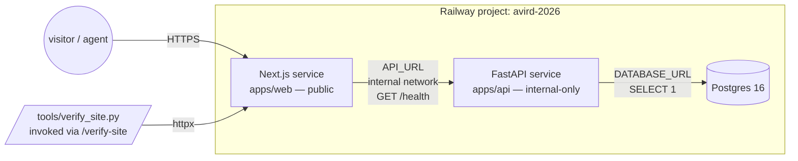

# Phase 0 Scaffold

## Overview

Stand up the empty deployed substrate for the NHTSA AV crash portfolio site: a Next.js frontend, FastAPI service, and Postgres database — all live on Railway — plus the compound-engineering conventions (CLAUDE.md, slash commands, hooks) and an agent-runnable site-verification harness. Phase 0 ships nothing about the data; it ships the rails everything else compounds on.

---

## Problem Frame

The repo today is empty (`.gitignore`, blank `CLAUDE.md`, the brainstorm doc, and `private/`). Subsequent phases (data + EDA, models, RAG, fault attribution) all assume a working deployed site, a Python service, a database, and AI-dev workflow conventions already exist. Bolting those in later is more expensive than putting them in first.

Phase 0 also exists to make the build *workflow* itself a learning artifact — slash commands, hooks, and a verification harness that an agent can invoke. R9.5 in particular establishes the substrate that the P5 site-review harness extends.

(See origin: `docs/brainstorms/nhtsa-crash-portfolio-requirements.md`)

---

## Requirements Trace

- R4. Repo conventions: progressive disclosure CLAUDE.md, slash commands, hooks for lint/format/test, conventional commits, brief writeups alongside code.
- R5. Empty Next.js site deployed on Railway with About page and placeholder index.
- R6. FastAPI service deployed on Railway returning a health route; reachable from the frontend.
- R7. Empty Postgres provisioned; connection wired through env vars; verified end-to-end with one trivial query.
- R8. CLAUDE.md committed with progressive disclosure (top-level summary, deeper docs linked).
- R9. At least one slash command and one hook in place (e.g. format-on-stop, or `/ship` running lint/test pre-commit).
- R9.5. Agent-runnable site-verification harness: an agent-invokable command that loads the deployed site headlessly and verifies the live URL responds 200, all internal links resolve, and the placeholder index + About pages render expected text.

The origin doc does not define separate Actors / Flows / Acceptance Examples; carrying R-IDs forward is sufficient.

---

## Scope Boundaries

- No domain data ingestion, schema, or models — that lands in P1.
- No styling polish or design system — UI is intentionally minimal/AI-generated and reshaped later.
- No auth, accounts, or rate limiting beyond Railway defaults — not needed until a later phase forces it.
- No CI/CD pipeline beyond the Railway-managed deploy on push — heavier CI is deferred until evals (P5) need it.
- No real-time data or streaming — SGO is batch.
- No carry-forward from older iterations — clean rebuild.
- No commitment to monorepo tooling (workspaces, turborepo, nx). Two top-level service directories suffice.
- IA / site navigation is **not** designed in P0. The placeholder index is exactly that — a placeholder.

---

## Context & Research

### Relevant Code and Patterns

- Repo is greenfield. The only files of substance are `.gitignore` (ignores `.claude/settings.local.json` and `private/*`), the brainstorm doc, and a stub `CLAUDE.md`.
- `.claude/settings.local.json` exists with two `Read` permissions for the auto-memory directory — preserve those when introducing project-level `.claude/settings.json`.

### Institutional Learnings

- `docs/solutions/` does not exist yet. Phase 0 will create the convention; learnings start landing from P1 onward.

### External References

- Railway supports Next.js, FastAPI (any Python), and Postgres as separate services; service-to-service URLs are exposed via Railway-injected env vars. Confirmed by user (origin: Dependencies / Assumptions).
- NHTSA SGO data: https://www.nhtsa.gov/laws-regulations/standing-general-order-crash-reporting (relevant to P1, not P0).

---

## Key Technical Decisions

- **Repo layout: `apps/web/` for Next.js, `apps/api/` for FastAPI, `docs/` for prose and writeups.** Two service dirs at root are equally fine; `apps/` keeps room for future workers/jobs without renaming. No workspace tooling — each service manages its own deps.
- **Stack pinning: Next.js (App Router, TypeScript) + FastAPI (`fastapi[standard]`) + Postgres 16 on Railway.** App Router is the current Next default; TS is the common convention for AI-generated UI. `fastapi[standard]` pulls uvicorn and pydantic v2 without extra ceremony.
- **Postgres client for the P0 trivial query: `asyncpg` (or `psycopg[binary]`) — no ORM yet.** ORM / migration tooling (likely SQLAlchemy + Alembic) is a P1 decision when there is a schema worth modeling.
- **Lint/format defaults: `ruff` (lint + format) for Python, `prettier` + `eslint` (Next.js defaults) for TypeScript.** Standard, low-friction; the slash command and hook in U2 invoke these.
- **Reachability proof: the Next.js placeholder index calls FastAPI's `/health` from a server component (or a small client effect) and renders the response.** That single render satisfies "reachable from the frontend" (R6) without inventing a UI feature.
- **Progressive disclosure shape for CLAUDE.md:** root `CLAUDE.md` is the short summary + index; deeper guides live in `docs/conventions/` and per-service `apps/web/CLAUDE.md` / `apps/api/CLAUDE.md` and are added as phases land.
- **Verification harness tool (R9.5): default to a Python script using `httpx` + `selectolax` (or `BeautifulSoup`) wrapped in a slash command.** This keeps the harness in the Python stack already provisioned, supports the three required checks (200 status, link resolution, expected text), and deploys nothing extra. Playwright is the documented upgrade path if P5's site-review harness needs JS-rendered or visual checks. Decision is final at U6 — see Open Questions.
- **Conventional Commits as the commit-message convention.** R4 calls it out; the `/ship` slash command in U2 only needs to advise (not enforce) the format.
- **AGENTS.md is not adopted in P0.** The brainstorm and R4/R8/R9 are explicitly Claude Code-shaped (CLAUDE.md, slash commands, hooks under `.claude/`). Re-evaluate if a second AI tool gets adopted in P2.

---

## Open Questions

### Resolved During Planning

- **Repo layout (one service or split, monorepo tooling y/n)** → `apps/web/` + `apps/api/`, no workspace tooling.
- **FastAPI public exposure** → Railway-internal-only. The api service has no public Railway domain; external traffic flows web → api over Railway's project-internal network. Web is the only internet-reachable origin. Chosen so P1+ data endpoints inherit a tight surface (no rate limit / auth burden created in P0).
- **Service-to-service env var name for the FastAPI URL** → `API_URL` (server-only — no `NEXT_PUBLIC_` prefix). Set from Railway's reference variable to the api service's internal hostname. Consumed only by Next.js server components, so it is never bundled into the browser. Documented in `apps/web/.env.example`.
- **Whether Phase 0 owns ORM/migration tooling** → No. Trivial query only; ORM is P1.
- **Verification harness tool** → `httpx` + a small HTML parser (`selectolax` or `BeautifulSoup`). Playwright is the documented upgrade path for P5 R27 if visual or JS-rendered assertions arrive.
- **Slash command name** → `/ship` for the lint+test gate.
- **Hook event surface** → PostToolUse on `Edit|Write`, scoped to touched files (chosen over a Stop hook for tighter feedback loop).
- **Web test runner** → `vitest` (lighter than jest, App-Router-friendly defaults). Wired into `npm test` so `/ship` invokes it.

### Deferred to Implementation

- **Final assertion strings for `/verify-site`.** The single-config-block design (U6) lets these evolve with the index/About text without churning the script.

---

## Output Structure

```
.
├── .claude/
│   ├── settings.json              # project-level: hooks, permissions
│   ├── settings.local.json        # gitignored, user-local (already exists)
│   └── commands/
│       ├── ship.md                # slash command: lint + test gate
│       └── verify-site.md         # slash command: invoke verification harness
├── apps/
│   ├── web/                       # Next.js (App Router, TS)
│   │   ├── CLAUDE.md              # service-local guidance
│   │   ├── app/
│   │   │   ├── page.tsx           # placeholder index, calls /health
│   │   │   └── about/page.tsx     # About page
│   │   ├── package.json
│   │   ├── tsconfig.json
│   │   ├── .env.example
│   │   └── README.md
│   └── api/                       # FastAPI
│       ├── CLAUDE.md              # service-local guidance
│       ├── app/
│       │   ├── __init__.py
│       │   ├── main.py            # FastAPI app, /health endpoint
│       │   └── db.py              # asyncpg pool, trivial SELECT 1
│       ├── pyproject.toml
│       ├── .env.example
│       └── README.md
├── tools/
│   └── verify_site.py             # R9.5 harness; invoked by /verify-site
├── docs/
│   ├── brainstorms/
│   │   └── nhtsa-crash-portfolio-requirements.md
│   ├── plans/
│   │   └── 2026-04-28-001-feat-phase-0-scaffold-plan.md
│   ├── conventions/
│   │   ├── stack.md               # stack snapshot, env-var contract
│   │   └── workflow.md            # slash commands, hooks, commit style
│   ├── writeups/                  # phase writeups (R4)
│   │   └── README.md              # what belongs here, link conventions
│   └── solutions/                 # institutional learnings (created empty in P0)
│       └── README.md
├── CLAUDE.md                      # progressive-disclosure root
├── .gitignore
└── README.md
```

The tree shows expected shape, not a hard constraint. Per-unit `**Files:**` sections are authoritative.

---

## High-Level Technical Design

> *This illustrates the intended approach and is directional guidance for review, not implementation specification. The implementing agent should treat it as context, not code to reproduce.*



Web is the only public origin. The harness exercises the same surface a visitor would; it cannot probe the api directly, which is by design — `/health` reachability is asserted indirectly through the index page rendering "API: ok". Env-var wiring (web reads `API_URL`; api reads `DATABASE_URL`) is the only inter-service contract Phase 0 establishes.

---

## Implementation Units

- U1. **Repo skeleton, conventions, and progressive-disclosure CLAUDE.md**

**Goal:** Establish the directory layout, root `CLAUDE.md`, conventions docs, and writeup/solutions stubs that every later unit and phase compounds on.

**Requirements:** R4, R8

**Dependencies:** none

**Files:**
- Create: `CLAUDE.md` (root, progressive-disclosure summary linking to deeper docs)
- Create: `README.md` (one-paragraph project overview + how to run locally)
- Create: `docs/conventions/stack.md` (stack snapshot, env-var contract, ports)
- Create: `docs/conventions/workflow.md` (slash commands, hooks, conventional-commit summary — populated alongside U2)
- Create: `docs/writeups/README.md` (what belongs here; one-doc-per-phase pattern)
- Create: `docs/solutions/README.md` (purpose of institutional learnings dir, populated from P1)
- Create: `apps/web/CLAUDE.md` and `apps/api/CLAUDE.md` (stubs that link back to root)
- Modify: `.gitignore` (add `node_modules/`, `__pycache__/`, `.venv/`, `.env`, `.next/`, `dist/`, OS junk)

**Approach:**
- Root `CLAUDE.md` carries: project one-liner, stack summary, where deeper docs live, current phase, link to brainstorm + active plan. Keep under ~50 lines.
- `docs/conventions/stack.md` is the single source of truth for env-var names, service URLs, and port assignments. Subsequent units update it as they wire things.
- `docs/writeups/README.md` establishes the phase-writeup convention from R4 ("brief writeups committed alongside code") so P1+ has a place to land.
- Service-local CLAUDE.md files exist mainly to point an agent loaded into `apps/web/` or `apps/api/` back at the root for project-wide context.

**Patterns to follow:**
- Progressive disclosure: short root, link to deeper docs by topic.
- Conventional Commits style is documented in `docs/conventions/workflow.md` but not enforced by tooling in P0.

**Test scenarios:**
- Test expectation: none — pure documentation and configuration scaffolding; no behavior to assert.

**Verification:**
- `CLAUDE.md` exists at root and links to `docs/conventions/stack.md`, `docs/conventions/workflow.md`, the active plan, and the brainstorm.
- `docs/conventions/`, `docs/writeups/`, `docs/solutions/` each contain at least a README.
- `.gitignore` covers Node, Python, and Next build artifacts.

---

- U2. **Claude Code substrate: project `settings.json`, one slash command, one hook**

**Goal:** Land the compound-engineering substrate so subsequent phases inherit format/lint/test reflexes and an agent-invokable shipping gate. R9 minimum: one slash command + one hook.

**Requirements:** R4, R9

**Dependencies:** U1 (conventions docs exist to be linked from the slash command's prompt)

**Files:**
- Create: `.claude/settings.json` (project-level hooks; permissions limited to read-only repo paths and the lint/format/test commands the hook runs)
- Create: `.claude/commands/ship.md` (slash command: lint + format + test gate; advises Conventional Commits)
- Modify: `docs/conventions/workflow.md` (document what `/ship` does and what the hook does; how to add new ones)
- Modify: `CLAUDE.md` root index (link to workflow.md)

**Approach:**
- Slash command: `/ship` — runs `ruff check apps/api`, `ruff format --check apps/api`, `cd apps/web && npm run lint`, then the test stubs (initially trivial). Reports pass/fail; user commits manually after green.
- Hook: PostToolUse on `Edit|Write` matching `apps/api/**/*.py` runs `ruff format` on the touched file; matching `apps/web/**/*.{ts,tsx}` runs `prettier --write`. Tight feedback loop, fits the file-at-a-time edit pattern.
- Both commands tolerate empty test suites in P0 (test stubs return success). Real test invocation expands as later units add tests.
- Keep `settings.local.json` untouched; it is gitignored and user-local (already covered by `.gitignore`).

**Patterns to follow:**
- `references` and command bodies follow the standard `.claude/commands/*.md` slash command shape.

**Test scenarios:**
- Happy path: `/ship` on a clean tree exits success and prints a one-line summary per check (lint, format, web lint, tests).
- Error path: `/ship` on a tree with a deliberately-broken Python file (e.g., unused import) reports the failure and exits non-zero without proceeding to the test step.
- Happy path (hook): editing `apps/api/app/main.py` via the agent triggers `ruff format` on that file (no other files reformatted).
- Edge case (hook): editing a Markdown file in `docs/` does not invoke any formatter (matchers are scoped).

**Verification:**
- `/ship` is invokable from a fresh agent session and gates correctly on a deliberate failure.
- The hook fires on a real edit and only on the configured paths.
- `docs/conventions/workflow.md` describes both, with copy-paste invocation examples.

---

- U3. **Railway project + Postgres provisioning + env-var contract**

**Goal:** Stand up the Railway project, provision empty Postgres, and pin the env-var contract that U4 and U5 consume.

**Requirements:** R7

**Dependencies:** U1 (`docs/conventions/stack.md` exists and gets updated here)

**Files:**
- Modify: `docs/conventions/stack.md` (record Railway project name, service names, env-var names: `DATABASE_URL` for api, `API_URL` for web, port assumptions, public/internal exposure per service, single-owner trust model)
- Create: `apps/api/.env.example` (placeholder values; documents `DATABASE_URL` and `PORT`)
- Create: `apps/web/.env.example` (placeholder values; documents `API_URL` — Railway-internal hostname for the api service)

**Approach:**
- Create one Railway project with three services to follow: `db` (Postgres), `api` (filled by U4 — Railway-internal-only, no public domain), `web` (filled by U5 — the only public origin).
- Provision Postgres 16 from Railway's template; capture the auto-generated `DATABASE_URL` reference variable.
- Document in `stack.md` how cross-service references work (Railway reference variables) so U4/U5 do not invent their own conventions. The api service's reference variable points web at the *internal* hostname.
- Document the trust model in `stack.md` in one line: single-owner project; repo not externally writable; `DATABASE_URL` injected by Railway at runtime and never committed; `.env.example` placeholder-only; FastAPI logs a sanitized message on DB failure (never the connection string).
- Document the build-vs-runtime expectation: Railway reference variables are populated at request time. Next.js code that reads them must run dynamically (see U5).
- This unit owns infrastructure provisioning even though `apps/api` and `apps/web` services are *empty* until U4/U5 land. That is intentional — the env-var contract is the artifact; the service shells follow.

**Patterns to follow:**
- Railway reference variables for cross-service URLs (no hardcoded hostnames committed to the repo).

**Test scenarios:**
- Test expectation: none — provisioning + documentation; behavior is asserted in U4 (DB connectivity) and U6 (live URL).

**Verification:**
- Railway project exists with `db` service running and reachable via the project-internal `DATABASE_URL` reference.
- `docs/conventions/stack.md` documents service names, env-var names, and how new services should consume them.
- `.env.example` files exist for both apps with the documented variable names.

---

- U4. **FastAPI service: `/health` route + DB connectivity probe, deployed**

**Goal:** Deploy a minimal FastAPI service on Railway that exposes `/health` and proves DB connectivity by running one trivial query at startup or on demand.

**Requirements:** R6, R7 (verification half)

**Dependencies:** U1, U3

**Files:**
- Create: `apps/api/pyproject.toml` (project metadata; deps: `fastapi[standard]`, `asyncpg`, `httpx` for tests; dev deps: `ruff`, `pytest`, `pytest-asyncio`)
- Create: `apps/api/app/__init__.py`
- Create: `apps/api/app/main.py` (FastAPI instance; `/health` returns `{status, db}` where `db` is `"ok"` if `SELECT 1` succeeded and `"down"` otherwise; never raises to the client)
- Create: `apps/api/app/db.py` (asyncpg pool init/teardown; `check()` runs `SELECT 1`)
- Create: `apps/api/tests/test_health.py`
- Create: `apps/api/README.md` (local run + deploy notes)
- Modify: `docs/conventions/stack.md` (record the `/health` contract)

**Approach:**
- `/health` is the only route in P0. It returns 200 with the small status object even when DB is `"down"` — Railway healthchecks should still pass on transient DB blips. The `db` field is what U6 asserts on (via the index page rendering "API: ok").
- DB pool is lazy-initialized on first request to avoid coupling startup to DB availability (keeps U6 deterministic when running before U5 deploy completes).
- `Procfile` or `railway.json` start command: `uvicorn app.main:app --host 0.0.0.0 --port $PORT`. Pick whichever Railway recognizes for Python services and document it in `apps/api/README.md`.
- Service is configured Railway-internal-only — no public domain attached. Only the `web` service can reach `/health`. Verification therefore happens via the index page (U5/U6), not by directly hitting the api hostname.
- `db.py` error handling logs a sanitized message ("DB connection failed") on connection failure — never the raw exception or `DATABASE_URL`.

**Execution note:** Add the `/health` test before wiring DB code — the contract is the public artifact, the DB probe is the implementation detail.

**Patterns to follow:**
- FastAPI app factory not needed in P0; module-level `app = FastAPI()` is fine.
- Async DB access via `asyncpg` directly (no SQLAlchemy yet).

**Test scenarios:**
- Happy path: `GET /health` returns 200 with `{"status": "ok", "db": "ok"}` when DB is reachable.
- Error path: `GET /health` returns 200 with `{"status": "ok", "db": "down"}` when the DB pool fails to acquire a connection (simulated by pointing `DATABASE_URL` at an unreachable host in the test).
- Edge case: `/health` does not require auth headers (anonymous public access per origin's Scope Boundaries).
- Integration: against a real Railway-attached Postgres, the deployed `/health` endpoint reports `db: "ok"` end-to-end.

**Verification:**
- `apps/api` deploys cleanly on Railway; the api service has no public domain; only the `web` service (or a Railway shell on the api service itself) can reach `/health`. End-to-end DB liveness is proved by U5's index rendering "API: ok" against the deployed api.
- `pytest apps/api` passes locally with `DATABASE_URL` pointed at any reachable Postgres (a temporary local instance is fine).

---

- U5. **Next.js frontend: About page, placeholder index, calls FastAPI `/health`, deployed**

**Goal:** Deploy the empty Next.js site on Railway with the two pages required by R5, and prove R6 reachability by having the placeholder index render a value derived from `/health`.

**Requirements:** R5, R6 (reachability half)

**Dependencies:** U1, U3, U4

**Files:**
- Create: `apps/web/package.json` (Next 14+ App Router, React 18, TS; devDeps: `vitest`, `@vitejs/plugin-react`, `jsdom`, `@testing-library/react`, `prettier`, `eslint-config-prettier`; scripts include `test` mapped to `vitest run`)
- Create: `apps/web/tsconfig.json`
- Create: `apps/web/next.config.mjs`
- Create: `apps/web/vitest.config.ts` (jsdom environment, React plugin)
- Create: `apps/web/.prettierrc` (or `prettier.config.mjs`) — minimal, defaults
- Create: `apps/web/app/layout.tsx` (root layout, minimal)
- Create: `apps/web/app/page.tsx` (placeholder index; server-side-fetches `/health` from `API_URL` and renders the API status as plain text)
- Create: `apps/web/app/about/page.tsx` (About content: what this site is, who it's for)
- Create: `apps/web/app/page.test.tsx` and `apps/web/app/about/page.test.tsx` (component-level rendering tests via vitest + RTL)
- Create: `apps/web/README.md` (local run + deploy notes)

**Approach:**
- Use `create-next-app`-equivalent scaffold (App Router, TS, no Tailwind in P0 — styling is deferred). Strip the default boilerplate to bare essentials.
- Index page does a server-side fetch of `${API_URL}/health` with `cache: 'no-store'` and renders a single line: "API: ok" / "API: down" / "API: unreachable". `API_URL` is the Railway-internal hostname for the api service (set in U3); never bundled into client code.
- Add `export const dynamic = 'force-dynamic'` to the index route so the fetch runs at request time, not build time. Without this, Next.js may statically prerender the index, baking "API: unreachable" into the bundle when build-time and runtime env var availability differ on Railway.
- About page is static text describing what the site is and who it's for. No images, no styling beyond defaults. (External repo link is optional — origin doesn't commit to a public source-host.)
- Both pages contain stable, distinctive expected-text strings ("API: ok" expected on a healthy deploy, "About this project" on the About page) that U6's harness asserts on.

**Patterns to follow:**
- App Router server components for both pages.
- Use a server-only env var (no prefix) for values consumed only by server components, so they stay out of the client bundle. Reserve `NEXT_PUBLIC_*` for values a browser-side component genuinely needs to read — none in P0.

**Test scenarios:**
- Happy path: index renders "API: ok" when the fetch resolves with `{db: "ok"}`.
- Error path: index renders "API: unreachable" when the fetch throws (network error, DNS failure).
- Edge case: index renders "API: down" when `/health` returns `{db: "down"}` (still a 200 response).
- Happy path: About page renders the expected heading text.

**Verification:**
- `apps/web` deploys cleanly on Railway; the public URL serves the index and `/about` with status 200.
- The deployed index renders "API: ok" against the deployed FastAPI service (proves R6 end-to-end via Railway-internal networking).
- `npm test` in `apps/web` passes locally (vitest run).

---

- U6. **Agent-runnable site-verification harness + slash command**

**Goal:** Deliver R9.5 — an agent-invokable command that loads the deployed site headlessly and verifies the live URL responds 200, all internal links resolve, and the placeholder index + About pages render expected text.

**Requirements:** R9.5

**Dependencies:** U1, U2 (slash-command pattern), U4, U5 (a deployed site to verify)

**Files:**
- Create: `tools/verify_site.py` (Python script using `httpx` + a small HTML parser; takes `--base-url` and a small list of expected-text assertions; exits non-zero on any failure with a punch-list summary)
- Create: `tools/tests/test_verify_site.py` (unit tests against a local fixture HTTP server; no live deploy required)
- Create: `tools/pyproject.toml` or extend `apps/api/pyproject.toml` to host the harness deps (`httpx`, `selectolax` or `beautifulsoup4`)
- Create: `.claude/commands/verify-site.md` (slash command wrapping `python tools/verify_site.py --base-url $WEB_URL`)
- Modify: `docs/conventions/workflow.md` (document `/verify-site`, how to add new assertions)
- Modify: `CLAUDE.md` root index (link to the harness; note this is the substrate that P5 R27 extends)

**Approach:**
- Target is the public web origin only. The api service is Railway-internal — the harness cannot reach it directly, by design. End-to-end api liveness is asserted indirectly via the index page's rendered text.
- Three checks, in order:
  1. **Status:** `GET base_url` and `GET base_url/about` both return 200.
  2. **Internal links:** parse the HTML of both pages, collect same-origin `<a href>` values, dedupe, fetch each, assert all return 200.
  3. **Expected text:** `base_url` body contains `"API: ok"` (the healthy state — `"API: down"` and `"API: unreachable"` are degraded states the harness must surface as failures); `base_url/about` body contains the About page's heading text. Assertion strings live in a small config block at the top of the script — easy to extend.
- Output is a punch list: one line per check, prefixed `[ok]` / `[fail]`, plus a final summary count. Non-zero exit on any failure.
- Decision: ship with `httpx`. Off-the-shelf link checkers (`lychee`, `linkchecker`) cover checks 1+2 alone; the custom script wins because check 3 (substring assertions) is the load-bearing part and benefits from being colocated with the link/status logic. Playwright is **not** adopted in P0 — pages are server-rendered, the assertion set is small. The P5 site-review harness (R27) is the documented upgrade path if visual or JS-rendered assertions arrive.

**Execution note:** Test the harness against a local fixture server before pointing it at Railway — the agent should be able to run the test suite without depending on production.

**Patterns to follow:**
- Slash command in `.claude/commands/verify-site.md` shaped like `/ship` from U2 (single-purpose, exits with clear status).
- Script is portable Python that does not require the FastAPI app to import — it lives in `tools/` deliberately.

**Test scenarios:**
- Happy path: against a local fixture serving stub `index` (containing `"API: ok"`) + `about` HTML with valid internal links and the expected text, the harness exits 0 and prints three `[ok]` lines.
- Error path: when the fixture returns 500 on `/about`, the harness exits non-zero and the punch list shows `[fail] status /about: 500`.
- Error path: when an internal `<a href>` points at a path the fixture 404s on, the harness exits non-zero and the punch list names that link.
- Error path: when the index body renders `"API: down"` or `"API: unreachable"` (degraded but technically alive), the harness exits non-zero — degraded state is a failure for the integration test, not a pass.
- Error path: when the index body is missing any "API: …" substring entirely, the harness exits non-zero and names the missing assertion.
- Edge case: external links (different origin) are *not* fetched — they are out of scope for this harness.
- Integration: invoking `/verify-site` against the live Railway-deployed site exits 0.

**Verification:**
- `/verify-site` is callable from a fresh agent session, takes the deployed web URL (from env or arg), and reports correctly.
- A deliberate breakage on the deployed site (e.g., temporarily renaming the About page text) makes the harness fail with a useful message.
- `tools/tests/test_verify_site.py` passes locally without network access to Railway.

---

## System-Wide Impact

- **Interaction graph:** Three Railway services (`web` → `api` → `db`). Only `web` is public; `api` is internal-only. The harness probes `web` only. Phase 0 establishes this graph; later phases add nodes (vector store, model service, agent harness) onto it.
- **Error propagation:** `/health` deliberately does not raise on DB failure — it reports `db: "down"` instead. The Next.js index degrades gracefully to "API: down" / "API: unreachable" instead of throwing. The harness treats these degraded states as failures (the deploy is broken if the API isn't `ok`). This is the failure-mode contract every later page will inherit.
- **State lifecycle risks:** Postgres is empty in P0. No migration tooling exists yet, so any schema introduced in P1 is a clean-slate decision — no compatibility burden carried forward.
- **API surface parity:** All P0+ FastAPI routes live behind the Railway-internal-only api service. P1+ data endpoints inherit this — they are *not* publicly reachable; the web service proxies via route handlers / server components when external clients need a result. This avoids creating a rate-limit / auth surface in P0 that P1+ would otherwise have to retrofit.
- **Integration coverage:** The R9.5 harness *is* the integration test for the deployed system. P5's R27 expands its surface; P0's contract is "200 + links + 'API: ok'".
- **Unchanged invariants:** None to preserve — greenfield. The contract this plan locks in (env-var names in `stack.md`, the `/health` shape, the harness output format, the public-vs-internal exposure rule) is the new invariant subsequent phases inherit.

---

## Risks & Dependencies

| Risk | Mitigation |
|------|------------|
| Railway service-to-service reference variables behave differently than expected, breaking U5's call to U4. | U3 documents the contract in `stack.md` *before* U4/U5 deploy. If the internal hostname doesn't resolve, temporarily attach a Railway public domain to api (and switch `API_URL` to it) with an explicit TODO; not blocking for P0. |
| Next.js statically prerenders the index at build, baking "API: unreachable" into the bundle because `API_URL` is unreachable at build time. | `export const dynamic = 'force-dynamic'` on the index route; `cache: 'no-store'` on the fetch; verify Railway provides reference vars at runtime (they do — the build-vs-runtime contract is documented in `stack.md`). |
| `create-next-app` defaults churn between Next versions and produce a different layout than this plan assumes (e.g., Pages Router resurrected as default). | The plan pins App Router + TS explicitly. If the scaffold disagrees, prefer the current Next default and update `stack.md` rather than fighting the framework. |
| Hook in U2 fires on edits the agent doesn't expect, slowing the loop. | Scope matchers narrowly by path glob; ship with the smallest useful matcher set and expand as P1+ identifies real friction. |
| Verification harness becomes a maintenance sink as content evolves. | Assertion strings live in a single config block at the top of `tools/verify_site.py`. Updating an assertion is a one-line change. P5's R27 is the place to add visual/heavier checks, not P0. |
| `.claude/settings.json` permissions block legitimate work (e.g., `npm install`). | Start with read-only repo paths plus the specific lint/format/test commands the hook runs; expand on real friction, not anticipated friction. |

---

## Documentation / Operational Notes

- Phase 0 ends with a short writeup at `docs/writeups/p0-scaffold.md`: what was built, the env-var contract, how to run `/ship` and `/verify-site`. Establishes the per-phase writeup pattern (R4) for P1+.
- Update `CLAUDE.md` root to point at the new active plan and the workflow conventions doc once U2 lands.
- No monitoring or alerting in P0. Railway's default deploy logs are enough; if `/verify-site` becomes a scheduled check later, that's a P5 R28 question.

---

## Sources & References

- **Origin document:** [docs/brainstorms/nhtsa-crash-portfolio-requirements.md](../brainstorms/nhtsa-crash-portfolio-requirements.md)
- NHTSA SGO data source: https://www.nhtsa.gov/laws-regulations/standing-general-order-crash-reporting (P1 input, listed for completeness)
