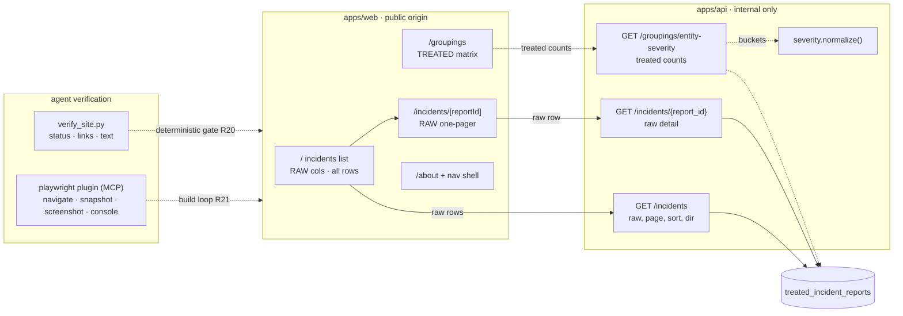

# feat: Website MVP — W1 incident browser (raw) + W2 groupings (treated) + agent verification

## Summary

Grow the public site off the P0 scaffold by adding a thin read-only API over `treated_incident_reports`, the first three real pages, and a real agent-driven page-verification loop. The defining data split: **the incident browser shows raw reported data; the groupings page shows treated data.** W1 ships the browser — a recent-first incident list (the new landing page) over the **raw** SGO columns, no dedup, sorted by clicking column headers (pure raw-text sort), clicking through to a per-incident raw one-pager with narrative, plus a top-nav shell and a GitHub link on About. W2 ships a `master_entity` × highest-injury-severity matrix of summed counts with per-entity totals over the **treated** data — canonical-deduped rows and normalized severity buckets.

Two Claude Code plugins (both now installed) carry the build and verification work. **`frontend-design`** builds the visual pages with real design quality (bounded by this project's "navigable in a year, not wow a stranger" simplicity bar). **`playwright`** supplies the MCP browser tools for the verify loop. Verification is two layers: the existing `verify_site.py` stays as the cheap deterministic gate (status, links, expected text — token-free, CI/post-deploy); on top of it, the Playwright plugin gives the agent eyes (navigate → accessibility snapshot → screenshot → console-error check → compare against intent → iterate), closing R21's "done means observed working" loop instead of relying on the HTTP gate alone. This resolves and builds the deferred R23 spike.

The plan covers all required W1–W2 behavior (R1–R5), the cross-cutting simplicity/harness constraints (R20–R22), and R23 (now built, not deferred). It holds W2's optional grouping cuts (R6) and all of W3+ out of scope.

---

## Problem Frame

The data engineering and EDA are done — rich per-incident data lives in `treated_incident_reports` (raw SGO passthrough columns *plus* cleaned/normalized/flag/target derivations: `incident_date`, `master_entity`, `is_latest_of_multiple_report`, severity targets, etc.). But the public site is still the P0 placeholder: `web` renders an index showing API health plus an About page, and `api` exposes only `/health`. The analysis exists; the surface to *see* it does not.

This plan closes the first slice of that gap. It reuses the existing scaffold patterns exactly — Next.js server components reading `API_URL` dynamically, FastAPI with a lazy asyncpg pool, vitest + pytest, the editable-assertion `verify_site.py` harness — and adds the smallest set of routes and pages that make incidents browsable (raw) and groupable (treated). It also closes a real gap the brainstorm flagged but deferred: the agent build loop (R21) currently has no way to *see* a page. Relying on `verify_site.py` alone means "reachable + expected text present" is the only signal — it can't catch a broken layout, a console error, or a page that renders but looks wrong. The R23 spike (researched in this plan) supplies the missing perception layer.

---

## Requirements

Traced from the origin requirements doc (`docs/brainstorms/2026-06-05-website-mvp-requirements.md`).

**W1 — Incident browser foundation (raw data)**
- **R1** — `api` exposes a thin read-only surface over `treated_incident_reports`: a paginated incidents list and a per-incident detail lookup. No write/mutation endpoints. → U1, U3
- **R2** — Landing page renders the incidents list recent-first, over the raw SGO columns, sortable by date/entity/severity, server-side pagination. → U3, U7
- **R3** — Each row clicks through to a detail subpage showing the raw one-pager field set plus the incident narrative. → U3, U8
- **R4** — About links to the GitHub repo; a top-nav shell links Incidents and About and accepts later pages without rework. → U5

**W2 — Groupings (treated data)**
- **R5** — A groupings page renders a `master_entity` × highest-injury-severity matrix (seven display buckets), each cell a summed count with a per-entity total; read-only, canonical rows; severity normalized from the raw field. → U2, U4, U9

**Cross-cutting (every unit)**
- **R20** — Every new page and route ships with harness verification; checks grow as pages land; a phase is not done until its pages pass. → U10 (deterministic gate), U6 (agent loop), verification in every web/api unit
- **R21** — Visual pages follow build → run → screenshot → check → iterate; done means observed working. → U6 builds the mechanism; carried into U7, U8, U9 verification
- **R22** — Page/route code stays simple and readable; minimal dependencies; no premature abstraction; unused flexibility is flagged. → carried into every unit (incl. justification for the one new agent-tooling dependency)
- **R23** — Survey current best practice for agent-driven frontend work (plugin/tool use, MCP servers, visual/screenshot verification) and record a recommendation. **Resolved in this plan** (see Sources & Research) and built in U6.

**Deferred (captured, not built here):** R6 (W2 month/state cuts), R7–R8 (W3 filtering/drill-through), R9–R19 (W4–W7). See Scope Boundaries.

---

## Key Technical Decisions

1. **Raw on the browser, treated on the groupings page.** The incident list and detail show raw SGO column *values*; the groupings matrix uses treated columns (`master_entity`, normalized severity, canonical flag). This is the spine of the plan — every unit honors which side it's on. (user decision at planning kickoff)

2. **The list shows all raw rows — no canonical dedup.** The landing list does **not** apply `is_latest_of_multiple_report`; every raw report row appears, including multiple reports of one incident. **This deviates from the origin doc's "canonical incidents only on lists and counts" decision** — the deviation is deliberate (user decision) and scoped to the *list*; the groupings *counts* remain canonical. (see origin: canonical incidents only — overridden for the list)

3. **Thin read-only API, live queries, three routes.** `GET /incidents` (paginated, sortable raw list), `GET /incidents/{report_id}` (raw detail), `GET /groupings/entity-severity` (treated matrix counts). Live queries — no static snapshots in W1–W2. (see origin: thin read-only API decision)

4. **Pure raw-text sort, behind a column allow-list.** Sort/direction map through a fixed server-side allow-list (`date`→`"Incident Date"`, `entity`→`"Reporting Entity"`, `severity`→`"Highest Injury Severity Alleged"`; `asc`/`desc` only); `ORDER BY` is a pure text sort on the raw columns, never interpolating the raw param. Consequence the user accepted: "recent-first" is *approximate* (raw `Incident Date` is free-text, not chronological), and severity sorts alphabetically, not by harm. The allow-list is still the SQL identifier-injection control. (user decision: pure raw text sort)

5. **Severity normalization is a pure, unit-tested function — used only by groupings.** Raw `Highest Injury Severity Alleged` → seven display buckets (Fatality, Serious, Moderate, Minor, No Injuries, Property, Unknown). Single source of bucket logic, consumed by the matrix (U4) only; the raw list shows the raw severity string untouched. Exact raw→bucket mapping confirmed against the live DB at build time.

6. **Two-layer verification.** (a) **Deterministic gate** — `verify_site.py` checks status, internal links, and expected text over HTTP; token-free; runs in CI and post-deploy; the hard pass/fail. (b) **Agent perception loop** — the **`playwright` plugin's** MCP tools let the agent navigate, take an accessibility snapshot, screenshot, and read console errors, so the build loop can *see* a page and compare it to intent (R21). The gate proves reachability; the loop proves it looks/behaves right.

7. **Playwright plugin for the driving loop; Chrome DevTools MCP reserved for later.** The official `playwright` Claude Code plugin is installed and provides the MCP server (accessibility-snapshot-first, token-cheap, cross-browser): `browser_navigate`, `browser_snapshot`, `browser_take_screenshot`, `browser_console_messages`, plus interaction tools — no manual `.mcp.json` to author. Chrome DevTools MCP (Chromium-only, debugging/Core-Web-Vitals/perf) is deferred to W5 visuals / perf work. The token-efficient Playwright CLI + Skills path is noted as an evolution if MCP context cost bites. (R23 recommendation — see Sources & Research)

8. **The plugins are agent-time tooling, not runtime dependencies (R22).** Both `frontend-design` and `playwright` are Claude Code plugins used while building/verifying — they add **nothing** to the shipped `web`/`api` bundles. They're adopted because concrete phases force them (R21 build loop and R23 for `playwright`; design quality for `frontend-design`), exactly the simplicity constraint's carve-out.

12. **Design via the `frontend-design` plugin, bounded by the simplicity bar.** The visual pages (U5, U7, U8, U9) are built with the `frontend-design` skill for genuine design quality and to avoid generic AI aesthetics — but held to the origin's hard constraint: clean, simple, modern, "navigable in a year," no speculative abstraction (R22). Where design ambition and simplicity conflict, simplicity wins; the skill detects and respects the existing scaffold rather than re-theming it. (`frontend-design` is the user-chosen official plugin; `ce-frontend-design` is also available but unused here.)

9. **Sort UI: clickable column headers, state in the URL query.** `?sort=date&dir=desc&page=1`; clicking a header toggles direction; pagination shares the query-param mechanism. No client-state library — server components read `searchParams`. (user decision)

10. **Default page size 50.** Server-side `LIMIT/OFFSET`; the list response carries `page`, `page_size`, and `total` (an **unfiltered** `COUNT(*)`, since the list isn't deduped) for pagination controls.

11. **Data access is a dependency, mirroring the `check_db` override pattern.** Routes depend on data-access functions injected via FastAPI `Depends`, so route tests override them with fakes and need no live Postgres — exactly how `tests/test_health.py` overrides `check_db`.

---

## High-Level Technical Design

Route ↔ page map. Raw path is solid; treated path is dashed. `web` reaches `api` server-side over Railway's internal network (`API_URL`); the agent verification loop drives `web` through Playwright MCP out-of-band.



**Severity display buckets** (R5 — treated groupings only; seven columns, left→right by decreasing harm):

| Bucket | Meaning |
|--------|---------|
| Fatality | Fatal injury alleged |
| Serious | Serious / severe injury |
| Moderate | Moderate injury |
| Minor | Minor / possible injury |
| No Injuries | Crash with no alleged injury |
| Property | Property damage only |
| Unknown | Unknown / unmapped / null |

The raw-string → bucket mapping is confirmed against the live `Highest Injury Severity Alleged` values at build time; unmapped or null values fall to `Unknown`.

---

## Output Structure

New files (modified existing files noted in units):

```
apps/api/app/
  data.py            # data-access functions + FastAPI dependency (U1)
  severity.py        # pure raw→bucket normalization, treated-only (U2)
  incidents.py       # /incidents raw list + detail router (U3)
  groupings.py       # /groupings/entity-severity treated router (U4)
apps/api/tests/
  test_severity.py   # U2
  test_incidents.py  # U3
  test_groupings.py  # U4
.claude/commands/
  verify-page.md      # /verify-page loop wrapping the playwright plugin's MCP tools (U6)
apps/web/app/
  incidents/[reportId]/page.tsx + page.test.tsx   # raw detail (U8)
  groupings/page.tsx + page.test.tsx              # treated matrix (U9)
  components/Nav.tsx                               # nav shell (U5)
  lib/api.ts                                       # typed server-side API client (U7)
apps/web/app/page.tsx                              # REPLACED: placeholder → raw incidents list (U7)
```

---

## Implementation Units

### U1. DB access seam for read routes (api)

**Goal:** A small, testable data-access layer over the existing pool so routes don't touch asyncpg directly and route tests run without Postgres.

**Requirements:** R1 (foundation)
**Dependencies:** none
**Files:** `apps/api/app/data.py`, `apps/api/app/db.py` (add a public pool accessor)

**Approach:** Add a public `get_pool()` in `db.py` wrapping the existing private `_ensure_pool()` (preserve lazy-init + sanitized-failure). In `data.py`, define the query functions routes call (`fetch_incidents`, `count_incidents`, `fetch_incident`, `fetch_entity_severity_counts`) and a FastAPI dependency returning the data-access surface; tests override it (mirroring `tests/test_health.py`'s `check_db` override). Define the canonical-filter clause (`is_latest_of_multiple_report = true`) as one shared constant — **used only by the groupings query** (U4); the list query (U3) deliberately omits it. Note column-quoting: raw columns are mixed-case with spaces and need double-quoting (`"Incident Date"`, `"Reporting Entity"`, `"Highest Injury Severity Alleged"`, `"Crash With"`, `"City"`, `"State"`, `"Report ID"`); cleaned columns are snake_case (`incident_date`, `master_entity`, `is_latest_of_multiple_report`).

**Patterns to follow:** `apps/api/app/db.py` lazy pool + sanitized failure; dependency-injection seam from `apps/api/tests/test_health.py`.

**Test scenarios:** `Test expectation: none — plumbing/seam; behavior is exercised through U3/U4 route tests, which prove the override seam by running without a live DB.`

**Verification:** `pytest` in `apps/api` still green; U3/U4 routes testable with overrides and no Postgres.

---

### U2. Severity normalization helper — treated/groupings only (api)

**Goal:** A pure function mapping raw `Highest Injury Severity Alleged` strings to the seven display buckets, as the single source of bucket logic for the groupings matrix.

**Requirements:** R5
**Dependencies:** none
**Files:** `apps/api/app/severity.py`, `apps/api/tests/test_severity.py`

**Approach:** Pure `normalize(raw: str | None) -> str` returning one of seven bucket labels; null/empty/unmapped → `Unknown`. Keep the raw→bucket map a plain dict plus an ordered bucket-list constant (the matrix column order in U4). No DB/I-O. The raw value set is confirmed at build time; adding a newly-found value is a one-line dict edit. **Not used by the raw list** — the list shows the raw severity string as-is.

**Patterns to follow:** small focused module, `from __future__ import annotations`, type hints — matches `apps/api/app/db.py`.

**Test scenarios:**
- Covers R5. Each known raw value maps to its expected bucket (one assertion per bucket).
- Null → `Unknown`; empty/whitespace → `Unknown`; unmapped string → `Unknown` (never raises).
- Whitespace/case robustness for at least one value if build-time mapping shows dirty inputs.
- The exported bucket-order constant lists exactly the seven buckets in display order.

**Verification:** `pytest apps/api/tests/test_severity.py` green; mapping covers every distinct live raw value (unmapped land in `Unknown`, not lost).

---

### U3. Incidents list + detail routes — raw (api)

**Goal:** `GET /incidents` (paginated, sortable, **all raw rows, no dedup**) and `GET /incidents/{report_id}` (raw one-pager + narrative).

**Requirements:** R1, R2, R3
**Dependencies:** U1
**Files:** `apps/api/app/incidents.py`, `apps/api/app/main.py` (register router), `apps/api/tests/test_incidents.py`

**Approach:**
- **List:** params `page` (default 1), `sort` (`date`|`entity`|`severity`, default `date`), `dir` (`asc`|`desc`, default `desc`). `ORDER BY` resolved via the fixed allow-list map to raw columns (KTD 4) — pure text sort, never interpolate the raw param. **No canonical filter.** Select the raw column subset: `"Incident Date"`, `"Reporting Entity"`, `"City"`, `"State"`, `"Highest Injury Severity Alleged"` (raw string, no normalization), `"Crash With"`, and `"Report ID"` (detail link). `LIMIT 50 OFFSET (page-1)*50`. Response `{ items, page, page_size, total }` where `total` is an **unfiltered** `COUNT(*)`.
- **Detail:** look up one row by `"Report ID"` (parameterized), no canonical filter. Return the raw one-pager field set — city/state, roadway type + description, time/date, weather, crash with, highest injury severity (raw), property damage, CP/SV pre-crash movement, airbags deployed, vehicle towed, CP/SV contact areas, passengers belted, pre-crash speed, law-enforcement investigating — plus `"Narrative"`. Contact areas come from the per-direction `CP/SV Contact Area - *` columns (collapse truthy ones into a list). 404 when no row matches.

**Patterns to follow:** FastAPI router + `Depends`, dependency override in tests (`tests/test_health.py`); sanitized-failure posture from `db.py`.

**Test scenarios:**
- List: default returns items ordered by `"Incident Date"` desc (text), page 1, `total` present, `page_size: 50`.
- List: `sort=entity&dir=asc` resolves to `"Reporting Entity"` ascending; `sort=severity` resolves to `"Highest Injury Severity Alleged"`.
- List: out-of-set `sort=DROP TABLE` falls back to default — proves the allow-list, no raw interpolation.
- List: `page=2` produces offset 50 (assert offset reaching the fake).
- List: **no canonical clause** is applied (assert the dedup flag is absent from the list query) and `total` is the unfiltered count — guards the KTD-2 deviation.
- List: each item carries `report_id` and the **raw** severity string (not a normalized bucket).
- Detail: known `report_id` returns the full raw one-pager + narrative; contact areas collapsed to a list.
- Detail: unknown `report_id` → 404; lookup applies no canonical filter.
- No write/mutation routes exist (read-only surface).

**Verification:** `pytest apps/api/tests/test_incidents.py` green; curl returns raw rows and a populated raw detail object.

---

### U4. Entity × severity groupings route — treated (api)

**Goal:** `GET /groupings/entity-severity` returning the treated matrix of summed counts with per-entity totals.

**Requirements:** R5
**Dependencies:** U1, U2
**Files:** `apps/api/app/groupings.py`, `apps/api/app/main.py` (register router), `apps/api/tests/test_groupings.py`

**Approach:** Aggregate **canonical** rows (`is_latest_of_multiple_report = true`, the shared constant from U1) grouped by `master_entity`, counting per severity bucket. Prefer fetching `(master_entity, raw_severity, count)` and pivoting in Python via U2's `normalize()` + bucket-order constant, so bucket logic stays in one place and SQL stays simple. Response `{ buckets: [<seven labels>], rows: [{ entity, counts: {<bucket>: n}, total }] }`, rows sorted by total desc (confirm at build).

**Patterns to follow:** same router + dependency-override pattern as U3.

**Test scenarios:**
- One row per distinct `master_entity`, `counts` keyed by all seven buckets (zero-filled).
- Per-entity `total` = sum of that row's bucket counts.
- Raw severities bucketed via `normalize()` (unmapped → `Unknown`, not dropped).
- `buckets` is the seven-label ordered constant.
- **Canonical clause applied** (assert the dedup flag reaches the fake) — the treated side keeps dedup even though the list dropped it.
- Empty result → `rows: []`, `buckets` still present.

**Verification:** `pytest apps/api/tests/test_groupings.py` green; curl totals reconcile against a manual canonical `COUNT` for a spot-checked entity.

---

### U5. Nav shell + About GitHub link (web)

**Goal:** A top-nav shell linking Incidents and About across pages, built to accept later pages without rework; add the GitHub repo link to About.

**Requirements:** R4
**Dependencies:** none
**Files:** `apps/web/app/components/Nav.tsx`, `apps/web/app/layout.tsx` (render Nav), `apps/web/app/about/page.tsx` (add GitHub link), `apps/web/app/about/page.test.tsx`

**Approach:** A small server component `Nav` rendering a links array (`Incidents`→`/`, `About`→`/about`); adding a later page is a one-line edit (no routing framework, no active-state lib — YAGNI). Render `Nav` in the root layout. Add a GitHub repo link to About. Minimal, readable markup.

**Design & build:** use the `frontend-design` skill for the nav/layout shell, held to the simplicity bar (KTD 12) — a clean, legible nav, not a themed header.

**Patterns to follow:** `next/link` in `apps/web/app/page.tsx` and `about/page.tsx`; `apps/web/app/layout.tsx`.

**Test scenarios:**
- About renders a GitHub repo link (anchor `href` contains the repo URL).
- Nav renders Incidents + About links with correct `href`s.
- About still renders "About this project" (don't regress the harness assertion).

**Verification:** `npm test` green; nav on every page; About → GitHub link resolves.

---

### U6. Agent page-verification loop — `/verify-page` over the playwright plugin (tooling)

**Goal:** Give the agent eyes. The `playwright` plugin is already installed and provides the MCP browser tools; this unit adds a thin `/verify-page` command that runs the R21 build loop (navigate → a11y snapshot → screenshot → console-error check → compare to intent → report) and documents the two-layer verification model, so later web units verify by *observing*, not just by passing the HTTP gate. This is the built form of the R23 recommendation.

**Requirements:** R20, R21, R23
**Dependencies:** none — the `playwright` plugin MCP server is installed (no `.mcp.json` to author); smoke-tested against the existing `/about` page; used by U7–U9
**Files:** `.claude/commands/verify-page.md` (the command), `docs/conventions/workflow.md` (document the command + the two-layer verification model), `apps/web/CLAUDE.md` (note the build-loop affordance)

**Approach:**
- Author `.claude/commands/verify-page.md` — a `/verify-page <route> [intent notes]` slash command (matching the existing `.claude/commands/` convention) that instructs the agent to: start the dev server (or target a deployed URL), then use the plugin's MCP tools — `browser_navigate` to the route, `browser_snapshot` (a11y tree — token-cheap primary signal), `browser_take_screenshot` (layout/visual judgment), `browser_console_messages` — then compare what rendered against the stated intent and report a punch list (and iterate). Treat any console error as a finding. Prefer the a11y snapshot for reasoning; use the screenshot for visual judgment.
- Note the relationship to the `frontend-design` skill: design/build the page with `frontend-design`, then close the loop with `/verify-page`. Also note the existing `ce-test-browser` / `verify` skills can drive the same MCP tools for PR-scoped browser checks.
- Document the **two-layer model** in `workflow.md`: `/verify-page` (agent perception, build loop, R21) vs `/verify-site` (deterministic HTTP gate, R20). Note the token-efficiency evolution (Playwright CLI + Skills) as a future option if MCP context cost grows, and that Chrome DevTools MCP is reserved for later perf/debugging (W5/W7).
- Keep it minimal: no app dependency, no runtime impact (KTD 8); the plugin supplies the tooling.

**Patterns to follow:** existing slash-command shape in `.claude/commands/{ship,verify-site}.md`; the slash-command table in `docs/conventions/workflow.md`.

**Test scenarios:** `Test expectation: none — agent tooling/config, no app behavior. Validated by a smoke run: /verify-page against /about returns a screenshot + a11y snapshot + zero console errors via the playwright plugin, proving the loop works before U7–U9 rely on it.`

**Verification:** `/verify-page /about "P0 About page renders heading + GitHub link"` produces a screenshot, an a11y snapshot, and a console-error report through the playwright plugin; `workflow.md` documents both commands and the two-layer model.

---

### U7. Incidents list page — new landing page, raw (web)

**Goal:** Replace the P0 placeholder at `/` with the recent-first **raw** incident list: raw column subset, all rows (no dedup), clickable-header pure-text sorting, server-side pagination.

**Requirements:** R1, R2 (consumes U3); R20–R22
**Dependencies:** U3, U5, U6
**Files:** `apps/web/app/page.tsx` (replace placeholder), `apps/web/app/page.test.tsx` (rewrite), `apps/web/app/lib/api.ts` (typed server-side API client)

**Approach:** Server component reading `searchParams` for `page`/`sort`/`dir`; `export const dynamic = 'force-dynamic'` + `cache: 'no-store'` (Railway reference-var contract). `lib/api.ts` wraps `API_URL` fetches with typed shapes and the existing `ok`/error idiom from the current `page.tsx`. Render a table with the raw columns (Reporting Entity, Incident Date, City, State, Highest Injury Severity Alleged, Crash With); date/entity/severity headers are links that toggle `dir` + set `sort` in the query string; each row links to `/incidents/{report_id}` (real `<a href>` so the deterministic harness link-crawler reaches detail). Severity shows the **raw** string. Pagination (prev/next + indicator) driven by `total`/`page_size`. Degraded/empty/unreachable API states render a readable message rather than throwing. A small note that recent-first is approximate (raw text date) is acceptable. Single readable component; no client state.

**Design & build:** build the table/list with the `frontend-design` skill (readable density, clear sort affordances on headers, scannable rows), bounded by KTD 12. Close with `/verify-page /` (U6) before the deterministic gate.

**Patterns to follow:** `apps/web/app/page.tsx` (dynamic route, `API_URL` fetch, graceful states); `page.test.tsx` fetch-mock pattern.

**Test scenarios:**
- Renders rows from a mocked `/incidents` response with the raw columns and the raw severity string (no bucket label).
- Each row links to `/incidents/{report_id}`.
- Column headers carry sort links flipping `dir` + setting `sort` (assert header anchor hrefs).
- Default view requests `sort=date&dir=desc&page=1`.
- Pagination: next/prev reflect `total`/`page`/`page_size`; next suppressed on last page.
- API unreachable / non-2xx → readable fallback, no thrown error.
- Empty list → "no incidents" message, not a broken table.

**Verification:** `npm test` green; **`/verify-page /` (U6 loop)** confirms raw rows render, header-sort and pagination work via URL, and the console is clean (R21); then the deterministic gate (U10) passes.

---

### U8. Incident detail page — raw (web)

**Goal:** Per-incident detail subpage rendering the raw one-pager field set plus the narrative.

**Requirements:** R1, R3 (consumes U3); R20–R22
**Dependencies:** U3, U5, U6
**Files:** `apps/web/app/incidents/[reportId]/page.tsx`, `apps/web/app/incidents/[reportId]/page.test.tsx`

**Approach:** Dynamic server component reading `reportId`, fetching `/incidents/{report_id}` via `lib/api.ts`, `dynamic`/`no-store`. Render the raw R3 fields in a readable definition-style layout (group related fields), contact areas as a small list, narrative as a distinct block, a back link to the list. 404 from the API → Next `notFound()` / not-found message. Trim presentation only if the field set reads too dense (Open Questions); don't drop required fields silently.

**Design & build:** use the `frontend-design` skill for the one-pager layout (grouped fields, legible narrative block), bounded by KTD 12. Close with `/verify-page /incidents/<sample-id>` (U6).

**Patterns to follow:** dynamic-route server component + `lib/api.ts` from U7; graceful error handling from `page.tsx`.

**Test scenarios:**
- Renders raw one-pager fields from a mocked detail response (representative subset incl. city/state, raw severity, pre-crash movement, contact areas).
- Renders the narrative block.
- API 404 → not-found message (no crash); API unreachable → readable fallback.
- Back-to-list link present.

**Verification:** `npm test` green; **`/verify-page /incidents/<sample-id>`** confirms fields + narrative render with a clean console (R21).

---

### U9. Groupings page — entity × severity matrix, treated (web)

**Goal:** Read-only treated matrix: one row per entity, seven severity columns, per-entity totals.

**Requirements:** R5 (consumes U4); R20–R22
**Dependencies:** U4, U5, U6
**Files:** `apps/web/app/groupings/page.tsx`, `apps/web/app/groupings/page.test.tsx`, `apps/web/app/components/Nav.tsx` (add Groupings nav link)

**Approach:** Server component fetching `/groupings/entity-severity` via `lib/api.ts`, `dynamic`/`no-store`. Render a table: entity name, the seven bucket columns in `buckets` order, a total column; zero cells render consistently. Add a `Groupings` link to the nav (U5's array). Cells are plain counts — **not** links (drill-through is W3/R8). Single readable table.

**Design & build:** use the `frontend-design` skill for the matrix table (readable dense grid, clear entity/total columns, sensible zero-cell treatment), bounded by KTD 12. Close with `/verify-page /groupings` (U6).

**Patterns to follow:** U7's `lib/api.ts` + table rendering; graceful states from `page.tsx`.

**Test scenarios:**
- A row per entity with seven bucket cells in `buckets` order plus a total (mocked response).
- Per-entity total cell matches the response `total`.
- Header row lists the seven buckets in order.
- API unreachable / empty → readable fallback / "no data".
- Cells are plain text, not links (guards against pulling W3 drill-through forward).

**Verification:** `npm test` green; **`/verify-page /groupings`** confirms the matrix renders with a clean console; spot-check one entity total against the API (R21).

---

### U10. Extend the deterministic site gate (tools)

**Goal:** Grow `verify_site.py` to cover the new pages and retarget the now-stale `/` assertions, so W1–W2 isn't "done" until the live site passes the deterministic gate (R20).

**Requirements:** R20
**Dependencies:** U7, U8, U9
**Files:** `tools/verify_site.py` (assertion config), `tools/tests/test_verify_site.py`

**Approach:** Update `EXPECTED_TEXT`: replace the `/` `API: ok` needle (placeholder gone) with a stable substring the raw list always renders (e.g. an "Incidents" heading); add `/groupings` with a stable heading needle. Remove/retarget the `DEGRADED_INDEX_STATES` check on `/` (no longer an API-status page). Detail pages are covered by the existing internal-link crawler (the list renders real `<a href>` detail links → crawled for 200), so no per-id expected-text. Keep harness structure; only assertion config + fixtures change.

**Patterns to follow:** existing `EXPECTED_TEXT`/`PAGES_TO_CHECK` block and `tools/tests/test_verify_site.py` fixtures.

**Test scenarios:**
- Fixture for the new `/` (raw list) passes the new needle and isn't flagged by a removed/retargeted degraded check.
- Fixture for `/groupings` passes its needle.
- A fixture list page with a detail `<a href>` is discovered by the crawler and checked for 200.
- A missing needle → `[fail]` (regression guard).
- Old `API: ok` needle no longer required on `/`.

**Verification:** `python tools/verify_site.py --base-url $WEB_URL` exits 0 against the deployed site after W1–W2 deploy; `/ship` and `/verify-site` both green.

---

## Scope Boundaries

**Deferred to follow-up phases (captured in the origin doc, not built here)**
- **R6** — W2 by-month / by-state grouping cuts (user chose matrix-only).
- **R7–R8 (W3)** — list filters and groupings bucket drill-through. Groupings cells stay plain text (U9) to avoid pulling drill-through forward.
- **R9–R11 (W4)** — findings/approach, roadmap, data-dictionary pages.
- **R12–R15 (W5)** — contact-area + pre-crash-movement visuals, redacted-narrative stats, static-snapshot derived pages. (Chrome DevTools MCP perf/CWV tooling naturally lands here.)
- **R16–R19 (W6–W7)** — narrative/RAG surface, MCP/agent-queryable *product* surface, site-review audit harness (R19 extends U6's loop toward whole-site audit punch lists).

> **R23 is no longer deferred** — it's researched (Sources & Research) and built (U6).

**Outside this round's identity**
- No auth/accounts; anonymous public read access.
- No write/mutation endpoints — read-only API.
- No real-time data; reads whatever the batch-built table holds.
- IA is not pre-architected; nav grows as pages land (U5's links array is the extension point).
- Visual polish bounded by "navigable in a year," not recruiter-facing showmanship.

---

## Risks & Dependencies

- **List deviates from origin's canonical-on-lists decision (KTD 2).** The raw list shows all rows incl. duplicate reports of one incident; counts can look inflated vs. the canonical groupings page. Deliberate (user decision); the U3 test asserting no-canonical-clause + unfiltered count is the guard. Revisit if the duplication reads as a bug to visitors (a W3-era filter could expose a canonical toggle).
- **"Recent-first" is approximate (KTD 4).** Raw `Incident Date` is free text; pure text sort isn't true chronological order, and severity sorts alphabetically. Accepted by the user; note it on the page so it doesn't read as a bug.
- **SQL identifier injection on sort (mitigated by KTD 4).** The fixed allow-list map is the control; the U3 out-of-set-sort fallback test is the regression guard. All values are asyncpg-parameterized.
- **Severity raw-string mapping is build-time-confirmed (U2)** — now only affects the groupings page. Unmapped → `Unknown` (nothing lost); adding a value is a one-line edit.
- **Detail identifier assumption.** Assumes `"Report ID"` uniquely identifies a report for detail. Confirm against the live table at U3 build.
- **Landing-page swap breaks the deterministic gate.** Replacing `/` retires the `API: ok` assertion; U10 must land with U7 or `/verify-site` fails. Sequencing handles this (U10 depends on U7).
- **Playwright plugin environment.** The `playwright` plugin is installed and supplies the MCP server, but it still needs Node and browser binaries (`npx playwright install` on first use). It's agent-time only — if the browser can't launch, the deterministic gate (U10) still gates the build so the site can't ship un-checked; the agent loop degrades to manual screenshot review. No runtime/site impact (KTD 8).
- **Design ambition vs. simplicity (KTD 12).** `frontend-design` is built to produce distinctive UI; this project's hard constraint is "navigable in a year, not wow a stranger" with no premature abstraction (R22). The risk is over-design (motion, theming, component layers the phase doesn't use). Mitigation: KTD 12 makes simplicity the tiebreaker, and the U-level "build is observed working" gate is about correctness/legibility, not polish.
- **Data dependency.** `treated_incident_reports` must be populated on Railway with the raw + treated columns the pages use. The repo data dictionary confirms all exist (`"Incident Date"`, `"Reporting Entity"`, `"City"`, `"State"`, `"Highest Injury Severity Alleged"`, `"Crash With"`, `"Report ID"`, CP/SV contact areas, CP/SV pre-crash movement, `"Narrative"`; treated `master_entity`, `is_latest_of_multiple_report`); confirm population at W1 build.
- **Internal-only API.** New routes inherit the Railway-internal-only surface; `web` reaches them server-side via `API_URL` (no `NEXT_PUBLIC_`). No change to the exposure model.

---

## Open Questions (deferred to implementation)

- Exact raw → bucket mapping for `Highest Injury Severity Alleged` (confirm distinct live values at U2 build).
- Which raw entity column to display on the list — `"Reporting Entity"` (plan default) vs `"Operating Entity"` (U7/U3).
- Whether `"Report ID"` is the right detail route key, and detail behavior for a report whose canonical sibling differs (U3).
- Final raw column subset and exactly which columns are sortable beyond date/entity/severity (default is the R2 set).
- Whether the raw detail field set reads too dense and should be trimmed in presentation (U8) — no required field dropped silently.
- Groupings row ordering (total desc vs. entity name) (U4/U9).
- Stable expected-text needles for the new `/` and `/groupings` pages (finalize in U10 against rendered markup).
- Whether to adopt the Playwright CLI + Skills token-efficient path later, after observing the `playwright` plugin's MCP context cost in the U7–U9 loops (U6).

---

## Sources & Research

**R23 — agent-driven frontend verification (researched for this plan).** Recommendation, now adopted: use the official **`playwright` Claude Code plugin** as the agent's browser-driving/verification surface for the R21 build loop, wrapped in a thin `/verify-page` command, layered on top of the existing deterministic `verify_site.py` gate; and the official **`frontend-design` plugin** to build the visual pages. Both are installed. Rationale from current best practice:
- **Playwright plugin / MCP** (Microsoft `@playwright/mcp` under the hood) is accessibility-snapshot-first (text, token-cheap, no vision model required), cross-browser (Chromium/Firefox/WebKit), and exposes `browser_navigate`, `browser_snapshot`, `browser_take_screenshot`, `browser_console_messages`, plus interaction tools. The plugin provides the MCP server directly (no manual `.mcp.json`); `--headless` / `--port` modes exist for CI. ([Playwright MCP](https://playwright.dev/docs/getting-started-mcp), [microsoft/playwright-mcp](https://github.com/microsoft/playwright-mcp))
- **Playwright vs Chrome DevTools MCP:** Playwright *drives* (user-perspective, cross-browser, the right default for an agent loop); Chrome DevTools MCP *debugs* (Chromium-only, Core Web Vitals/network/perf). Reserve Chrome DevTools MCP for later perf work (W5/W7). ([Driving vs Debugging — Steve Kinney](https://stevekinney.com/writing/driving-vs-debugging-the-browser), [Chrome DevTools vs Playwright vs Puppeteer MCP](https://mcp.directory/blog/chrome-devtools-mcp-vs-playwright-mcp-2026))
- **Token efficiency:** Playwright CLI + Skills saves snapshots to disk as compact YAML (~4× fewer tokens) — the evolution path if MCP context cost bites. ([Playwright MCP & Claude Code](https://testomat.io/blog/playwright-mcp-claude-code/), [AI browser automation token benchmark 2026](https://www.ytyng.com/en/blog/ai-browser-automation-tools-comparison-2026))
- **Closed-loop verification (Anthropic best practice):** give the agent a pass/fail it can read; for UI, screenshot the result, compare to intent, list differences, fix, re-verify; show evidence (screenshot/output) rather than asserting success; gate with in-prompt checks, `/goal`, a Stop hook, or a verification subagent. This is exactly the U6 loop. ([Best practices for Claude Code](https://code.claude.com/docs/en/best-practices), [Giving Claude Code Eyes](https://medium.com/@rotbart/giving-claude-code-eyes-round-trip-screenshot-testing-ce52f7dcc563))

**Codebase grounding.**
- Origin requirements: `docs/brainstorms/2026-06-05-website-mvp-requirements.md`.
- Stack + env contract: `docs/conventions/stack.md` (internal-only API, server-side `API_URL`, dynamic-route/`no-store` rule, lazy pool).
- Workflow + harness: `docs/conventions/workflow.md`, `tools/verify_site.py`, `.claude/commands/{ship,verify-site}.md`.
- Patterns mirrored: `apps/api/app/{main,db}.py` + `apps/api/tests/test_health.py` (router + dependency-override testing, lazy pool, sanitized failure); `apps/web/app/{page,layout}.tsx` + `page.test.tsx` (dynamic server component, `API_URL` fetch, fetch-mock tests).
- Schema grounding: `docs/avird-sgo-database-data-dictionary/column_dictionary.json` (211 columns; confirmed all raw + treated fields the pages use exist).
