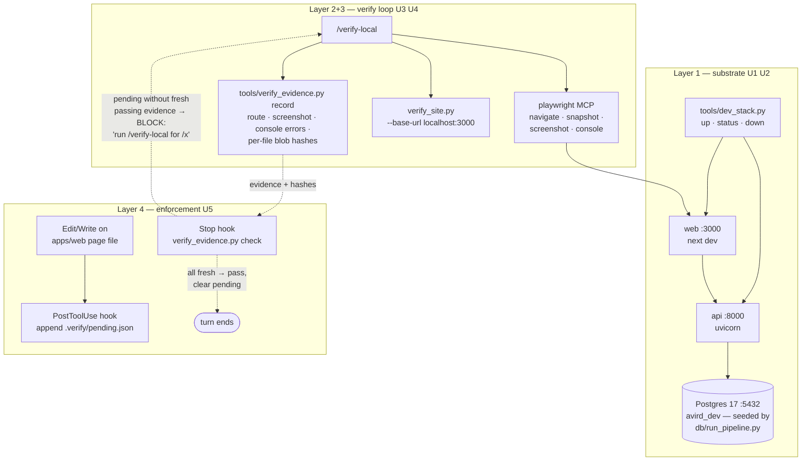

# feat: Local verification pipeline — seeded stack, evidence-backed verify loop, Stop gate

## Summary

Give the agent a complete, prompt-free, local self-validation loop so "done" on website work means **observed working, with evidence** — not "tests pass." Four layers, each backed by the one below: (1) a **substrate** — api + web running against the already-installed native Windows Postgres, seeded with the real NHTSA data by the existing `db/run_pipeline.py`; (2) a **one-action procedure** — a `/verify-local` command that brings the stack up, drives each changed route through the Playwright MCP perception loop, and runs the deterministic `verify_site.py` gate against `localhost:3000`; (3) **evidence artifacts** — per-route records (screenshot, console-error count, content hashes) in a gitignored `.verify/`, so verification is checkable, not claimed; (4) a **deterministic Stop-hook gate** that blocks end-of-turn when page-affecting files changed without fresh passing evidence. The same loop is callable mid-turn whenever the agent wants to reproduce a bug or validate a fix — the gate only bites the agent that skipped it.

No Docker. No Railway dev environment (deferred). Railway prod keeps its existing post-deploy role via `/verify-site`. This is the direct response to the incident captured in the origin doc: verification was expensive, optional, and unverifiable; this plan makes it cheap, one action, and enforced.

---

## Problem Frame

The W1–W2 build shipped ten units and 71 green tests **without ever rendering a page**. The agent had the verification tooling (`/verify-page`, the Playwright plugin) the whole time — what it lacked was (a) a running stack with real data to point the tools at, (b) a frictionless path (every loop step cost a permission prompt), and (c) any mechanism that made skipping impossible. When challenged, it conflated "DB unreachable" (true, Railway-internal) with "can't verify" (false — the browser loop was never blocked), then reached for a throwaway fake-data stub.

The fix is structural, not exhortative. The repo already owns most of the raw material: native Postgres 17/18 services are running locally (`:5432`/`:5433`), the committed NHTSA CSVs (~5 MB) plus `db/run_pipeline.py` rebuild the exact `treated_incident_reports` table the API reads, and the two verification surfaces (`/verify-page` perception loop, `tools/verify_site.py` deterministic gate) exist. What's missing is the orchestration (one-command stack), the seed wiring (local DB + env), the permission allowlist, the evidence contract, and the deterministic gate. The build *workflow* is itself a learning artifact for this project — the guardrail architecture here ("instructions steer, hooks enforce") is part of the deliverable.

---

## Requirements

Traced from the user's two requirements and the origin doc's five guidance items.

- **R1 — Repeatable seeded local stack.** One command brings up api (`:8000`) + web (`:3000`) against a local Postgres seeded with the real data via the existing pipeline; one command tears it down; idempotent re-seed. No per-session temp servers, no fake-data stubs. (origin §1, §2) → U1, U2
- **R2 — The agent validates by observing.** For any page change the agent can render the page in a browser (a11y snapshot + screenshot + console), reproduce a reported bug, see it, fix it, and re-verify the fix — against real data. (user req 1) → U2, U4
- **R3 — Prompt-free loop.** Every command in the loop (stack, seed, evidence, browser tools, local gate) is allowlisted in committed project settings so the loop runs dozens of times without a permission prompt. (user req 2; origin §3) → U2, U4, U5
- **R4 — Evidence, not claims.** Each verified route produces a checkable artifact: screenshot path, console-error count, timestamp, and content hashes of the files that affect the route. "Done" is backed by artifacts the user can review. (origin §4) → U3, U4
- **R5 — Deterministic Stop gate, callable mid-turn.** A Stop hook blocks end-of-turn while any page-affecting change lacks fresh passing evidence for its affected routes; the block message names exactly what to run. Verification debt **persists across sessions** — work that ended a session unverified stays blocked until verified (or explicitly cleared by the user). The same verification is invocable any time during the turn via `/verify-local`. (user decision; origin §4) → U3, U5
- **R6 — Honest blocker separation + documented definition of done.** Docs state plainly: DB-unreachable blocks live-data checks only — render/console/layout checks are never excused; "done" for web work means evidence exists. (origin §5) → U6

---

## Key Technical Decisions

1. **Local-first verification surface; Railway prod stays the post-deploy gate; Railway dev deferred.** The inner loop (reproduce → fix → re-verify) runs at hot-reload speed locally; `/verify-site` against the deployed URL remains the env-fidelity net. A Railway dev environment is deferred until local blind spots actually bite. (user decision)

2. **Native Windows Postgres, no Docker.** PostgreSQL 17 and 18 services are already installed and running locally (`:5432`, `:5433`). Docker would add a Docker Desktop install for marginal parity gains. Target the v17 instance on the default port `5432`; prod is PG 16 — the API's SQL surface (plain SELECT/COUNT/GROUP BY) has no version-sensitive constructs. (user decision; deviates from origin doc's docker-compose suggestion, deliberately)

3. **Full-data seed via the existing pipeline — zero new seed code.** `db/run_pipeline.py` against a local `DATABASE_URL` ingests the committed CSVs (~5 MB) and rebuilds `treated_incident_reports` exactly as prod gets it. Idempotent by design (sha256 ingest guard). A new tiny `local_db_setup.py` only creates the `avird_dev` database if absent; everything downstream is reuse. (user decision; supersedes origin §2's "small slice" — full reuse is simpler and the data is small)

4. **Layered guardrails: cheap → one action → evidence → enforced.** Allowlist + one-command stack make verification cheap (Layer 1); `/verify-local` makes it one named action (Layer 2); `.verify/` artifacts make it checkable (Layer 3); the Stop hook makes it unskippable (Layer 4). The design principle being exercised: **instructions steer, hooks enforce** — anything truly required lives in deterministic code, not markdown. (user-confirmed architecture)

5. **Stop gate, not commit gate — with mid-turn callability and persistent debt.** The gate fires when the agent tries to end its turn. Change tracking comes from a PostToolUse marker: every Edit/Write to a page-affecting web file appends to `.verify/pending.json`; the Stop hook checks pending files against evidence and blocks with an actionable message ("run `/verify-local` for routes X, Y"). Pending entries are **verification debt that persists across sessions** — a session interrupted while blocked leaves its debt in place, and the next session inherits it rather than silently forgiving it (user decision: persistence-as-debt over clear-on-session-start). A user-invoked `pending-clear` escape hatch exists for deliberate write-offs; the agent never invokes it silently. The agent clears the gate by genuinely verifying — the lazy path and the correct path converge. (user decision)

6. **One shared deterministic module; hooks stay thin.** All gate logic — file→route mapping, pending bookkeeping, evidence recording, freshness checking — lives in `tools/verify_evidence.py`, fully pytest-tested. The two hook scripts are thin stdin/stdout wrappers around it, mirroring the existing `format_on_edit.py` posture (never crash, fail open on infrastructure errors, fail **closed** on missing evidence).

7. **Freshness = content hashes, not timestamps.** Evidence records the blob hash (`git hash-object`) of every file affecting the route at verify time. The gate recomputes; any mismatch = stale. Timestamps lie (clock skew, touch); content hashes don't.

8. **File→route mapping by App Router convention.** `apps/web/app/<seg>/page.tsx` → `/<seg>`; `app/page.tsx` → `/`; dynamic segments (`[reportId]`) verify against a representative live row, keyed by the route template; shared files (`layout.tsx`, `components/`, `lib/`, `globals.css`) affect **all** routes. Route inventory is derived by globbing `page.tsx` files — no hand-maintained list. Test files (`*.test.tsx`) are excluded.

9. **The gate reads artifacts; it never drives the browser.** Perception (navigate/snapshot/screenshot/judge) needs the agent + MCP tools and costs tokens; the gate must be deterministic and token-free. So the Stop hook only validates that the artifacts exist, pass, and are fresh — the split mirrors the existing two-layer model (perception loop vs. deterministic gate).

10. **Evidence lives in gitignored `.verify/`.** Screenshots and JSON records are session artifacts for the user to review in-flight, not history. Committing them would bloat the repo; the proof that verification happened lives in the gate having passed. (user-confirmed)

---

## High-Level Technical Design

The loop and the gate, end to end. Solid arrows are the build loop; dashed are the enforcement path. The diagram groups Layers 2 and 3 into a single subgraph — they ship together as the verify loop; the four-layer model in the Summary remains the conceptual structure.



Evidence record shape (directional, one JSON file per route under `.verify/evidence/`):

```
{ route, verified_at, result: pass|fail, console_errors: n,
  screenshot: ".verify/screenshots/<route>.png",
  file_hashes: { "apps/web/app/page.tsx": "<blob-sha>", ... } }
```

Gate decision per pending file: map file → affected routes → for each route, evidence must (a) exist, (b) be `pass`, (c) have `file_hashes` matching current blob hashes for every affecting file, (d) reference a screenshot file that exists. Any miss → block with the exact `/verify-local <route>` commands to run. No pending entries → pass silently — a session that touches no page files adds no pending, so docs-only / api-only sessions never feel the gate unless they inherit unresolved debt from a prior session (deliberate: debt persists until verified or explicitly cleared).

---

## Output Structure

```
tools/
  local_db_setup.py          # create avird_dev if absent (U1)
  dev_stack.py               # up/status/down for api+web (U2)
  verify_evidence.py         # routes/pending/record/check — the shared gate logic (U3)
  tests/
    test_verify_evidence.py  # U3
    test_dev_stack.py        # U2 (pure-logic parts)
.claude/
  hooks/
    mark_web_pending.py      # PostToolUse → pending.json (U5)
    verify_gate.py           # Stop → check + block (U5)
  commands/
    verify-local.md          # the one-action loop (U4)
  settings.json              # MODIFIED: hooks + allowlist (U2/U4/U5)
.verify/                     # gitignored: pending.json, evidence/, screenshots/
```

Modified existing files noted per unit (`.gitignore`, env examples, docs, `apps/web/CLAUDE.md`, `docs/conventions/{stack,workflow}.md`).

---

## Implementation Units

### U1. Local database bootstrap + seed (substrate)

**Goal:** A local `avird_dev` database on the running PG 17 instance, populated with the real `treated_incident_reports` by the existing pipeline, repeatable in one command.

**Requirements:** R1
**Dependencies:** none (first unit). **One-time env update:** the db pipeline's deps (`sqlalchemy`, `psycopg`, `pandas`, `numpy`, `python-dotenv`) live in the separate eda env today, **not** the shared app venv the agent and allowlisted commands run in — extend the shared venv's `requirements.txt` and `uv pip install` per stack.md's documented update procedure before the first seed, or U1's first command fails with ImportError. **One-time user action:** provide local Postgres credentials (the `postgres` password chosen at install) into gitignored `.env` files.
**Files:** `tools/local_db_setup.py` (new), `.env.example` additions (repo root, for the db pipeline), `apps/api/.env.example` (already carries the local example URL — confirm it matches), `docs/conventions/stack.md` (local-stack section)

**Approach:** `local_db_setup.py` connects to the maintenance DB (`postgres`) at `localhost:5432` via psycopg from the shared app venv (see the one-time env update above), checks `pg_database` for `avird_dev`, creates it if absent (PG has no `CREATE DATABASE IF NOT EXISTS`), prints next steps. Seeding is then literally `python db/run_pipeline.py` with `DATABASE_URL=postgresql://postgres:<pw>@localhost:5432/avird_dev` — `db/connection.py` already loads `.env` via dotenv and rewrites the scheme for psycopg v3; the pipeline is idempotent (sha256 ingest guard, treated rebuild). Document the one-time setup + re-seed command in `stack.md`'s local-dev section (the file's own header says conventions land there, nowhere else). Note: the api service (asyncpg) and the pipeline (SQLAlchemy+psycopg) share the same URL value; asyncpg wants the bare `postgresql://` scheme, which is what goes in the env files.

**Patterns to follow:** `db/connection.py` env handling; `db/run_pipeline.py` preflight-ping posture (fail fast, descriptive stderr).

**Test scenarios:** `Test expectation: none — one-time bootstrap script against a live local PG; its effect is proven by U7's end-to-end run (pipeline summary reports treated/canonical row counts > 0).`

**Verification:** `python tools/local_db_setup.py` is idempotent (second run reports "exists"); `python db/run_pipeline.py` exits 0 and reports treated rows; `SELECT COUNT(*) FROM treated_incident_reports` > 0 locally.

---

### U2. Dev-stack orchestration — `tools/dev_stack.py` (substrate)

**Goal:** One command brings api + web up against the seeded local DB with the prod env contract (`DATABASE_URL`, `API_URL`); one command reports health; one tears down. Windows-first.

**Requirements:** R1, R2, R3
**Dependencies:** U1
**Files:** `tools/dev_stack.py`, `tools/tests/test_dev_stack.py`, `.claude/settings.json` (allowlist `Bash(python tools/dev_stack.py:*)`), `.gitignore` (add `.verify/`)

**Approach:** Three subcommands. `up`: load `apps/api/.env` + `apps/web/.env` (simple parse — both apps read plain `os.environ`), spawn `python -m uvicorn app.main:app --port 8000` (cwd `apps/api`) and `npm run dev` (cwd `apps/web`, `API_URL=http://localhost:8000`) as detached processes (Windows: `CREATE_NEW_PROCESS_GROUP`, `npm.cmd`); write PIDs to `.verify/pids.json`; poll `GET :8000/health` and `GET :3000` until 200 or timeout, then print a status block including the DB state from `/health` (so "api up but db down" is visible immediately, honoring R6's blocker separation). `up` when already running = report status, don't double-spawn (check pidfile + ports first). `status`: the polling/reporting half alone. `down`: terminate recorded PIDs (`taskkill /T` on Windows for the npm process tree), clear pidfile. Use `python -m uvicorn` per the Railway-gotchas learning (console scripts unreliable on PATH).

**Patterns to follow:** `tools/verify_site.py` punch-list output style (`[ok]`/`[fail]` lines, non-zero exit on failure); `format_on_edit.py` never-crash posture.

**Test scenarios:**
- Env-file parser: parses `KEY=value`, ignores comments/blank lines, does not override an already-set environ key.
- Health-poll logic: returns ok on 200, fail after timeout (mock the HTTP call, no real server).
- `up` with a live pidfile + responding ports → reports already-running, spawns nothing (spawn function mocked).
- `down` with a stale pidfile (process gone) → cleans up without raising.
- Status output: one `[ok]`/`[fail]` line per service, exit non-zero when either is down.

**Verification:** `python tools/dev_stack.py up` from a cold start → both ports healthy, `/health` reports `db: ok`; `/` renders real incident rows in a browser; `down` leaves no orphaned `node`/`python` processes listening on 3000/8000.

---

### U3. Evidence contract — `tools/verify_evidence.py` (the shared gate logic)

**Goal:** One tested module owning the deterministic half of the system: route inventory, file→route mapping, pending bookkeeping, evidence recording, freshness checking. Hooks and the skill both call it; nothing else reimplements its rules.

**Requirements:** R4, R5
**Dependencies:** none (parallel with U1/U2)
**Files:** `tools/verify_evidence.py`, `tools/tests/test_verify_evidence.py`, `.claude/settings.json` (allowlist `Bash(python tools/verify_evidence.py:*)`)

**Approach:** Subcommands consumed by hooks/skill: `routes` (glob `apps/web/app/**/page.tsx` → route list, App Router mapping per KTD 8); `affected <file>` (file → routes; shared files → all); `pending-add <file>` (append unique to `.verify/pending.json`; no-op for non-page-affecting paths — this is the *only* filter, so the PostToolUse hook stays dumb); `pending-routes` (the routes the gate currently wants); `record --route R --screenshot P --console-errors N --result pass|fail` (write the evidence JSON with current blob hashes of all affecting files — hash via `git hash-object` of working-tree content); `pending-clear` (explicit user-invoked write-off of all pending debt — the escape hatch per KTD 5; the agent never runs it silently); `check [--clear-satisfied]` (the gate decision per the High-Level Technical Design (HTD) rules: exists + pass + hashes match + screenshot file exists; emits a human-readable block message listing exact `/verify-local <route>` commands, machine exit code). Dynamic route templates (`/incidents/[reportId]`) are first-class route keys; `record` accepts the template plus the concrete sample URL used.

**Patterns to follow:** `verify_site.py` module shape (dataclass results, punch-list lines, argparse, pure functions testable without I/O); editable-assertion posture (route mapping rules in one obvious place at the top).

**Test scenarios:**
- Mapping: `app/page.tsx` → `/`; `app/groupings/page.tsx` → `/groupings`; `app/incidents/[reportId]/page.tsx` → `/incidents/[reportId]`; `app/components/Nav.tsx` and `app/layout.tsx` and `app/lib/api.ts` → all routes; `app/page.test.tsx` → no routes; `apps/api/app/main.py` → no routes.
- Pending: add is idempotent (same file twice = one entry); non-affecting file is a no-op; `pending-routes` unions routes across pending files.
- Pending persists across process invocations — no implicit reset; `pending-clear` empties it explicitly.
- Record/check happy path: record pass evidence for all pending routes → `check` passes and `--clear-satisfied` empties pending.
- Freshness: after recording, modify an affecting file → `check` blocks that route only, names it in the message.
- Shared-file invalidation: evidence fresh for all routes, then edit `layout.tsx` → all routes stale.
- Failure paths: evidence with `result: fail` blocks; missing screenshot file blocks; missing evidence file blocks; empty pending → check passes with no output.
- Block message contains the literal `/verify-local <route>` string for each blocked route.

**Verification:** `pytest tools/tests/test_verify_evidence.py` green; manual smoke: `pending-add` a page file, `check` exits non-zero with an actionable message, `record` + `check --clear-satisfied` exits 0.

---

### U4. `/verify-local` — the one-action loop (skill)

**Goal:** A single command the agent (or user) runs to verify changed routes end to end: ensure stack → drive each route through the Playwright MCP perception loop → record evidence → run the deterministic local gate → punch-list summary.

**Requirements:** R2, R3, R4
**Dependencies:** U2, U3
**Files:** `.claude/commands/verify-local.md`, `.claude/settings.json` (allowlist the playwright plugin's MCP browser tools so the loop is prompt-free — server-level allow), `docs/conventions/workflow.md` (command table row; fuller doc model in U6)

**Approach:** The command instructs the agent to: (1) target routes from args, else `verify_evidence.py pending-routes`, else all routes; (2) `dev_stack.py up` (no-op if running) and confirm `/health` shows `db: ok` — if db is down, say so and continue with render-only expectations (R6: a data blocker never excuses render checks); (3) per route, run the existing `/verify-page` steps (navigate → a11y snapshot → screenshot to `.verify/screenshots/` → console messages → compare to intent), choosing a concrete sample URL for dynamic templates by taking the first detail link from the rendered list page; (4) `verify_evidence.py record` with the honest result — **record `fail` evidence when findings exist**, fix, re-run, and only then record `pass`; (5) finish with `python tools/verify_site.py --base-url http://localhost:3000` and print a combined punch list. Reuses `/verify-page`'s loop body by reference rather than duplicating its prose. Notes first-run `npx playwright install` and that `WEB_URL`-style remote targets are out of scope here (that's `/verify-site` on prod).

**Patterns to follow:** `.claude/commands/{verify-page,ship}.md` shape (frontmatter description, numbered steps, output contract, comparison table to sibling commands).

**Test scenarios:** `Test expectation: none — agent procedure (markdown); its deterministic substrate is tested in U2/U3, and the procedure itself is acceptance-tested by U7's drill.`

**Verification:** From a state with one pending changed page: `/verify-local` brings the stack up if needed, produces a screenshot + evidence JSON for that route, `verify_site.py` passes against localhost, and a subsequent `verify_evidence.py check` exits 0.

---

### U5. Enforcement hooks — pending marker + Stop gate

**Goal:** The two thin hooks that make the contract mandatory: every page-affecting Edit/Write is marked pending; ending the turn with unverified pending changes is blocked with an actionable message.

**Requirements:** R3, R5
**Dependencies:** U3
**Files:** `.claude/hooks/mark_web_pending.py`, `.claude/hooks/verify_gate.py`, `.claude/settings.json` (register both hooks; allowlist their invocations like the existing format hook)

**Approach:** `mark_web_pending.py` (PostToolUse, `Edit|Write` matcher — registered alongside, not inside, the existing format hook entry): read payload, extract file path, delegate to `verify_evidence.py pending-add` (in-process import, not subprocess, for speed); silent, never blocks, fail-open on infrastructure errors — exactly `format_on_edit.py`'s posture. `verify_gate.py` (Stop): read payload; **respect the loop-prevention flag** (when the payload indicates the stop was already triggered by this hook — `stop_hook_active` — allow the stop to avoid infinite block loops; confirm exact field name against current Claude Code hook docs at build); run `check`; on failure emit the block per the current Stop-hook contract (confirm at build: exit code 2 + stderr, or JSON `{"decision": "block", "reason": ...}`) with the message from U3 naming the exact `/verify-local` commands; on success, `--clear-satisfied` and allow. Fail **closed** on missing/stale evidence, fail **open** on unexpected infrastructure errors (a broken gate must not brick every session — log loudly instead).

**Patterns to follow:** `format_on_edit.py` (stdin payload parse, REPO_ROOT resolution, never-crash wrapper, narrow path scoping); existing `settings.json` hook registration shape.

**Test scenarios:** (thin-wrapper logic only — gate rules are U3's tests)
- Payload with an `apps/web/app` page file → pending-add called with that path; payload with `docs/foo.md` → no-op.
- Malformed/empty stdin payload → exit 0, no crash (both hooks).
- Stop payload with the loop-prevention flag set → allows immediately without running check.
- Check-fail path → block emitted in the documented contract shape, message includes `/verify-local`.
- Check-pass path → allows and pending is cleared.

**Verification:** Live drill (precursor to U7): edit a page file, attempt to end the turn → blocked with the actionable message; run `/verify-local` → next stop passes. Docs-only edit → stop never blocked.

---

### U6. Documentation — definition of done, three-surface model, honest blockers

**Goal:** The conventions docs teach the loop: what "done" means for web work, when each verification surface applies, and that a data-layer blocker never excuses render checks.

**Requirements:** R6
**Dependencies:** U1–U5 (documents what they built)
**Files:** `docs/conventions/workflow.md` (rewrite the two-layer section as three surfaces: `/verify-local` build loop + local gate, Stop-gate enforcement, `/verify-site` post-deploy; command table rows; hooks table rows), `docs/conventions/stack.md` (local stack: DB setup, seed, dev_stack, ports), `apps/web/CLAUDE.md` (definition of done: evidence in `.verify/`, gate behavior, blocker separation), root `CLAUDE.md` (one-line pointer if needed — stays short per its own rule)

**Approach:** Keep each doc's existing structure and voice; extend tables rather than inventing new formats. The web CLAUDE.md gets the sharpest statement since it's what an agent loads when touching pages: *done = fresh passing evidence for every changed route; the Stop gate enforces this; DB down blocks live-data assertions only — render/console checks still required.* Cross-link the origin learning doc as the why.

**Test scenarios:** `Test expectation: none — prose. U7's drill validates the documented procedure matches reality.`

**Verification:** A fresh agent session pointed at `apps/web/CLAUDE.md` can run the full loop from docs alone (no tribal knowledge); every command/hook in the tables exists and is allowlisted.

---

### U7. Acceptance drill — re-run the incident against the gate

**Goal:** Prove the pipeline end to end by deliberately replaying the failure mode it exists to prevent, and capture the result as the phase's compounding artifact.

**Requirements:** R1–R6 (acceptance)
**Dependencies:** U1–U6
**Files:** `docs/solutions/workflow-issues/agent-shipped-website-without-running-verification-loop.md` (append a resolution note), `docs/writeups/` entry (per repo convention, end-of-phase writeup)

**Approach:** Scripted drill, executed live: (1) cold start — `local_db_setup` + seed + `dev_stack up` from nothing, timing it; (2) make a visible page change (e.g., tweak a heading) and attempt to end the turn **without** verifying → the Stop gate must block, naming the route; (3) run `/verify-local` → evidence lands, gate passes; (4) introduce a deliberate bug a unit test won't catch (e.g., a console error or broken layout), run `/verify-local` → the loop must *find* it (fail evidence), fix it, re-verify → pass; (5) confirm a docs-only session never trips the gate. Record outcomes, friction points, and any permission prompt that still fired (each one is a defect against R3) in the writeup; append the resolution note to the origin learning doc.

**Test scenarios:** `Test expectation: none — this unit IS the acceptance test of the whole pipeline.`

**Verification:** All five drill steps behave as specified; zero permission prompts during the loop; writeup committed; origin doc carries the resolution note.

---

## Scope Boundaries

**In scope:** everything above — local substrate, evidence contract, skill, hooks, allowlist, docs, acceptance drill.

**Deferred to follow-up work**
- **Railway dev environment** as a pre-deploy staging gate — revisit if local/prod drift produces bugs the local loop can't catch. (user decision)
- **Gate scope beyond web pages** — api-only changes currently don't trip the gate (unit tests + the web loop exercising the API cover them); extend the mapping if api regressions slip through.
- **verify_site needle updates in the gate** — the Stop gate doesn't run `verify_site.py` itself (it's artifact-only, KTD 9); if needle drift becomes a problem, `/verify-local`'s step 5 already catches it locally.
- **Token-efficiency evolution** (Playwright CLI + on-disk snapshots) and **Chrome DevTools MCP** (perf/CWV) — unchanged from the W1–W2 plan's deferral.

**Outside this work's identity**
- No Docker, no docker-compose (deviates from origin doc §1 deliberately — native PG is already running).
- No new product pages, routes, or API endpoints.
- No CI integration of the browser loop (deterministic `verify_site.py` remains the CI-shaped gate; the perception loop is agent-time).
- No screenshot-diff/visual-regression tooling — the agent judges screenshots; pixel-diff infra is out.

---

## Risks & Dependencies

- **Stop-hook contract drift.** The exact payload field for loop prevention and the block-response shape must be confirmed against current Claude Code docs at U5 build time (noted in-unit). Getting loop prevention wrong = infinite block loop; the fail-open-on-infrastructure-error posture is the backstop.
- **Evidence honesty gap.** The perception step is agent-judged; an agent could `record pass` without genuinely looking. Mitigations: the recorder requires a screenshot file that must exist (gate checks), console count comes from a real MCP call in the procedure, and the user reviews `.verify/` artifacts. Accepted for a POC — the gate guarantees the loop *ran*, the artifacts let the user audit *how well*.
- **Windows process management.** Detached `npm run dev` trees can orphan on Windows. `taskkill /T`, pidfile hygiene, and `up`'s already-running check are the mitigations; U2 tests the stale-pidfile path.
- **Two local PG versions vs prod PG 16.** Targeting v17 on `:5432`; the API's SQL is version-insensitive, and `/verify-site` on prod remains the fidelity net. If `:5432` turns out to be the v18 instance (port assignment unverified), adjust the documented URL — `local_db_setup.py` should print the server version it connected to.
- **`next dev` vs production build.** The dev server skips prod-build failures (prerender errors, etc.). Accepted: Railway's build + `/verify-site` cover that class; the local loop's job is render/behavior/console.
- **Playwright environment.** First run needs `npx playwright install`. If the browser can't launch, the gate still blocks unverified work (correct behavior) — the block message should distinguish "no evidence" from "tooling broken" so the user can intervene rather than the agent faking it.
- **Hook latency.** `mark_web_pending` runs on every Edit/Write; it must stay milliseconds (path-filter first, import-not-subprocess), or it degrades the edit loop the way permission prompts degraded verification.
- **Local credentials.** `DATABASE_URL` with a real local password lives only in gitignored `.env` files (`.env` already ignored); `.env.example` keeps placeholders.

---

## Open Questions (deferred to implementation)

- Exact current Stop-hook payload/response contract (loop-prevention field name; exit-2-stderr vs JSON decision) — confirm at U5 build.
- Where the playwright plugin's `browser_take_screenshot` writes by default, and whether it accepts a target path — determines whether `/verify-local` moves files into `.verify/screenshots/` or records the plugin's path as-is (U4).
- Whether `pending.json` should also track deletions/renames of page files (probably: a deleted page should drop its pending entries and its evidence) (U3).
- Precise allowlist string for the playwright plugin's MCP tools (server-level wildcard vs per-tool entries) (U4).
- Whether `dev_stack.py up` should auto-run the seed when `treated_incident_reports` is empty, or just say so (lean: say so — seeding is loud and belongs to U1's command) (U2).

---

## Sources & Research

**Origin and grounding (all read during planning):**
- Origin: `docs/solutions/workflow-issues/agent-shipped-website-without-running-verification-loop.md` — the incident, the five guidance items (this plan implements all five, swapping docker-compose for native PG per user decision).
- Prior plan: `docs/plans/2026-06-05-001-feat-website-mvp-w1-w2-plan.md` — built `/verify-page` (U6 there) and `verify_site.py` extensions (U10) that this plan composes rather than replaces.
- Environment recon (this session): no Docker on the machine; PostgreSQL 17 + 18 Windows services running, listening on `:5432`/`:5433`, `psql.exe` present under `C:\Program Files\PostgreSQL\{17,18}\bin`; committed NHTSA CSVs total ~5 MB; `.env` already gitignored.
- Reused machinery: `db/run_pipeline.py` (idempotent create→ingest→build→manifest CLI), `db/connection.py` (dotenv + psycopg-v3 scheme rewrite), `tools/verify_site.py` (deterministic gate, takes any `--base-url`), `.claude/commands/verify-page.md` (perception loop body), `.claude/hooks/format_on_edit.py` (hook posture to mirror), `.claude/settings.json` (existing allowlist + hook registration shapes).
- Conventions honored: `docs/conventions/stack.md` (env contract, single-source rule), `docs/conventions/workflow.md` (command/hook tables), `docs/solutions/tooling-decisions/railway-monorepo-deploy-gotchas-2026-05-05.md` (`python -m` invocation rule, applied to dev_stack).

**External research:** none run — the design composes existing repo machinery with Claude Code hook/skill mechanics; the one external contract (current Stop-hook payload shape) is deliberately deferred to U5 build time as an open question rather than assumed here.
