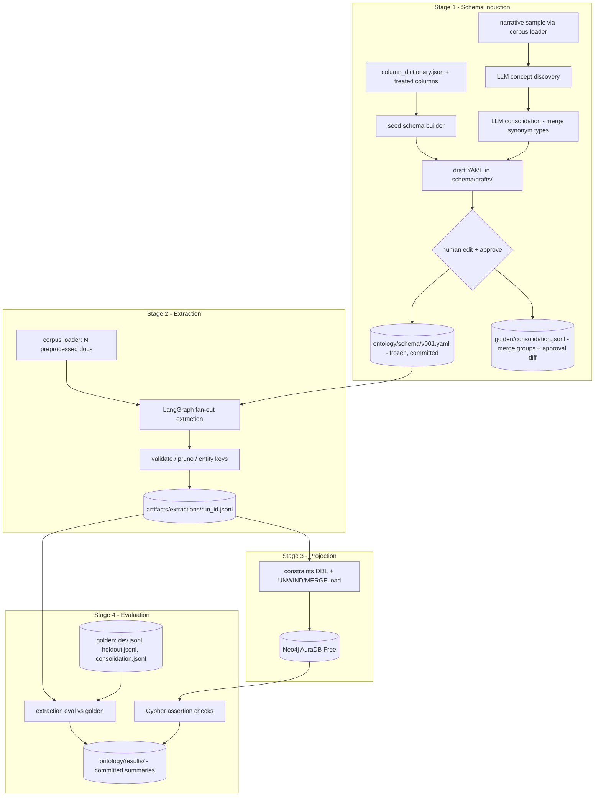

# feat: End-to-end ontology pipeline over NHTSA SGO crash data

## Summary

Build an `ontology/` track that induces a property-graph ontology schema (YAML artifact) from the SGO structured columns plus LLM concept discovery over crash narratives, extracts schema-conforming entity/relationship instances with a LangGraph pipeline (corpus size parameterized, default n=100), projects them into Neo4j AuraDB Free, and proves quality with a hand-corrected golden dataset and per-stage metrics.

---

## Problem Frame

This is a learning track: practice ontology engineering end to end on real data so the approach transfers to other domains (work uses LangGraph + OCI; the closest free equivalents are LangGraph + Neo4j AuraDB). The SGO dataset is well suited — a few thousand incidents mixing structured columns (a natural seed schema) with free-text narratives (a real unsupervised-discovery problem). Success must be provable: every stage emits metrics rooted in a golden dataset or mechanical checks, so "the ontology works" is a number, not a vibe. Code must stay simple enough to read, understand, and re-apply.

---

## Requirements

**Schema induction**

- R1. A YAML ontology schema artifact defines node types, relationship types, properties, and `(source, RELATIONSHIP, target)` patterns — property-graph semantics, not RDF/OWL.
- R2. The schema derives from two sources with per-type provenance: a deterministic seed from structured columns, and LLM concept discovery over a narrative sample.
- R3. A human approval gate sits between draft and frozen schema; extraction runs only against a frozen, versioned schema.
- R4. The schema carries 10–20 competency questions, used later as a schema-level metric.

**Extraction and storage**

- R5. A LangGraph pipeline extracts entity/relationship instances conforming to the frozen schema from N narratives (N parameterized, default 100, full-corpus capable).
- R6. Every narrative-extracted entity/relationship carries a supporting quote verified against the preprocessed narrative after deterministic normalization (casefold, whitespace collapse, punctuation folding); unsupported quotes drop as `hallucination` and near-misses as `quote_mismatch`, under separate counters, never ingested.
- R7. Extraction output persists as a durable JSONL artifact on disk; Neo4j is a rebuildable projection of that artifact, never the source of truth.
- R8. Instances load into Neo4j AuraDB Free via idempotent batched MERGE behind uniqueness constraints; a full rebuild after instance pause/deletion is one command and pays only for LLM cache misses.

**Evaluation**

- R9. A golden dataset of 40–50 stratified, human-corrected narratives exists with versioned annotation guidelines and a dev/held-out split.
- R10. Extraction metrics vs. golden, scored over narrative-provenance instances only: entity and relationship precision/recall/F1 under strict and relaxed matching, plus hallucination, quote-mismatch, omission, and direction-error rates.
- R11. Schema metrics: competency-question answerability and golden-mention coverage, computed as mapped / (mapped + `UNMAPPED`).
- R12. Graph metrics: schema/constraint conformance, orphan rate, and cardinality assertions, all as re-runnable Cypher checks.
- R13. Every pipeline stage writes JSONL run records (run id, git SHA, schema/prompt/model versions, data snapshot, cache hits vs. paid calls, drops/corrections, retries, latency, tokens); metric summaries are committed to the repo.
- R16. The consolidation stage is golden-evaluated: human-corrected merge groups (`ontology/golden/consolidation.jsonl`, produced during the schema-approval pass) score the LLM's proposed merges as pairwise precision/recall/F1, and each schema version records a draft-vs-approved approval diff (types added/dropped/renamed).

**Workflow and conventions**

- R14. All paid LLM calls are content-address cached (sha256 of the fully rendered prompt + model id) with incremental persistence; `--dry-run` and `--limit` preflight supported.
- R15. `ontology/CLAUDE.md` follows the repo's progressive-disclosure convention; new env vars are registered in `docs/conventions/stack.md`; tests are hermetic (stubbed LLM and Neo4j, no network, no credentials).

---

## Key Technical Decisions

- **Extraction artifact is the source of truth; Neo4j is a disposable projection.** AuraDB Free pauses after 72h idle and is deleted after extended pause, with no backups. Persisting per-document extractions to `ontology/artifacts/extractions/` means eval never depends on the live graph and rebuilds are free.
- **YAML schema mirrors the neo4j-graphrag `GraphSchema` shape** (`node_types` / `relationship_types` / `patterns`), extended with `provenance` (column vs. narrative), `competency_questions`, and `version`. No interchange standard exists; this shape is the closest practical convention, gives a free reference implementation to compare against, and transfers to other domains. YAML over JSON: it is a hand-edited approval artifact and benefits from comments.
- **Hand-rolled extraction, not `LLMGraphTransformer`.** The off-the-shelf transformer black-boxes the three things being learned (prompt design, schema-constrained structured output, graph write patterns), drags in heavy deps, and gives no control over MERGE keys. Raw `neo4j` driver + Pydantic structured output is less surface area. Skim its prompt as prior art.
- **Two-phase induction with a human gate** (literature consensus: seed-then-discover, consolidate, human approval before freezing). Approval mechanics are files + git: drafts live in `ontology/schema/drafts/`; the human edits, saves as `ontology/schema/v001.yaml`, and commits. Extraction refuses to load from `drafts/`. The approval pass doubles as a labeling pass: corrected merge groups land in `ontology/golden/consolidation.jsonl`, making the HITL gate itself a measured stage (R16).
- **Structured-column entities are instantiated deterministically (no LLM); narrative extraction adds to them.** Incident, company, and vehicle facts already live in columns — paying an LLM to re-derive them would be both wasteful and less accurate. The LLM extracts only what narratives add.
- **Corpus source: `treated_incident_reports`, canonical rows only** (`is_latest_of_multiple_report = TRUE`), merged narrative column with fallback to `Narrative`, entity grouping via `master_entity`. Raw CSVs lack dedupe flags and `master_entity` — they are not an alternative source. Run records pin the treated table's `built_at`/`source_batch_ids` snapshot.
- **Stable node keys.** Incident: `Same Incident ID`, else canonical `Report ID`. Vehicle: subject vehicle by VIN when present, else `incident_key + ':SV'`; any other vehicle (narrative-extracted or seeded from crash-partner columns) without a VIN gets `incident_key + ':V' + ordinal` — partner vehicles must never collide with the subject vehicle's key. Company: `master_entity`. Narrative-only entities (pedestrian, cyclist, object): scoped per incident as `incident_key + label + ordinal`. No cross-document resolution of narrative mentions — exact-match on canonical keys first; escalate only if dedup metrics demand it.
- **LLM cache key = sha256(fully rendered prompt) + model id,** persisted incrementally per call. The rendered prompt embeds the document text, the schema-derived structure, and the task, so discovery and extraction calls over the same narrative never collide, and any schema or prompt change invalidates by content rather than by trusting a human-declared version label (full re-extraction ≈ low single-digit dollars on Haiku). Version labels and the schema file's content hash go in run records as a tamper check. Inherit the embeddings-cache pattern but fix its documented bugs: end-of-run-only persistence, timeout errors not classed transient, `max_retries=0` returning `None`.
- **Models: `claude-haiku-4-5` for extraction and discovery; a Sonnet-class model for golden pre-labeling** (stronger and different from the pipeline model, reducing correlated bias). Structured output via `with_structured_output(method="json_schema")` (langchain-anthropic ≥1.1), falling back to default tool-calling if model support is an issue. Keep extraction Pydantic models flat — nested schemas measurably degrade quality.
- **Schema-change policy:** graph is wiped and rebuilt per schema version; cache misses by design; the golden set gets a v(N)→v(N+1) label-mapping pass with human spot-check rather than full re-annotation (the most expensive invalidation is human time).
- **Instrumentation: JSONL run records as the durable system of record; LangSmith tracing optional** (env-var toggle, free tier, 14-day retention). Traces debug individual runs; committed metric summaries are the evidence that outlives them.
- **Version pins:** `langgraph>=1.2,<2.0`, `langchain-anthropic>=1.1,<2.0`, `neo4j>=6.0,<7.0`, `pydantic>=2.7,<3`, `pyyaml>=6.0`. Dedicated uv env (`avird-2026-ontology`); use Python 3.12.
- **No LangGraph checkpointer.** Batch one-shot runs don't need persistence/resume; the LLM cache plus idempotent MERGE provide cheap re-runnability. Concurrency capped (~4–5) via `max_concurrency` against the ~50 RPM tier-1 limit, with backoff on 429.

---

## High-Level Technical Design

### Pipeline data flow



### Stage handoff matrix

| Stage | Consumes | Produces | Location | Committed? |
|---|---|---|---|---|
| Corpus load + preprocess | `treated_incident_reports` (Postgres) | preprocessed docs, skip log | in-memory / run record | no |
| Seed schema | `docs/avird-sgo-database-data-dictionary/column_dictionary.json` | seed draft YAML | `ontology/schema/drafts/` | yes |
| Concept discovery | narrative sample, seed draft | merged draft YAML | `ontology/schema/drafts/` | yes |
| Human approval | draft YAML | frozen schema | `ontology/schema/v001.yaml` | yes |
| Consolidation golden (same approval pass) | proposed merge groups | `consolidation.jsonl`, approval diff | `ontology/golden/` | yes |
| Extraction | frozen schema, corpus, LLM cache | extraction JSONL, run records | `ontology/artifacts/` | no (gitignored) |
| Graph load | extraction JSONL | property graph | AuraDB (external) | n/a |
| Golden build | corpus sample, frozen schema | golden JSONL, guidelines | `ontology/golden/` | yes |
| Evaluation | extraction JSONL, golden, graph | metric summaries | `ontology/results/` | yes |

### Schema lifecycle

Draft (generated, editable) → frozen `v001.yaml` (committed; extraction/golden/eval all reference it by version) → revision creates `v002.yaml`, triggering: cache misses by design, graph wipe-and-rebuild, golden label-mapping pass with spot-check. Frozen schema files are never edited in place.

---

## Output Structure

```text
ontology/
  CLAUDE.md            # progressive-disclosure index: env, run order, sharp edges
  corpus.py            # treated-table loader, preprocessing, stable doc keys
  schema_model.py      # Pydantic models for the YAML schema; load/validate
  seed_schema.py       # deterministic seed schema from structured columns
  discover.py          # LangGraph graph 1: concept discovery + consolidation
  llm.py               # client factory, content-addressed cache, retries
  extract.py           # LangGraph graph 2: fan-out extraction
  prune.py             # quote verification, label/pattern pruning, entity keys
  graph_load.py        # Neo4j constraints, idempotent MERGE load, reset, preflight
  golden.py            # stratified sampling, pre-label, split management
  evaluate.py          # extraction/schema/graph metrics, run-record summaries
  run_pipeline.py      # CLI orchestrator (stage flags, --limit, --dry-run, --reset --yes)
  schema/
    drafts/            # generated drafts (committed for review history)
    v001.yaml          # frozen schema (committed)
  golden/
    guidelines.md      # versioned annotation guidelines
    consolidation.jsonl # merge-group golden labels (produced during schema approval)
    dev.jsonl          # ~10 docs, prompt-iteration set
    heldout.jsonl      # ~30+ docs, final-numbers-only set
  results/             # committed metric summaries per eval run
  artifacts/           # gitignored: extractions/, cache/, runs/
  tests/
    conftest.py        # sys.path insert + stub LLM/Neo4j fixtures
    test_*.py
```

The tree is a scope declaration; per-unit `Files` lists are authoritative.

---

## Implementation Units

### U1. Scaffold the ontology workspace and environment

- **Goal:** `ontology/` exists with env, secrets wiring, CLAUDE.md, and conventions registered repo-wide.
- **Requirements:** R15
- **Dependencies:** none
- **Files:** `ontology/CLAUDE.md`, `ontology/tests/conftest.py`, `docs/conventions/stack.md` (env-var table), `CLAUDE.md` (link in layout + "Where to look next"), `.gitignore` (`ontology/artifacts/`)
- **Approach:** Create the uv env `avird-2026-ontology`: try Python 3.12 first; Install pinned deps from Key Technical Decisions. Add `ANTHROPIC_API_KEY`, `NEO4J_URI`, `NEO4J_USERNAME`, `NEO4J_PASSWORD` to the root gitignored `.env` (dotenv try-import pattern from `db/connection.py`); register them in `stack.md`. Provision AuraDB Free via console.neo4j.io and record the console-displayed node/relationship limits in `ontology/CLAUDE.md` (sources conflict: 200K/400K vs 50K/175K). CLAUDE.md mirrors `eda/CLAUDE.MD`: env-activation block, module-placement rule, run-order quick reference, sharp edges (AuraDB pause behavior, cache semantics).
- **Patterns to follow:** `eda/CLAUDE.MD` structure; `eda/tests/conftest.py` sys.path insertion; `apps/api/.env.example` placeholder style.
- **Test scenarios:** Test expectation: none — scaffolding; `conftest.py` is exercised by every later unit's tests.
- **Verification:** `python -c "import langgraph, neo4j, pydantic, yaml"` succeeds in the env; root CLAUDE.md and stack.md updated; AuraDB instance reachable from a throwaway connectivity check.

### U2. Corpus loader and narrative preprocessing

- **Goal:** Deterministic corpus access: canonical incident rows, cleaned narrative text, stable document keys, skip handling.
- **Requirements:** R5 (corpus half), R14 (`--limit`), feeds R2/R9
- **Dependencies:** U1
- **Files:** `ontology/corpus.py`, `ontology/tests/test_corpus.py`
- **Approach:** Load from `treated_incident_reports` filtered to `is_latest_of_multiple_report = TRUE` (reuse the `db/connection.py` engine pattern; add `db/` and `eda/` to `sys.path` the way `db/` modules import `eda_utils_*`). Narrative text: `Narrative - Same Incident ID` falling back to `Narrative`. Preprocess: split on / strip the `--- next report ---` separator, detect whole-cell redaction via `eda_utils_sgo.is_redacted` → mark doc `skipped_redacted` (no LLM spend; structured entities still flow through), strip inline `[XXX]` spans, then normalize whitespace (strip leading/trailing, collapse internal runs left behind by span removal — deterministic, since this text is what quotes verify against and what the cache keys on), flag (don't chunk) unusually long merged narratives. Document key: `Same Incident ID` when present, else canonical `Report ID`. The loader accepts an explicit doc-key list in addition to `--limit` (used by extraction's `--include-golden`). Carry `master_entity` and the structured columns the seed schema instantiates. Capture `built_at`/`source_batch_ids` for run records. Defensive `_safe_col` access throughout.
- **Patterns to follow:** `eda/eda_utils_sgo.py`, `eda/eda_utils_dedupe.py` (do not re-derive identity logic), `eda/eda_utils_targets.py` `_safe_col`.
- **Test scenarios:** separator removed from merged narrative; whole-cell redacted cell → `skipped_redacted` with reason, not an empty string sent onward; inline `[XXX]` stripped; trailing whitespace stripped and double spaces left by span removal collapsed; a doc whose text is empty/whitespace-only after cleaning → skipped with reason, never sent to the LLM; merged column missing → falls back to `Narrative`; missing `Same Incident ID` → key falls back to `Report ID`; `--limit 5` returns exactly 5 docs deterministically (stable ordering); an explicit doc-key list returns exactly those docs; preprocessed text is byte-identical across two runs (cache-key stability).
- **Verification:** Run against the real DB: ~2,300 canonical docs (2,344 at the 2026-03-16 snapshot; 3,120 total treated rows), plausible skip counts logged, spot-check three narratives.

### U3. Schema model and deterministic seed schema

- **Goal:** The YAML schema format exists as validated Pydantic models, and a seed schema generates deterministically from structured columns.
- **Requirements:** R1, R2 (seed half), R4 (competency-question slots)
- **Dependencies:** U1
- **Files:** `ontology/schema_model.py`, `ontology/seed_schema.py`, `ontology/schema/drafts/seed.yaml` (generated), `ontology/tests/test_schema_model.py`, `ontology/tests/test_seed_schema.py`
- **Approach:** Pydantic v2 models mirroring neo4j-graphrag `GraphSchema` keys — `node_types` (label, description, properties with name/type/required), `relationship_types`, `patterns` as source/relationship/target triplets — plus `version`, `provenance` per type (`column` | `narrative`), and `competency_questions`. `model_config = ConfigDict(extra="forbid")`; load via `yaml.safe_load`; guard empty-file `None`; quote ambiguous scalars (YAML 1.1 `no`/`off`/dates). Seed builder reads `docs/avird-sgo-database-data-dictionary/column_dictionary.json` plus treated-column knowledge to propose node types (directional: Incident, Vehicle, Company, Location, environmental conditions) and patterns — exact type inventory is an implementation-time decision made by reading the columns. Competency questions are hand-written into the draft during U4 review. `model_json_schema()` later feeds structured output, closing the YAML → Pydantic → Claude loop.
- **Patterns to follow:** treat `eda/context/data_dictionary.csv` definitions as heuristic — spot-check before encoding into descriptions.
- **Test scenarios:** YAML round-trip (load → dump → load) is lossless; misspelled key rejected by `extra="forbid"`; pattern referencing an undeclared node/relationship type rejected by a model validator; generated seed validates against the model; unquoted `no`-style scalar in a fixture surfaces as a type error (Norway-problem guard); empty YAML file raises a clear error.
- **Verification:** `seed.yaml` generated, validates, and reads sensibly to a human.

### U4. Concept discovery and schema consolidation (LangGraph graph 1)

- **Goal:** LLM discovery proposes narrative-only types with example mentions; consolidation merges synonyms; output is a reviewable draft that a human freezes as `v001.yaml`, with the merge decisions captured as a consolidation golden set.
- **Requirements:** R2 (narrative half), R3, R14, R16
- **Dependencies:** U1, U2, U3
- **Files:** `ontology/discover.py`, `ontology/llm.py`, `ontology/schema/drafts/v001-draft.yaml` (generated), `ontology/golden/consolidation.jsonl`, `ontology/tests/test_discover.py`, `ontology/tests/test_llm.py`
- **Approach:** `llm.py` owns the shared client factory (ChatAnthropic, `claude-haiku-4-5`, structured output), the content-addressed cache (key per Key Technical Decisions, incremental per-call persistence under `ontology/artifacts/cache/`), retry with backoff (fixing the embeddings-pattern bugs: classify timeouts as transient, `max_retries=0` raises), and `--dry-run` counting. `discover.py` is a small StateGraph: sample narratives (a few hundred, stratified) → per-narrative discovery emitting candidate node/relationship types with example mentions (structured output) → aggregate → consolidation pass (LLM merges synonym types, emitting proposed merge groups as a structured artifact; embedding clustering only if merge proves insufficient — start without it) → write `ontology/schema/drafts/v001-draft.yaml` merging seed + discovered types with provenance. Human approval: edit the draft, add competency questions, save as `ontology/schema/v001.yaml`, commit — and in the same pass, correct the proposed merge groups into `ontology/golden/consolidation.jsonl` (the consolidation golden, R16) and record the draft-vs-approved approval diff (types added/dropped/renamed). Loaders refuse paths under `drafts/` for extraction.
- **Patterns to follow:** `eda/tests/conftest.py` `StubInferenceClient` (deterministic stub with failure injection); `docs/solutions/architecture-patterns/narrative-embeddings-pipeline-2026-05-18.md` cache pattern with its documented fixes.
- **Test scenarios:** stubbed discovery over three narratives aggregates candidate types; consolidation merges two synonym candidates into one (stub returns the merge); draft output marks discovered types `provenance: narrative` and seed types `provenance: column`; second identical call is a cache hit (stub client records zero calls); any change to the rendered prompt (prompt revision or schema change) changes the cache key (stub called again); proposed merge groups are emitted in the structured shape the consolidation eval scores; injected transient failure retries then succeeds; injected permanent failure raises after `max_attempts`; `max_retries=0` raises rather than returning `None`; interrupting after doc 2 of 3 (simulated) leaves docs 1–2 persisted in cache; extraction-schema loader rejects a `drafts/` path.
- **Verification:** Real run over the sample completes within budget (`--dry-run` first); draft is human-readable; you approve and commit `v001.yaml`.

### U5. Extraction pipeline (LangGraph graph 2)

- **Goal:** Schema-constrained instance extraction over N documents into a durable JSONL artifact with full run records.
- **Requirements:** R5, R6, R7, R13, R14
- **Dependencies:** U2, U3, U4 (frozen schema)
- **Files:** `ontology/extract.py`, `ontology/prune.py`, `ontology/run_records.py`, `ontology/tests/test_extract.py`, `ontology/tests/test_prune.py`
- **Approach:** StateGraph: load corpus (skip-redacted docs bypass the LLM but still emit their deterministic structured-column entities) → fan-out via `Send` per doc, `max_concurrency` ~4–5 → per doc: cache check → structured-output extraction against flat Pydantic models derived from the frozen schema (entities: type/name/properties/supporting quote; relationships: source/target/type/quote) → `prune.py`: quote check against the persisted preprocessed text after deterministic normalization (casefold, whitespace collapse, punctuation folding) — no plausible source span drops as `hallucination`, near-miss above a similarity threshold drops as `quote_mismatch`; unknown label drop + log; pattern check with direction correction when the reversed direction matches a declared pattern (persist the as-emitted direction alongside the corrected one; log every correction); drop relationships whose source or target entity was dropped, under a `dangling_relationship` counter → assign entity keys per the Key Technical Decisions, collapsing within-narrative duplicate mentions to one entity per key → append doc result to `ontology/artifacts/extractions/<run_id>.jsonl` incrementally, every instance tagged `provenance: column | narrative`, with the preprocessed text (or its hash) included so quotes stay verifiable. Doc selection supports an explicit doc-key list and an `--include-golden` flag so eval runs always superset the golden dev or held-out keys. `run_records.py` writes one JSONL record per doc and a run-level summary: run id, git SHA, schema/prompt/model versions plus the schema file's content hash, data snapshot, `cache_hits` vs `llm_calls` vs `skipped`, per-counter drops and corrections, retries, latency, tokens. A crash-resumed invocation gets a new run id; the cache absorbs completed docs. Optional LangSmith via env var, no code dependency. Fallback if single-pass extraction underperforms on the dev split: split into two passes — entities first, then relationships over the found entities — without changing the artifact shape.
- **Patterns to follow:** `eda/build_narrative_embeddings.py` CLI shape (`--dry-run`, `--limit N`); RetryPolicy or plain try/except per node recording into a `failed_docs` state list — pick the more readable.
- **Test scenarios:** (stubbed LLM throughout) valid extraction lands in the artifact with entities, relationships, quotes, and `provenance` tags; quote differing only in casing/whitespace/punctuation → accepted after normalization; quote with no plausible source span → dropped, `hallucination` counter incremented, logged; near-miss quote → dropped under `quote_mismatch`, not `hallucination`; unknown entity label dropped + logged; relationship whose reversed direction matches a pattern → corrected + logged, as-emitted direction persisted in the artifact; relationship matching no pattern either way → dropped; entity dropped for a failed quote check → its relationships dropped under `dangling_relationship`; redacted doc → no LLM call, structured entities still present tagged `provenance: column`; cache hit → stub client not called, `cache_hits` incremented; two mentions of the same per-incident entity collapse to one keyed entity; a second VIN-less vehicle gets an ordinal key distinct from the subject vehicle's; `--include-golden` → extraction doc set supersets the golden keys; interrupt after doc k → docs 1..k present in artifact (incremental persistence); run record contains every required field; `--dry-run` reports doc and cache-miss counts with zero LLM calls.
- **Verification:** Real n=100 run completes; artifact line count matches non-skipped docs; run summary shows plausible token/cost numbers; spot-check five extractions against their narratives.

### U6. Neo4j projection: constraints, idempotent load, reset, preflight

- **Goal:** The extraction artifact loads into AuraDB repeatably; the graph is rebuildable from scratch with one command.
- **Requirements:** R8
- **Dependencies:** U3 (key definitions), U5 (artifact format — can develop against a fixture artifact in parallel)
- **Files:** `ontology/graph_load.py`, `ontology/tests/test_graph_load.py`
- **Approach:** `neo4j` driver 6.x high-level API (`execute_query`, no manual sessions). Preflight `verify_connectivity()` with an actionable error for paused instances ("resume in the Aura console, ~1–2 min") modeled on `db/connection.py`'s descriptive RuntimeError. Idempotent DDL: `CREATE CONSTRAINT ... IF NOT EXISTS` uniqueness constraints on every keyed node type, created before ingest (also makes MERGE indexed instead of a label scan). Load: read artifact JSONL → per node type, `UNWIND $rows AS row MERGE (n:Label {key: row.key}) SET n += row.props` in batches; relationships via `MATCH` both endpoints + `MERGE`. Merge on the key only, never the full property map. `--reset --yes` wipes the graph (guarded, matching `db/run_pipeline.py` convention).
- **Patterns to follow:** `db/run_pipeline.py` guarded-destructive-flag and stage-flag conventions.
- **Test scenarios:** (driver stubbed — assert on generated Cypher + params) constraint DDL emitted once per keyed type with `IF NOT EXISTS`; node batch MERGEs on key only with props in `SET`; relationship load MATCHes both endpoints; loading the same fixture artifact twice produces identical statement sets (idempotency at the statement level); reset without `--yes` refuses; paused-instance error path produces the friendly message (stub raises the driver's `ServiceUnavailable`).
- **Verification:** Against the real AuraDB: load runs twice → node/relationship counts identical; counts match artifact totals; a manual Cypher browse looks sane; full wipe-and-rebuild from artifact works.

### U7. Golden dataset

- **Goal:** 40–50 stratified, human-corrected golden narratives with versioned guidelines and disciplined splits.
- **Requirements:** R9
- **Dependencies:** U2, U4 (golden labels reference frozen-schema types)
- **Files:** `ontology/golden.py`, `ontology/golden/guidelines.md`, `ontology/golden/dev.jsonl`, `ontology/golden/heldout.jsonl`, `ontology/tests/test_golden.py`
- **Approach:** Stratified sample across narrative length, `master_entity`, and ADS/ADAS, excluding whole-cell-redacted docs except 2–3 kept deliberately to exercise the skip path; note that redaction concentrates in specific entities so naive entity stratification would produce unlabelable strata. Write `guidelines.md` before labeling (what counts as an entity, quote conventions, ambiguous-case rulings, how crash-partner vehicles are annotated, an `UNMAPPED` tag for salient mentions no schema type expresses — with a free-text candidate type — and the scoping rule that golden labels cover the narrative universe only, since column-derived instances are excluded from extraction scoring); version it. Pre-label with the Sonnet-class model; correct every annotation by hand-editing the JSONL in an editor (no annotation UI — deliberate YAGNI). Each record pins the doc key and the sha256 of the preprocessed text so staleness is detectable after data refreshes. Split ~10 dev / ~30+ held-out; the eval CLI requires an explicit `--heldout` flag, and prompts/schema are never iterated against held-out. After a 1–2 week gap, re-annotate ~10 docs and record intra-annotator agreement in `guidelines.md`. Report golden size at the annotation level (N entities, N relationships), not just N docs.
- **Patterns to follow:** golden records reuse the extraction artifact's per-doc shape so eval compares like with like.
- **Test scenarios:** sampler produces requested strata counts and excludes redacted docs by default; dev/held-out splits are disjoint and stable across runs (seeded); golden record fixture validates against the record schema; text-hash mismatch between golden record and current corpus → loud staleness warning; pre-label output conforms to the same shape extraction emits.
- **Verification:** You have corrected all ~40–50 docs; guidelines.md captures the rulings you actually made; annotation-level counts reported.

### U8. Evaluation and metrics reporting

- **Goal:** Per-stage metrics computed from durable artifacts, with committed summaries that back every success claim.
- **Requirements:** R4, R10, R11, R12, R13, R16
- **Dependencies:** U4 (consolidation golden), U5, U6, U7
- **Files:** `ontology/evaluate.py`, `ontology/results/` (committed summaries), `ontology/tests/test_evaluate.py`
- **Approach:** Extraction eval (artifact vs. golden, per doc, scored over `provenance: narrative` instances only so deterministic column entities can't distort the numbers): strict match = type + normalized name/quote + direction; relaxed = type + fuzzy span overlap. Entity and relationship P/R/F1 for both modes; hallucination, quote-mismatch, and omission rates (validation-stage counters reported by eval; omission = golden items with no prediction); direction-error rate from the artifact's as-emitted vs. corrected direction fields plus prune correction counts — post-correction artifacts match declared patterns by construction, so an eval-side direction-agnostic delta would measure nothing. Component breakdown (entity detection vs. typing vs. relationship) so failures are localizable. Consolidation eval (R16): pairwise same-group precision/recall/F1 of the LLM's proposed merge groups against `ontology/golden/consolidation.jsonl`, reported alongside the approval diff per schema version. Schema metrics: coverage = mapped / (mapped + `UNMAPPED`) over golden mentions, so the metric has a real failure mode; competency-question answerability = each CQ has a checked-in Cypher query that runs and returns a plausible result, hand-checked binary. Graph metrics as Cypher assertions against AuraDB: label/pattern conformance (should be ~100% post-prune — report what the pruner dropped instead), required-property presence, orphan-node rate, cardinality spot checks (every Incident has ≥1 Vehicle). Dev split for iteration; `--heldout` for final numbers only. Summaries (JSON + a short markdown table) committed to `ontology/results/`; raw run records stay gitignored.
- **Patterns to follow:** `db/manifest.py` generated-not-handwritten output convention.
- **Test scenarios:** toy golden + prediction fixtures with known answers → exact P/R/F1 values for strict and relaxed; column-provenance instances excluded from extraction P/R/F1; direction-error rate matches a fixture's as-emitted vs. corrected fields; omission, hallucination, and quote-mismatch counts match fixture construction; coverage counts an `UNMAPPED` golden mention in the denominator; toy candidate-merge fixture with known groups → exact pairwise consolidation P/R/F1; eval without `--heldout` refuses to read `heldout.jsonl`; summary file is deterministic for fixed inputs; Cypher assertion builder emits expected queries (driver stubbed).
- **Verification:** A full eval run on real n=100 output produces committed summaries; numbers are explainable; one pass through the held-out set produces the headline metrics.

---

## Scope Boundaries

**Out of scope**

- RDF/OWL, reasoners, or triple stores — property graph only.
- Site/frontend integration and RAG over the graph (separate future tracks per the project brainstorm).
- Cross-document resolution of narrative-mention entities (per-incident scoping only; escalate only if metrics demand it).
- Annotation tooling/UI — hand-edited JSONL is the workflow.
- Anthropic Message Batches API (50% discount, async) — note for a future full-corpus optimization, not v1.
- Fine-tuning or embedding-based extraction variants.

**Deferred to Follow-Up Work**

- Full-corpus run (~2,350 docs) and AuraDB node-cap reassessment (user: "if we hit the node cap can reassess").
- Schema v002 iteration loop exercised end to end (policy is defined; doing a revision is follow-up).
- Monthly data-refresh flow (treated-table rebuild → cache/golden staleness handling at scale).
- Serving graph queries via `apps/api`.
- Capture LangGraph + AuraDB learnings via `/ce-compound` after the track lands (noted gap in `docs/solutions/`).

---

## Acceptance Examples

- AE1. **Redacted narrative.** Given a whole-cell-redacted narrative, when extraction runs, the doc is skipped before any LLM call with a logged reason, and its structured-column entities still appear in the artifact and the graph.
- AE2. **Free rebuild.** Given a completed run and an unchanged schema/prompt/model, when AuraDB is wiped (or deleted by Neo4j) and the pipeline re-runs, zero paid LLM calls occur (all cache hits) and the rebuilt graph has identical node/relationship counts.
- AE3. **Direction correction.** Given an extracted relationship whose direction violates the schema patterns but whose reverse matches, when validation runs, the direction is corrected and logged, the as-emitted direction is persisted in the artifact, and eval reports it in the direction-error rate.
- AE4. **Held-out hygiene.** Given the held-out golden split, when evaluation runs without `--heldout`, held-out metrics are refused; dev-split metrics remain available.

---

## Risks & Dependencies

- **Anthropic API key is a prerequisite** — no LLM-calling code or key exists in the repo yet. Obtain a key, fund tier 1, add to `.env` before U4.
- **AuraDB Free deletion policy** (pause at 72h idle, deletion after extended pause, no backups). Mitigated by design: artifact-as-source-of-truth, one-command rebuild. Residual risk is only lost convenience.
- **Prompt sensitivity of schema induction** — induced schemas are not reproducible run-to-run. Mitigated by the human approval gate and frozen versioning; the draft is a proposal, not an oracle.
- **`method="json_schema"` model support** in langchain-anthropic — fall back to default tool-calling mode if the chosen model lacks native structured outputs.
- **Heuristic data dictionary** — `eda/context/data_dictionary.csv` is a PDF dump; spot-check any definition before encoding it into schema descriptions.
- **Rate limits** (~50 RPM tier 1) — concurrency cap + backoff; n=100 is minutes, full corpus is ~1 hour, both acceptable for batch.

---

## Sources & Research

- Two-phase schema induction + human gate: AutoSchemaKG (arXiv 2505.23628); LLM-KG construction survey (arXiv 2510.20345).
- Schema shape + pruning/direction-correction prior art: Neo4j GraphRAG schema design (neo4j.com/blog/developer/unleashing-the-power-of-schema/) and `neo4j-graphrag-python` KG-builder docs; PG-Schema (arXiv 2211.10962) for concept vocabulary.
- Golden-set sizing and solo-annotator practice: Hamel Husain evals FAQ (hamel.dev/blog/posts/evals-faq/); LLM-pre-label + human-correct workflow (arXiv 2403.18152).
- Structured-output and flat-schema guidance: PARSE (arXiv 2510.08623); langchain-anthropic `with_structured_output` reference.
- LangGraph 1.x batch patterns (Send fan-out, `max_concurrency`, no checkpointer for one-shot batch): docs.langchain.com/oss/python/langgraph/graph-api.
- AuraDB Free limits/pause/deletion: Neo4j Aura support FAQ; constraints available on Free tier (Aura import docs).
- Repo prior art: `docs/solutions/architecture-patterns/narrative-embeddings-pipeline-2026-05-18.md` (cache pattern + known bugs), `eda/context/findings.md` (SGO data quirks), `docs/plans/2026-05-26-001-feat-postgres-data-ingest-treatment-plan.md` (treated-table contract).
