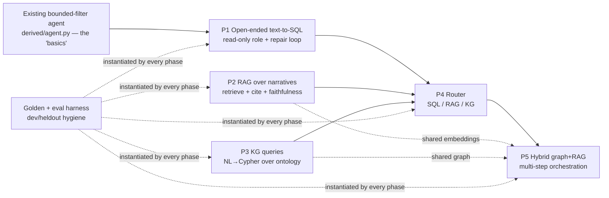
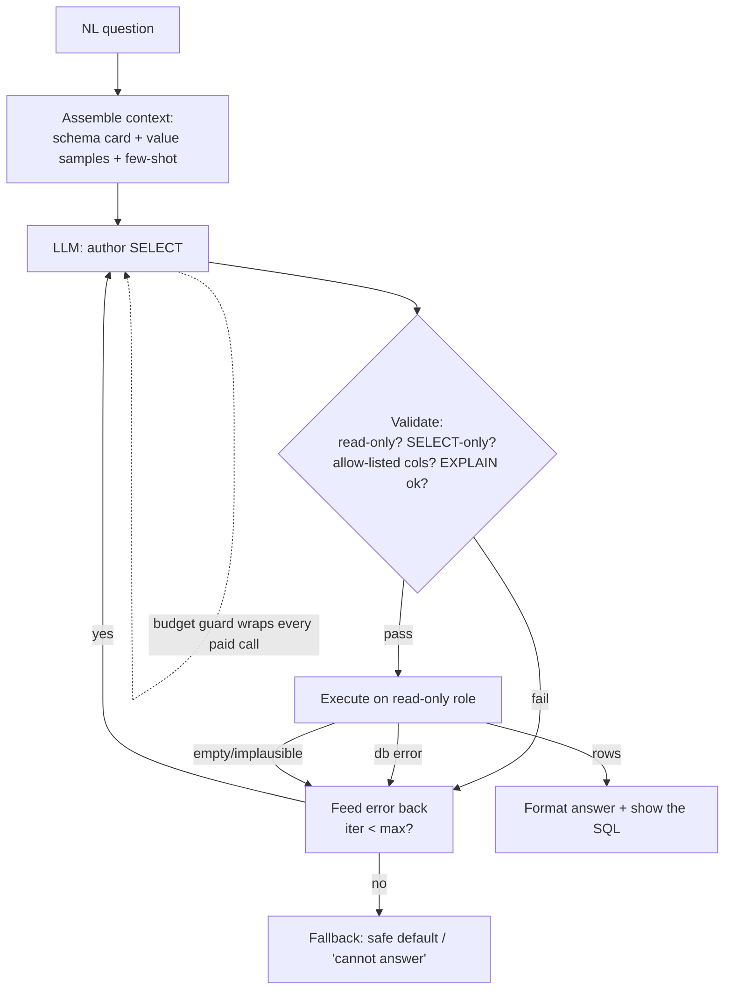

# feat: Agentic data-access progression — text-to-SQL, RAG, KG, routing, hybrid orchestration

## Summary

A **progression roadmap** for learning database-backed agentic retrieval on the AV-crash dataset, sequenced into five phases that build on each other:

1. **P1 — Open-ended text-to-SQL** over the full `treated_incident_reports` table (model authors real SQL against a read-only role; the existing bounded-filter agent is the "basics" baseline this graduates from).
2. **P2 — RAG over narratives** (embed → retrieve → grounded generation with citations), reusing the existing `bge-base` embedding cache.
3. **P3 — Knowledge-graph queries** (NL → Cypher over the existing Neo4j ontology, schema-constrained, validated).
4. **P4 — Agent router** that picks SQL vs RAG vs KG for a given question.
5. **P5 — Hybrid graph+RAG + agentic orchestration** (multi-step plans that fuse structured, semantic, and graph evidence).

The plan is **front-loaded**: P1 and P2 are implementation-ready (units, test scenarios, golden-set specs); P3 was firmed up to implementation-ready on 2026-07-02 after P1/P2 shipped (see the phase header for the decisions that resolved it); P4 and P5 are directional decisions plus learning scaffolding you firm up once the earlier phases teach you what you need.

Every phase is treated through the **same five learning dimensions** you asked about — **validations, prompts, context-building, agentic self-validation loops, and golden datasets** — defined once as a reusable rubric (see *Learning Scaffolding Model*) and instantiated per phase rather than re-explained five times.

**Posture (per your answers):** local-first for every phase (iterate against the seeded local Postgres / local Neo4j via CLI + golden eval harness), with live public-API exposure a **deliberate per-phase decision** — and when a phase does go live it inherits the existing budget-guard + allow-list discipline. No phase is wired to the public surface by this plan without that gate being passed explicitly.

---

## Problem Frame

The repo already has one production agentic surface: the W5 NL-query agent (`apps/api/app/derived/agent.py`) maps free text to a **bounded** allow-listed filter (entity / state / severity), never model-authored SQL. It is a deliberately narrow, safe pattern — the right "basics," but it does not teach the harder, more general skills: getting a model to author correct SQL/Cypher, grounding generation in retrieved evidence, validating model output you can't fully constrain, closing the loop with execute-observe-repair, routing across tools, and measuring all of it against held-out golden sets.

This plan exists to **exercise those skills on a real dataset you already understand**, reusing infrastructure that already exists (the data seam, the embedding cache, the Neo4j ontology, the `ontology/evaluate.py` golden discipline, the budget-guard pattern) rather than inventing a new substrate. The deliverable is a learning progression, not a product feature — so the bar is "did I learn the validation/prompt/context/self-validation/golden pattern for each capability," measured by a working local harness and a golden eval that produces real numbers.

**Non-goal:** shipping all five to the public site. The user explicitly wants to *see the progression* and decide phase-by-phase what (if anything) goes live.

---

## Requirements

- **R1.** Open-ended text-to-SQL: a model authors SQL over the full treated table, executed against a **read-only** database role, gated by a layered validator (statement-type + table/column allow-list + `EXPLAIN` dry-run), with an execute-observe-repair self-correction loop bounded by a max-iteration and budget cap. *(P1)*
- **R2.** A reusable **golden-set + eval harness** pattern, mirroring `ontology/evaluate.py`'s dev/held-out hygiene, instantiated for each phase with the phase-appropriate metric (SQL: execution-result equivalence; RAG: citation/answer match; KG: answer-set match; router: routing accuracy; hybrid: end-to-end task success). *(all phases)*
- **R3.** RAG over narratives: retrieval over the existing `bge-base` embeddings, context assembly with per-chunk provenance, grounded generation that **cites the incidents it used**, and a faithfulness self-check that can trigger re-retrieval. *(P2)*
- **R4.** KG queries: NL → Cypher constrained to the `schema/v001.yaml` node/relationship/pattern vocabulary, validated read-only (syntax via `EXPLAIN`, label/rel allow-list), seeded by the schema's existing **competency questions** as the golden set. *(P3)*
- **R5.** An agent **router** that classifies a question to the best capability (SQL / RAG / KG), with an explicit abstain/clarify path, evaluated against a golden routing set. *(P4)*
- **R6.** Hybrid orchestration: a multi-step agent that can combine graph traversal and narrative retrieval (and SQL aggregation) to answer questions no single capability answers well, with end-to-end self-validation. *(P5)*
- **R7.** Every phase is runnable **locally** against the seeded stack with no public-API dependency; any live-API exposure is a separate, explicitly-gated decision that reuses the existing budget-guard + proxy pattern. *(all phases)*
- **R8.** Secrets (`ANTHROPIC_API_KEY`, `NEO4J_*`, `HF_TOKEN`, `DATABASE_URL`) are read at call time, never logged, never committed — mirroring the existing sanitized-degrade discipline. *(all phases)*

**Origin requirements advanced:** none formal (solo plan, no upstream brainstorm). Conceptually advances the project's standing "P3 RAG" thread referenced in the embeddings plan (origin R18 there) and the agentic-learning goal in the root `CLAUDE.md`.

---

## Learning Scaffolding Model

This is the reusable rubric. Each phase below instantiates these five dimensions; this section defines what each means and the **transferable pattern** so the phases stay terse. The whole point of the plan is that you internalize this rubric, not any one capability.

### 1. Validations — *trust the structure, not the model*
Gates that hold **regardless of what the model emits**. Layered, cheapest-first, fail-closed:
- **Capability boundary** — the model produces *candidates*, never authority. (Already the discipline in `filters.resolve`.)
- **Safety gate** — the irreversible-action floor: a **read-only DB role** for SQL/Cypher so even a perfect injection can't mutate; statement-type allow-list (reject anything but `SELECT` / read Cypher); table/column/label allow-list.
- **Static validation** — parse / `EXPLAIN` (Postgres and Neo4j both support `EXPLAIN` without executing) to catch malformed output before it runs.
- **Output-contract validation** — the model's wrapper output (JSON envelope, fenced SQL, tool name) is schema-checked; malformed → repair or fallback, never crash.
- **Budget gate** — a daily USD guard (the existing `BudgetGuard` pattern) so a paid loop can't run away.

### 2. Prompts — *the contract you give the model*
- **System prompt** states the role, the exact output contract (e.g. "return only a single read-only SQL statement, no prose"), and refusal behavior ("if you cannot answer from this schema, return `{}`").
- **Few-shot exemplars** drawn from the golden dev split (never the held-out split) — Q→SQL / Q→Cypher / Q→answer pairs that pin the dialect, the column-naming quirks (mixed-case-quoted raw columns vs cleaned snake_case), and the citation format.
- **Output discipline** mirrors the existing agent: compact, fence-free, parseable; prose is the enemy of a machine-validated contract.

### 3. Context building — *what grounding goes in the window*
The model can only be as right as the context you assemble. Per capability:
- **Schema cards** — table/column descriptions, types, and the canonical-vs-raw distinction (P1); the node/rel/pattern vocabulary + competency questions (P3).
- **Value grounding** — distinct-value samples for low-cardinality columns (entities, states, severities) so the model filters on real values, not hallucinated ones (the `fetch_known_values` idea generalized).
- **Retrieved evidence** — top-k narrative chunks with provenance (P2); subgraph neighborhoods (P5).
- **Conversation/loop state** — prior failed attempt + the error/empty-result observation fed back on repair iterations.

### 4. Agentic self-validation loops — *execute, observe, critique, repair*
The leap beyond one-shot generation: the agent runs its own output, observes the result, and decides whether to accept or repair — bounded by `max_iterations` and the budget guard.
- **SQL/Cypher:** generate → validate → execute → on error feed the DB error back and repair; on empty/implausible result, reconsider (was the filter value wrong?).
- **RAG:** generate → faithfulness judge (is every claim supported by a retrieved chunk?) → on unsupported claims, re-retrieve or constrain.
- **Router:** route → if downstream returns low-confidence/empty, optionally re-route to a second capability.
- This is the same family as the existing **debate judge** (`apps/api/app/debate.py`) — an LLM evaluating an LLM — generalized into a control loop.

### 5. Golden datasets — *the only honest measure*
Every phase gets a small, version-controlled golden set with **dev/held-out hygiene exactly as `ontology/evaluate.py` enforces it** (held-out is final-numbers-only, refused without an explicit `--heldout` flag). Structure:
- `golden/<capability>/dev.jsonl` and `heldout.jsonl` — `{question, expected_*}` rows.
- A phase-appropriate **metric**: execution-result-set equivalence (P1), citation-recall + answer match (P2), answer-set F1 (P3), routing accuracy + abstain-precision (P4), task-success rubric (P5).
- An `evaluate.py`-style harness that emits a committed JSON + markdown table so claims are backed by reproducible numbers.

> **The transferable lesson:** validations and golden sets are what make agentic features *safe to ship and honest to claim*; prompts and context are what make them *work*; the self-validation loop is what makes them *robust*. Every phase below is the same five-part story with a different backend.

---

## High-Level Technical Design

> *Directional guidance for review, not implementation specification.*

**Progression + dependency shape:**



**The generated-SQL self-correction loop (P1) — the reusable loop shape:**



**Router decision flow (P4) — directional:**

```mermaid
flowchart TD
  Q[NL question] --> CL[LLM classifier:<br/>SQL | RAG | KG | abstain]
  CL --> R{confident?}
  R -- abstain/low --> CLAR[Ask to clarify / default view]
  R -- SQL --> P1c[P1 text-to-SQL]
  R -- RAG --> P2c[P2 narrative RAG]
  R -- KG --> P3c[P3 NL→Cypher]
  P1c & P2c & P3c --> CHK{usable result?}
  CHK -- no --> ALT[optional: re-route to 2nd-best]
  CHK -- yes --> OUT[answer + provenance]
```

---

## Key Technical Decisions

- **KTD-1 — Read-only DB role is the P1 safety floor.** Open-ended generated SQL is only acceptable because it runs on a Postgres role with `SELECT`-only grants on `treated_incident_reports` (and nothing else). This is the structural control that lets the model author free-form SQL without the allow-list having to anticipate every query shape. The statement-type + column allow-list + `EXPLAIN` validation sit *on top* as defense-in-depth, not as the only line. *(Generalizes `filters.resolve`'s "trust the structure" discipline to a coarser-but-stronger boundary.)*
- **KTD-2 — Build portable, expose deliberately.** Each capability's core is a self-contained module under `apps/api/app/` that takes an **injected** model + data seam (mirroring `run_query(..., model=...)`), so it runs in a local CLI harness with a fake/real model and *can* later mount as a route. The live route is never created by the phase's core unit — it's a separate, explicitly-gated unit. This honors local-first while keeping the production wiring one small step away.
- **KTD-3 — pgvector for RAG retrieval, with an in-memory fallback.** The narrative embeddings already exist as a parquet cache (`data/embeddings/`). For "real" retrieval-learning, ingest them into a Postgres `narrative_embeddings` table with the `pgvector` extension (you already run Postgres locally and in prod) and retrieve via `<=>` cosine distance. Fallback for zero-setup iteration: load the parquet into memory and reuse the existing `eda_utils_neighbors` cosine search. Decision recorded as an open question (pgvector availability on Railway PG 16) — default to pgvector, fall back cleanly.
- **KTD-4 — Reuse the `ontology/evaluate.py` golden discipline verbatim as a pattern.** Don't invent a new eval framework. Copy the dev/held-out split contract, the `golden_split_path` guard, and the JSON-summary-committed / raw-records-gitignored split. Each phase gets its own `golden/<cap>/` dir and a thin `evaluate_<cap>.py`.
- **KTD-5 — Budget guard on every paid loop, with a per-phase cost estimate.** The self-validation loops make *multiple* LLM calls per question. Each phase's agent takes a `BudgetGuard` (the existing pattern) and the loop reserves before each paid call; over-budget degrades to a safe fallback, never an error. **Caveat to fix on reuse:** `derived/budget.py::estimate_cost()` is hardcoded to the NL-query call shape (`_ESTIMATE_INPUT_CHARS = 500 + 1500`, `_ESTIMATE_OUTPUT_TOKENS = 256`). P1/P2 prompts (schema card + value samples + few-shot; SQL/answer output) are larger, so the verbatim guard *under-reserves* and the daily cap won't mean what the env var says. Each phase needs a per-phase `estimate_cost` (subclass override or constructor params) sized to its prompt/output budget. Non-negotiable before any live exposure (R7/R8).
- **KTD-6 — The model is always injected behind a `Protocol` seam.** Every phase mirrors `FilterModel`/`ClaudeFilterModel`: a `Protocol` with a real Anthropic-backed impl and a fake for tests. This is what keeps the whole progression testable without a key or network, and is itself a core learning pattern.
- **KTD-7 — Claude model selection.** Default to `claude-haiku-4-5` for the high-frequency structural calls (SQL/Cypher authoring, routing), matching the existing NL-query and debate defaults; reserve a larger model (`claude-sonnet-4-6` or `claude-opus-4-8`) for the faithfulness judge and hybrid orchestration where reasoning quality matters more than latency/cost. Overridable per-phase via env (`ANTHROPIC_MODEL`-style), never hardcoded.
- **KTD-8 — Schema/context is generated from the live DB, not hand-maintained.** The P1 schema card and value-grounding samples are derived from `information_schema` + `SELECT DISTINCT` at startup (cached), so the grounding can't drift from the actual table. Generalizes `fetch_known_values`.

---

## Output Structure

Proposed layout for the new work (early phases concrete, later phases directional). Per-unit `**Files:**` remain authoritative.

```
apps/api/app/
  nlsql/                  # P1 — open-ended text-to-SQL (portable core)
    __init__.py
    schema_card.py        # introspect information_schema -> grounding
    validate.py           # statement-type + allow-list + EXPLAIN gate
    agent.py              # LangGraph: generate -> validate -> execute -> repair
    cli.py                # local-first driver (no route)
  rag/                    # P2 — narrative RAG (portable core)
    __init__.py
    ingest.py             # re-derive (incident_id, narrative) from CSVs, join cache vectors
    store.py              # pgvector retrieve + numpy-cosine in-memory fallback
    context.py            # chunk assembly + provenance
    agent.py              # retrieve -> generate(cite) -> faithfulness loop
    cli.py
  kgquery/                # P3 — NL -> Cypher (implementation-ready, U13–U18)
    __init__.py
    graph_card.py         # schema/v001.yaml -> card + label/rel allow-list
    validate.py           # write-clause rejection + allow-list + EXPLAIN gate
    agent.py              # generate -> validate -> execute(READ) -> repair
    cli.py
    routes.py             # POST /kgquery/ask + GET /kgquery/status
    budget.py             # KGQUERY_DAILY_BUDGET_USD, ledger kgquery_spend
  router/                 # P4 — capability router (directional)
    ...
  orchestrator/           # P5 — hybrid orchestration (directional)
    ...
golden/
  nlsql/{dev,heldout}.jsonl
  rag/{dev,heldout}.jsonl
  kgquery/{dev,heldout}.jsonl
  router/{dev,heldout}.jsonl
tools/
  eval_nlsql.py           # ontology/evaluate.py-style harness (per capability)
  eval_rag.py
db/
  roles/readonly_role.sql # P1 read-only grant script (idempotent)
  pgvector_setup.sql      # P2 extension + narrative_embeddings table
docs/writeups/            # one short writeup per phase as it lands
```

---

## Phase 1 — Open-ended text-to-SQL *(implementation-ready)*

**Goal:** Graduate from the bounded filter to a model that authors real `SELECT` SQL over the whole treated table, made safe by a read-only role + layered validator + execute-observe-repair loop, and measured by a golden Q→SQL set scored on execution-result equivalence.

**The five dimensions, instantiated:**
- **Validations:** read-only role (KTD-1); reject non-`SELECT` (parse the statement, allow exactly one read statement); table allow-list (`treated_incident_reports` only); `EXPLAIN` dry-run before execute; a row/time cap (`LIMIT` injected if absent, `statement_timeout`).
- **Prompts:** system prompt fixes the dialect (Postgres), the output contract ("one SELECT, no prose, no DDL/DML"), the **column-naming trap** (mixed-case-quoted raw columns like `"Highest Injury Severity Alleged"` vs cleaned `master_entity` / `incident_date`), and refusal ("if the question needs a column not in the schema card, return `SELECT NULL WHERE false`"). Few-shot from `golden/nlsql/dev.jsonl`.
- **Context building:** a schema card generated from `information_schema` (column name, type, raw-vs-clean note) + distinct-value samples for low-cardinality columns; on repair, the prior SQL + DB error appended.
- **Self-validation loop:** generate → validate → execute → on DB error or empty/implausible result, feed the observation back and repair, bounded by `max_iterations` (≈3) and the budget guard.
- **Golden dataset:** `golden/nlsql/{dev,heldout}.jsonl` of `{question, gold_sql}`; metric = run gold_sql and candidate_sql against the seeded local DB and compare **result sets** (order-insensitive), not SQL strings — the honest measure of correctness.

### U1. Read-only DB role + local grant script

**Goal:** A Postgres read-only role the SQL agent connects as, provisioned by an idempotent script for the local seeded DB and documented for Railway.

**Requirements:** R1, R7

**Dependencies:** none.

**Files:**
- Create: `db/roles/readonly_role.sql`
- Create: `tools/setup_readonly_role.py` (idempotent applier, mirrors `tools/local_db_setup.py`)
- Modify: `docs/conventions/stack.md` (document the role + a `READONLY_DATABASE_URL` env var)

**Approach:** `CREATE ROLE` with `LOGIN`, `GRANT CONNECT` + `GRANT SELECT` on `treated_incident_reports` only, `REVOKE` everything else; set `statement_timeout` and a conservative `work_mem` at the role level. Script is re-runnable (guards on existence). The agent reads `READONLY_DATABASE_URL`; absent locally → clear error pointing at this script.

**Patterns to follow:** `tools/local_db_setup.py` (idempotent DB setup + version print); the sanitized-degrade env discipline in `apps/api/app/db.py`.

**Test scenarios:**
- Happy path: applying the script to a fresh local DB creates the role; re-running reports "exists" and exits 0.
- Edge: the role can `SELECT` from `treated_incident_reports` but an `INSERT`/`UPDATE`/`DROP` attempt raises a permission error (assert the error class).
- Edge: the role **cannot** `SELECT` from an unrelated table (e.g. `derived_spend`) — least privilege confirmed.
- Error: missing `READONLY_DATABASE_URL` raises a one-line setup hint, not a raw asyncpg traceback.

**Verification:** `python tools/setup_readonly_role.py` is idempotent; a manual `psql` as the role proves SELECT-only.

### U2. Schema-card + value-grounding builder

**Goal:** Generate the grounding context (column catalog + low-cardinality value samples) from the live DB so prompts can't drift from the real table.

**Requirements:** R1 *(supports the prompt/context dimension)*

**Dependencies:** U1.

**Files:**
- Create: `apps/api/app/nlsql/schema_card.py`
- Create: `apps/api/app/nlsql/tests/test_schema_card.py`

**Approach:** Query `information_schema.columns` for `treated_incident_reports`; classify each column raw-quoted vs cleaned snake_case; for a curated set of low-cardinality columns (`master_entity`, `"State Clean"`, severity), pull `SELECT DISTINCT`. Render a compact text card + a structured allow-list (the column set the validator will check against). Cache per-process (cheap, R22 "no premature cache" — but schema is stable, so a module-level memo is fine). Generalizes `IncidentData.fetch_known_values`.

**Patterns to follow:** `apps/api/app/data.py` (`fetch_known_values`, `DERIVED_COLUMNS`, the raw-vs-clean column commentary).

**Test scenarios:**
- Happy path: against a fake connection returning a known column set, the card lists every column with type and the allow-list matches.
- Edge: a mixed-case-with-spaces column is rendered quoted in the card; a snake_case column unquoted.
- Edge: value-grounding for a column returns the distinct set; an empty table yields an empty sample without error.
- Integration: the produced allow-list is exactly what U3's validator consumes (shared fixture).

**Verification:** card text contains the canonical-vs-raw note and at least the entity/state/severity value samples.

### U3. SQL validator (statement-type + allow-list + EXPLAIN)

**Goal:** The structural gate that accepts only a single safe, allow-listed `SELECT` and proves it parses via `EXPLAIN` — independent of the LLM.

**Requirements:** R1

**Dependencies:** U1, U2.

**Files:**
- Create: `apps/api/app/nlsql/validate.py`
- Create: `apps/api/app/nlsql/tests/test_validate.py`
- Modify: `apps/api/pyproject.toml` + shared `requirements.txt` (add `sqlglot` — not currently an api dep)

**Approach:** Parse the candidate with a SQL parser (`sqlglot` — read-only, no execution) to assert exactly one statement and it is a `SELECT`; reject `;`-chaining, CTE-wrapped DML, `pg_*`/`information_schema` access, and any table not in the allow-list; ensure a `LIMIT` (inject a default cap if missing). Then `EXPLAIN` (not execute) on the read-only connection to catch column typos/syntax. Return a structured `ValidationResult{ok, reason, normalized_sql}`. Never raises on bad input — the loop reads `ok`. **Scope note:** the structural gate owns *table/schema/function-access rejection + single-SELECT + LIMIT* — the things `EXPLAIN` won't refuse. Treat **column existence** as `EXPLAIN`'s job (it errors on a bad column with zero rows returned), not a hard sqlglot column allow-list; column-level allow-listing of arbitrary aliases/expressions/subqueries is best-effort defense-in-depth, with the read-only role + table allow-list + `EXPLAIN` as the real boundary.

**Patterns to follow:** the allow-list-resolution discipline in `apps/api/app/derived/filters.py` (resolve to a known constant, drop the rest, never interpolate raw input).

**Test scenarios:**
- Happy path: a well-formed `SELECT ... FROM treated_incident_reports WHERE master_entity = 'Waymo'` passes; a missing `LIMIT` gets the default cap injected.
- Security: `SELECT ...; DROP TABLE treated_incident_reports` → rejected (multi-statement).
- Security: `WITH x AS (DELETE ...) SELECT ...` / any DML → rejected (not a pure SELECT).
- Security: `SELECT * FROM derived_spend` → rejected (table not allow-listed) even though the read-only role would also block it (defense-in-depth).
- Security: `SELECT * FROM pg_user` / `information_schema.tables` → rejected.
- Edge: a column-typo SQL fails at `EXPLAIN` with a captured reason (no execution, no rows).
- Edge: valid SQL already containing `LIMIT 10` is left unchanged.

**Verification:** every injection vector in the scenarios returns `ok=False` with a human-readable reason; the EXPLAIN path makes zero row-returning calls.

### U4. Text-to-SQL agent with execute-observe-repair loop

**Goal:** The LangGraph agent that assembles context, authors SQL, validates, executes on the read-only role, and repairs on failure — the reusable loop shape.

**Requirements:** R1, R5(prep), R8

**Dependencies:** U2, U3.

**Files:**
- Create: `apps/api/app/nlsql/agent.py`
- Create: `apps/api/app/nlsql/tests/test_agent.py`

**Approach:** Mirror `derived/agent.py` structure — a `StateGraph` with nodes `assemble_context → generate_sql → validate → execute → (repair|respond|fallback)`. Inject a `SqlModel` `Protocol` (real `ClaudeSqlModel`, fake for tests) and a `BudgetGuard`. Repair edge loops `generate_sql` with the prior SQL + error/empty observation appended, bounded by `max_iterations`. Any exhaustion or budget-trip routes to a `fallback` node returning a safe "couldn't answer" result + (optionally) the last attempted SQL for the learning UI. Result dict includes the executed SQL, the rows, and an `iterations` count.

**Patterns to follow:** `apps/api/app/derived/agent.py` (graph structure, injected model `Protocol`, budget reserve/release, fail-to-fallback edges, key-hygiene logger pinning).

**Test scenarios:**
- Happy path: fake model returns valid SQL first try → executes, returns rows, `iterations == 1`, `fallback == False`.
- Self-correction: fake model returns invalid SQL then valid on retry → loop repairs, `iterations == 2`, correct rows.
- Edge: fake model returns SQL that validates but yields zero rows → one reconsider iteration, then accepts the empty result (no infinite loop).
- Error: model unavailable (raises) → routes straight to fallback, budget reservation released, no key/payload logged.
- Budget: with a tripped guard, the agent degrades to fallback before any paid call.
- Bound: a model that *never* produces valid SQL stops at `max_iterations` and falls back (assert call count).

**Verification:** the graph never raises on bad model output; `iterations` and `fallback` are observable; runs with no network/key via the fake.

### U5. Local CLI harness

**Goal:** A no-route, local-first driver to ask questions and see the SQL + rows + iteration trace — the iteration surface for learning.

**Requirements:** R7

**Dependencies:** U4.

**Files:**
- Create: `apps/api/app/nlsql/cli.py`

**Approach:** `python -m app.nlsql.cli "which companies had the most fatal incidents?"` → prints assembled context (optional `--verbose`), each attempt's SQL, validation verdict, executed SQL, result table, iteration count, and token/cost. Reads `READONLY_DATABASE_URL`; uses the real model when `ANTHROPIC_API_KEY` is set, else a stub that echoes a canned SQL so the pipe is exercisable key-free.

**Patterns to follow:** the receipt-style CLI output in `eda/build_narrative_embeddings.py`; `ontology/run_pipeline.py` arg shape.

**Test scenarios:**
- Test expectation: none beyond U4 — thin CLI wrapper. A smoke test asserts `--help` prints and a stubbed run exits 0.

**Verification:** an end-to-end local run answers a real question and shows the repair loop when it fires.

### U6. Golden set + eval harness (nlsql)

**Goal:** A held-out-disciplined golden set and an `evaluate.py`-style harness scoring **execution-result equivalence**.

**Requirements:** R1, R2

**Dependencies:** U4. (U5 helpful for authoring golden rows.)

**Files:**
- Create: `golden/nlsql/dev.jsonl`, `golden/nlsql/heldout.jsonl`
- Create: `tools/eval_nlsql.py`
- Create: `tools/tests/test_eval_nlsql.py`

**Approach:** Seed ~20 dev + ~10 held-out `{question, gold_sql}` rows spanning aggregation, filtering, ordering, multi-condition, and "unanswerable" (expects refusal). Harness runs candidate + gold SQL on the seeded local DB, normalizes result sets (sort rows, round floats), and scores exact-set-match + a partial-credit column-overlap metric; reports accuracy, refusal-precision (did it refuse the unanswerable ones), and mean iterations. Copy `ontology/evaluate.py`'s `golden_split_path` guard so `heldout.jsonl` is refused without `--heldout`.

**Patterns to follow:** `ontology/evaluate.py` (split hygiene, committed JSON+markdown summary, deterministic scoring), `ontology/golden.py`.

**Test scenarios:**
- Happy path: a candidate matching gold scores as correct; a row-order-only difference still matches (order-insensitive).
- Edge: a candidate returning a superset/subset scores partial, not full.
- Security/hygiene: calling the harness on `heldout` without `--heldout` raises `PermissionError` (mirrors AE4).
- Edge: an "unanswerable" golden row counts the agent's refusal as correct and a hallucinated answer as wrong.
- Determinism: same inputs → identical summary JSON across two runs.

**Verification:** `python tools/eval_nlsql.py` prints a metrics table from real local execution; held-out stays untouched during iteration.

### U7. Phase-1 writeup

**Goal:** Short markdown capturing what worked, the column-naming traps, where the repair loop earned its keep, and the golden numbers.

**Requirements:** R1 *(learning artifact)*

**Dependencies:** U6.

**Files:** Create: `docs/writeups/2026-NN-text-to-sql-open-ended.md`

**Test scenarios:** none — prose writeup.

**Verification:** renders cleanly, links the CLI + eval commands, records the dev-set numbers.

### Phase-1 live-exposure gate *(deferred decision, not a unit)*

Once U1–U6 are green locally, **decide** whether to mount `POST /nlsql/query`. If yes, it's a new unit mirroring `derived/routes.py` + the `web` same-origin proxy + a dedicated budget guard (`NLSQL_DAILY_BUDGET_USD`) and the read-only role wired in prod. Recorded in *Open Questions*; not built by this plan.

---

## Phase 2 — RAG over narratives *(implementation-ready)*

**Goal:** Retrieve relevant narratives for a question, assemble them into grounded context, generate an answer that **cites the incidents it used**, and self-check faithfulness — reusing the existing `bge-base` embeddings.

**The five dimensions, instantiated:**
- **Validations:** every cited incident id must exist in the retrieved set (no fabricated citations); answer length/format contract; budget gate. The "structure to trust" here is **citation existence**, not SQL safety.
- **Prompts:** system prompt = "answer only from the provided numbered narratives; cite incident ids in `[id]` form; if the narratives don't support an answer, say so." Few-shot showing a cited answer and a refusal.
- **Context building:** retrieve top-k by cosine over the embedding cache; assemble numbered chunks with incident-id provenance; cap total context; optionally diversify (MMR) to avoid near-duplicate reports of one incident (the dedup story already exists in `eda_utils_dedupe`).
- **Self-validation loop:** generate → faithfulness judge ("is every claim supported by a cited chunk?") → on unsupported claims, re-retrieve (expand k / re-query) or strip the unsupported claim, bounded.
- **Golden dataset:** `golden/rag/{dev,heldout}.jsonl` of `{question, expected_incident_ids, answer_points}`; metric = citation recall/precision against `expected_incident_ids` + answer-point coverage (LLM-judged or keyword).

### U8. Embedding store: pgvector ingest + retrieval (in-memory fallback)

**Goal:** Make the narrative embeddings queryable by cosine, the retrieval backbone.

**Requirements:** R3, R7

**Dependencies:** the existing embedding cache (`eda/build_narrative_embeddings.py` output).

**Files:**
- Create: `db/pgvector_setup.sql`
- Create: `apps/api/app/rag/store.py`
- Create: `apps/api/app/rag/ingest.py` (re-derive `(same_incident_id, narrative)` → join cache → insert)
- Create: `apps/api/app/rag/tests/test_store.py`
- Modify: `docs/conventions/stack.md` (pgvector note + `narrative_embeddings` table + the new RAG deps)
- Modify: `apps/api/pyproject.toml` + the shared `requirements.txt` (see dependency note below)

**The ingest is the real work (not "load the parquet").** The embedding cache (`eda/eda_utils_embed.py::_save_cache`) stores **only** `{text_hash, vector, dim}` — it has **no `incident_id` and no narrative text**, and `embed_texts` returns a positional `doc_index`, not `Same Incident ID`. So two of the three target columns cannot come from the parquet. The ingest path must:
1. Re-derive the canonical rows the way `eda/build_narrative_embeddings.py` does — `load_and_concat_csvs` → `dedupe_same_incident` → select `Narrative - Same Incident ID` — which **requires the raw NHTSA CSVs present locally** (`data/nhtsa/`), not just the embeddings cache.
2. For each canonical row, re-hash the narrative with the same `_text_hash` used to write the cache, and join to the cache vector by `text_hash`.
3. Insert `(same_incident_id, narrative, vector)` — carrying the incident id and narrative text from the deduped frame, the vector from the cache.

**Approach:** `pgvector_setup.sql` enables the extension and creates `narrative_embeddings(incident_id text, embedding vector(768), narrative text)`. `store.py` exposes `retrieve(query_embedding, k) -> [{incident_id, narrative, distance}]` via `ORDER BY embedding <=> $1 LIMIT k`. **Fallback:** if pgvector is unavailable, load the parquet + deduped narratives into memory and run numpy/`eda_utils_neighbors` cosine search behind the same `retrieve` signature (KTD-3). Query embedding comes from the same `bge-base` adapter.

**Dependency strategy (decide before starting — `apps/api` is deliberately 4-dep + ML-free):** `eda/` is **not** an importable package from `apps/api` (flat modules loaded via `sys.path` in EDA scripts), and `eda_utils_neighbors`/`eda_utils_embed` pull `numpy`/`pandas`/`scikit-learn`/`pyarrow`/`huggingface_hub`. Default decision: **vendor a ~30-line numpy-only cosine search into `rag/store.py`** (avoids sklearn) and add only the minimal new api deps actually needed (`pyarrow` to read the cache; `huggingface_hub` for the query-embedding adapter — or precompute query embeddings out-of-process for local-first). Whatever is chosen, edit `apps/api/pyproject.toml` **and** hand-sync the shared `requirements.txt` (Railway installs from pyproject; the shared env mirrors it). Record the final dep set in `stack.md`.

**Patterns to follow:** `eda/build_narrative_embeddings.py` (load→dedupe→select pipeline + `_text_hash`), `eda/eda_utils_embed.py` (cache schema), `apps/api/app/data.py` (asyncpg seam).

**Test scenarios:**
- Happy path (in-memory): a synthetic 8-doc matrix returns the k nearest by cosine, self-excluded, in distance order.
- Happy path (pgvector, integration): ingesting 5 known rows and querying returns them ranked; distances monotonic.
- Edge: `k` larger than corpus is clamped.
- Edge: identical narratives (resubmissions) — MMR/diversity option avoids returning both as top results.
- Ingest: a deduped narrative whose re-hash finds **no** matching cache vector is **reported** (count + sample), never silently dropped — proves the hash-join contract.
- Ingest: every inserted row carries a non-null `incident_id` and `narrative` (the columns the parquet can't supply), confirming the CSV-derived join ran.
- Fallback: with pgvector disabled, the same `retrieve` signature returns equivalent neighbors from the in-memory path.

**Verification:** querying "pedestrian crosswalk at night" surfaces visibly relevant narratives; pgvector and fallback agree on top-3 for a fixed query.

### U9. RAG context assembly with provenance

**Goal:** Turn retrieved rows into a numbered, provenance-tagged context block under a token budget.

**Requirements:** R3

**Dependencies:** U8.

**Files:**
- Create: `apps/api/app/rag/context.py`
- Create: `apps/api/app/rag/tests/test_context.py`

**Approach:** `build_context(retrieved, max_chars) -> (context_text, id_map)` numbering each chunk `[1] (incident <id>): <narrative truncated>`, returning the id_map so the citation validator can resolve `[n]`→incident_id. Dedup by incident id; order by relevance; truncate per-chunk and total.

**Patterns to follow:** the truncation/`max_chars` helper shape in `eda/eda_utils_neighbors.py::neighbor_examples`.

**Test scenarios:**
- Happy path: 5 retrieved rows → 5 numbered chunks; id_map maps `1..5` to the right incident ids.
- Edge: total over `max_chars` drops lowest-relevance chunks and the id_map only contains kept chunks.
- Edge: duplicate incident ids collapse to one chunk.
- Edge: a narrative longer than the per-chunk cap is truncated with an ellipsis.

**Verification:** the rendered block is parseable back to incident ids by the citation validator (shared fixture with U10).

### U10. RAG agent: grounded generation + faithfulness self-check

**Goal:** Generate a cited answer and validate that citations exist and claims are supported, repairing when not.

**Requirements:** R3, R5(prep), R8

**Dependencies:** U8, U9.

**Files:**
- Create: `apps/api/app/rag/agent.py`
- Create: `apps/api/app/rag/cli.py`
- Create: `apps/api/app/rag/tests/test_agent.py`

**Approach:** Graph: `embed_query → retrieve → assemble → generate → validate_citations → (faithfulness_judge) → (repair|respond|fallback)`. `validate_citations` checks every `[n]` resolves to a retrieved chunk (structural gate). `faithfulness_judge` is a second LLM call (larger model per KTD-7) returning per-claim supported/unsupported; unsupported → re-retrieve with larger k or instruct "remove unsupported claims," bounded by `max_iterations` + budget. Injected `RagModel` + `JudgeModel` Protocols; fakes for tests. CLI mirrors U5.

**Patterns to follow:** `apps/api/app/derived/agent.py` (graph + injected model + budget); `apps/api/app/debate.py` (LLM-judging-LLM shape for the faithfulness judge).

**Test scenarios:**
- Happy path: fake model cites `[1][3]` both present → passes citation validation, faithfulness judge approves, returns answer + resolved incident ids.
- Citation gate: model cites `[9]` not in the retrieved set → validation fails → repair iteration (or strip), never surfaces a fabricated citation.
- Faithfulness: judge flags an unsupported claim → one re-retrieve/repair iteration; second pass approved.
- Refusal: retrieved chunks don't support the question → agent returns "not supported by the data," counted as correct behavior.
- Error/budget: judge or generator unavailable / budget tripped → degrade to a retrieval-only "here are the most relevant incidents" fallback, no crash.
- Bound: persistently-unfaithful model stops at `max_iterations`.

**Verification:** no fabricated citation ever leaves the agent; the faithfulness loop is observable; runs key-free via fakes.

### U11. Golden set + eval harness (rag)

**Goal:** Held-out-disciplined golden set scoring citation recall/precision + answer coverage.

**Requirements:** R2, R3

**Dependencies:** U10.

**Files:**
- Create: `golden/rag/dev.jsonl`, `golden/rag/heldout.jsonl`
- Create: `tools/eval_rag.py`
- Create: `tools/tests/test_eval_rag.py`

**Approach:** ~15 dev + ~8 held-out `{question, expected_incident_ids, answer_points}`. Metric: citation recall (did it cite the right incidents) + precision (did it cite irrelevant ones) + answer-point coverage (keyword or LLM-judge). Reuse the `golden_split_path` guard. Authoring tip: use U8 retrieval + manual review to pick `expected_incident_ids`.

**Patterns to follow:** `ontology/evaluate.py`, `tools/eval_nlsql.py` (U6).

**Test scenarios:**
- Happy path: an answer citing exactly the expected ids scores recall=precision=1.
- Edge: citing expected + one extra drops precision, not recall.
- Hygiene: `heldout` without `--heldout` raises.
- Edge: an "unsupported" golden row credits a refusal.
- Determinism: keyword-coverage scoring is stable across runs (LLM-judge path documented as non-deterministic; pin temperature 0 + note the caveat).

**Verification:** `python tools/eval_rag.py` prints citation + coverage numbers from real local retrieval.

### U12. Phase-2 writeup

**Goal:** Capture retrieval quality, the citation-gate vs faithfulness-judge distinction, pgvector-vs-in-memory notes, and golden numbers.

**Requirements:** R3 *(learning artifact)*

**Dependencies:** U11.

**Files:** Create: `docs/writeups/2026-NN-rag-over-narratives.md`

**Test scenarios:** none — prose.

**Verification:** renders cleanly; links commands; records dev numbers; notes the structural-citation-check vs LLM-faithfulness-judge as two different validation tiers.

### Phase-2 live-exposure gate *(deferred decision)*

Same shape as Phase 1: optional `POST /rag/ask` mirroring `derived/routes.py` + proxy + a `RAG_DAILY_BUDGET_USD` guard. Recorded in *Open Questions*; not built here.

---

## Phase 3 — Knowledge-graph queries *(implementation-ready — firmed up 2026-07-02 after P1/P2)*

**Goal:** NL → Cypher over the existing Neo4j ontology, constrained to the `schema/v001.yaml` vocabulary, validated read-only, seeded by the schema's **competency questions** as the golden set — delivered end-to-end through a `/kg` web page, the same shape P1 and P2 actually shipped.

**Decisions that firmed this up (2026-07-02):**
- **Graph backend: Neo4j Community Edition on Railway, one instance for dev and prod.** Replaces the AuraDB Free assumption. Rationale: no 72h pause / idle deletion (the worst P3 risk under Aura), same platform as everything else (the `api` service reaches it over Railway's private network, like Postgres), and the existing `graph_load.py` wiring carries over as an env-var change. Cost: a small always-on JVM container (~512M heap is plenty for this graph), roughly $2–5/mo of Railway usage + a volume. CE has **no role management** (Enterprise feature, same limitation Aura Free had), so the read-access-mode-transaction floor below is unchanged.
- **Local dev reaches the same instance via Railway's public TCP proxy** on the bolt port. Accepted trade-off: the proxy doesn't terminate TLS, so dev access is unencrypted `bolt://` + strong password — tolerable for a rebuildable graph of public NHTSA data; the proxy can be toggled off between sessions. (Prod traffic stays on the private network.)
- **Web delivery is in-plan, not gated.** P1 and P2 both "deferred" the route/page and both shipped one after iteration — the pattern (route + own budget guard/ledger + same-origin proxy + show-your-work page) is now the established deliverable, so P3 plans it up front (U17).
- **Coverage honesty: keep the 143-incident subgraph, label it.** The graph covers the ~143 incidents from the 2026-06-18 extraction run, not the full treated table, so KG answers will disagree with `/nlsql` on questions like "which companies had the most incidents." Every answer surface (page banner, writeup) frames results as "over the extracted subgraph (n≈143)." No new extraction spend — the NL→Cypher learning goal doesn't need full coverage.

**The five dimensions, instantiated:**
- **Validations:** the **primary** safety floor is a **read-access-mode transaction** (`session(default_access_mode=READ)` / `execute_query(routing_=READ)`) — the server rejects any write at runtime regardless of edition (CE has no role management, so a read-only credential is not available). On top of that: reject write clauses statically (`CREATE`/`MERGE`/`DELETE`/`SET`/`REMOVE`/`FOREACH`/`LOAD CSV`, and `CALL` wholesale); label/relationship allow-list drawn from the schema; `EXPLAIN` (Neo4j supports it) before run; `LIMIT` injection. (The KTD-1 analogue — the read-mode transaction, not a credential, is the floor.)
- **Prompts:** system prompt embeds the **node types, relationship types, and patterns** from `schema/v001.yaml` (the graph's whole point is that the schema is small and enumerable); output contract "one read-only Cypher, no prose"; refusal when the question needs a label not in the schema.
- **Context building:** render the schema as a compact "graph card" (labels, rels, the `patterns` triples) + the competency questions as few-shot exemplars (they're already written, lines 830–848 of `schema/v001.yaml`).
- **Self-validation loop:** generate → validate → `EXPLAIN` → execute → on Cypher error or empty result, repair with the error fed back; bounded.
- **Golden dataset:** `golden/kgquery/{dev,heldout}.jsonl` seeded directly from the 18 competency questions (split dev/heldout); metric = answer-set F1 against gold answers (run a hand-written gold Cypher per question to produce expected rows). Reuse `ontology/evaluate.py`'s graph-eval surface (it already does "competency-question answerability").

### U13. Railway Neo4j CE + graph rebuild from artifacts

**Goal:** A persistent Neo4j Community Edition instance on Railway holding the extracted ontology graph, reachable by the `api` service privately and by local dev via the TCP proxy — the P3 analogue of U1's "provision the substrate first."

**Requirements:** R4, R7

**Dependencies:** none. **Human/console steps included** (Railway dashboard provisioning), mirroring U1's role-provisioning shape.

**Files:**
- Modify: `docs/conventions/stack.md` (new `neo4j` service, `NEO4J_URI`/`NEO4J_USERNAME`/`NEO4J_PASSWORD` contract for both private-network and TCP-proxy forms, memory tuning, cost note)
- Modify: `ontology/CLAUDE.md` (replace the AuraDB sharp-edge block: no more 72h pause, but the graph stays **rebuildable-not-authoritative**; record the rebuild command and the instance's memory settings)

**Approach:** Provision a Neo4j CE service on Railway (official image + volume; tune `server.memory.heap.max_size≈512m`, pagecache ≈128m — the graph is tiny). Enable the public TCP proxy on 7687 for local dev; set a strong password. Repoint the root `.env` `NEO4J_*` at the proxy address. The extraction artifacts are gitignored and live only in the `avird-2026-ontology-v001` checkout — copy `ontology/artifacts/extractions/` (and the run manifests) into this worktree, then rebuild: `python ontology/graph_load.py` (preflight → constraints → load; `--reset --yes` first if re-running). `graph_load.py` needs **no code change** — it reads `NEO4J_URI`/`NEO4J_USERNAME`/`NEO4J_PASSWORD` as-is.

**Patterns to follow:** `ontology/graph_load.py` (get_driver env contract, preflight, `graph_counts`); U1 (`tools/setup_readonly_role.py`) for the "provision + verify + document" shape.

**Test scenarios:** *(infrastructure unit — verification is operational, not pytest)*
- Happy path: `graph_load.py` preflight succeeds against the Railway instance; load reports node/relationship counts matching the artifact.
- Idempotence: `--reset --yes` + reload lands identical counts.
- Edge: with the TCP proxy disabled, preflight fails with the module's friendly setup hint (no raw driver traceback) — confirms the degrade path U15 depends on.

**Verification:** `python ontology/graph_load.py` (no flags) prints live counts; a read query via `cypher-shell`/driver returns extracted incidents; `stack.md` records the proxy on/off toggle.

### U14. Graph card + Cypher validator

**Goal:** The grounding context (schema rendered as a compact "graph card") and the structural gate that accepts only a single safe, allow-listed read-only Cypher statement — independent of the LLM. *Mirrors U2+U3.*

**Requirements:** R4

**Dependencies:** U13 (for the EXPLAIN path; the static gate needs no live graph).

**Files:**
- Create: `apps/api/app/kgquery/__init__.py`, `apps/api/app/kgquery/graph_card.py`, `apps/api/app/kgquery/validate.py`
- Create: `apps/api/app/kgquery/tests/test_graph_card.py`, `apps/api/app/kgquery/tests/test_validate.py`
- Modify: `apps/api/pyproject.toml` + shared `requirements.txt` (add `neo4j` + `pyyaml` — the P2 precedent: minimal runtime deps in, heavy chains stay out)

**Approach:** `graph_card.py` parses `ontology/schema/v001.yaml` **directly with pyyaml** (never imports ontology modules — same isolation call as P2's vendored cosine): render node labels + properties, relationship types, the `patterns` triples, and expose the structured label/rel allow-list the validator consumes. The card ships with the api (read the yaml at startup from a repo-relative path; it's committed and frozen). `validate.py`: assert exactly one statement; reject write clauses by keyword/AST-walk (`CREATE`, `MERGE`, `DELETE`, `DETACH`, `SET`, `REMOVE`, `FOREACH`, `LOAD CSV`) and reject `CALL` wholesale (procedures are where read-only guarantees leak); check every label/relationship token against the allow-list; inject `LIMIT` if absent; then `EXPLAIN` on a read-mode session to catch syntax/semantic errors with zero execution. Return `ValidationResult{ok, reason, normalized_cypher}` — never raises on bad input.

**Patterns to follow:** `apps/api/app/nlsql/schema_card.py` (card + allow-list dual output, module-level memo), `apps/api/app/nlsql/validate.py` (structured result, layered checks, LIMIT injection).

**Test scenarios:**
- Happy path: the card lists every schema label/rel/pattern; the allow-list matches the yaml exactly (shared fixture with the validator tests).
- Happy path: `MATCH (c:Company)-[:OPERATED]->(v:Vehicle) RETURN c.name, count(v)` passes; missing `LIMIT` gets the cap injected; an existing `LIMIT 10` is untouched.
- Security: `MATCH (n) DETACH DELETE n` → rejected (write clause).
- Security: `MATCH (n) SET n.x = 1 RETURN n` / `MERGE (:Company {name:'x'})` / `CREATE …` → rejected.
- Security: `CALL db.labels()` / `CALL apoc.*` → rejected (CALL wholesale).
- Security: a label not in the schema (`MATCH (u:User) RETURN u`) → rejected with the unknown-label reason.
- Edge: a Cypher syntax error passes the static gate but fails `EXPLAIN` with a captured reason (no execution).

**Verification:** every write/injection vector returns `ok=False` with a human-readable reason; `EXPLAIN` runs in read mode and returns zero rows.

### U15. NL→Cypher agent with repair loop + CLI

**Goal:** The agent that assembles the graph card, authors Cypher, validates, executes in a read-mode transaction, and repairs on failure — P1's loop shape transferred to the graph. *Mirrors U4+U5.*

**Requirements:** R4, R5(prep), R7, R8

**Dependencies:** U13, U14.

**Files:**
- Create: `apps/api/app/kgquery/agent.py`, `apps/api/app/kgquery/cli.py`
- Create: `apps/api/app/kgquery/tests/test_agent.py`

**Approach:** Mirror `app/nlsql/agent.py`: `assemble_context → generate_cypher → validate → execute → (repair|respond|fallback)`, bounded by `max_iterations` (3) + budget guard. Injected seams: `CypherModel` `Protocol` (real `ClaudeCypherModel` on `claude-haiku-4-5` per KTD-7; fake for tests) and a `KgData` seam wrapping the neo4j driver — **every** execution path goes through `execute_query(routing_=READ)` / a `default_access_mode=READ` session (the U14 floor). Graph-unreachable (Railway restart, proxy off, instance down) is a **first-class degrade**, not an error: the agent returns `{graph_available: false, message}` without calling the model — the graph is rebuildable-not-authoritative, never assumed live. Result dict mirrors nlsql: `{question, cypher, rows, row_count, iterations, fallback, attempts, message, graph_available}`. CLI mirrors `nlsql/cli.py`: `python -m app.kgquery.cli "which companies had pedestrian incidents?"` with `--verbose` (graph card + attempt trace) and a canned-Cypher stub when no key is set.

**Patterns to follow:** `apps/api/app/nlsql/agent.py` (loop, Protocol seams, fallback edges, key hygiene), `apps/api/app/nlsql/cli.py`.

**Test scenarios:**
- Happy path: fake model returns valid Cypher first try → executes, `iterations == 1`, `fallback == False`.
- Self-correction: invalid Cypher then valid on retry → `iterations == 2`, correct rows.
- Edge: valid Cypher, zero rows → one reconsider iteration, then accepts the empty result.
- Degrade: `KgData` raising unreachable → `graph_available=false` result, **zero** model calls, budget untouched.
- Error: model raises → fallback, reservation released, no key/payload logged.
- Budget: tripped guard → fallback before any paid call.
- Bound: never-valid model stops at `max_iterations` (assert call count).
- Floor: the fake `KgData` asserts it was invoked read-mode (the seam's contract).

**Verification:** never raises on bad model output; runs key-free via fakes; a live CLI run against the Railway graph answers a competency question and shows the repair trace when it fires.

### U16. Golden set from competency questions + eval harness (kgquery)

**Goal:** A held-out-disciplined golden set seeded from the 18 competency questions, scored on **answer-set F1** against gold Cypher run on the live graph. *Mirrors U6.*

**Requirements:** R2, R4

**Dependencies:** U15. (CLI helpful for authoring gold Cypher.)

**Files:**
- Create: `golden/kgquery/dev.jsonl`, `golden/kgquery/heldout.jsonl`, `golden/kgquery/README.md`
- Create: `tools/eval_kgquery.py`, `tools/tests/test_eval_kgquery.py`

**Approach:** Split the 18 competency questions ~12 dev / 6 held-out as `{question, gold_cypher}` rows; hand-write the gold Cypher against the loaded 143-incident graph (the answers are small and checkable); add 2–3 "unanswerable" rows (questions needing labels outside the schema — expects refusal). Harness runs candidate + gold Cypher (both read-mode) and compares normalized result sets (order-insensitive, rounded); reports exact-set accuracy, answer-set F1 (partial credit), refusal-precision, and mean iterations. Copy the `golden_split_path` guard so `heldout.jsonl` refuses without `--heldout`. Committed JSON+markdown summary under `tools/results/`.

**Patterns to follow:** `tools/eval_nlsql.py` (U6), `ontology/evaluate.py` (split hygiene, deterministic summaries).

**Test scenarios:**
- Happy path: a candidate matching gold scores exact; row-order differences still match.
- Edge: superset/subset answers score partial F1, not full.
- Hygiene: heldout without `--heldout` raises `PermissionError`.
- Edge: an unanswerable row credits the agent's refusal, penalizes a hallucinated answer.
- Determinism: identical summary JSON across two runs (fake agent).

**Verification:** `python tools/eval_kgquery.py` prints metrics from real graph execution; held-out untouched during iteration.

### U17. Web delivery: `/kgquery` routes + budget guard + `/kg` page

**Goal:** The end-to-end deliverable — the pattern P1/P2 converged on, planned up front this time: a budget-guarded route, a same-origin proxy, and a show-your-work page.

**Requirements:** R4, R7, R8

**Dependencies:** U15. (U16 numbers inform the writeup, not this unit.)

**Files:**
- Create: `apps/api/app/kgquery/routes.py`, `apps/api/app/kgquery/budget.py`, `apps/api/app/kgquery/tests/test_routes.py`
- Create: `apps/web/app/api/kgquery/ask/route.ts` (same-origin proxy), `apps/web/app/kg/page.tsx` (+ client component as needed)
- Modify: `apps/api/app/main.py` (mount router), `docs/conventions/stack.md` (route + env contract), `apps/api/CLAUDE.md` (new paid surface note)

**Approach:** Mirror `nlsql/routes.py` + `nlsql/budget.py` exactly:
- `POST /kgquery/ask` — run the agent; always returns a renderable dict, never 500s (failures are `fallback=true`, graph-down is `graph_available=false`).
- `GET /kgquery/status` — graph availability + node/relationship counts + the rendered graph card (labels/rels/patterns) for the page sidebar; degrades to `available=false` without erroring (the analogue of `GET /nlsql/schema`).
- `budget.py` — its own durable ledger (`kgquery_spend`), own ceiling (`KGQUERY_DAILY_BUDGET_USD`), estimate sized to the P3 prompt (graph card + few-shot ≈ smaller than P1's schema card; size it from the rendered card, not copied constants — the KTD-5 caveat, third time).
- `/kg` page ("Ask the graph"): question box, the generated Cypher, the result table, the repair trace when it fired, the graph card sidebar, a **persistent "answers cover the extracted subgraph (n≈143), not the full dataset" banner** (the coverage-honesty decision), and a friendly graph-unavailable state.
- In prod the api reaches Neo4j over the **private network** URI; `NEO4J_*` set on the `api` Railway service.

**Patterns to follow:** `apps/api/app/nlsql/routes.py` + `budget.py` (injected deps, never-500 contract, per-surface ledger), `apps/web/app/api/nlsql/query/route.ts` (proxy), `apps/web/app/nlsql/page.tsx` (page shape).

**Test scenarios:**
- Happy path: POST with a question (fakes injected) → 200 with cypher/rows/iterations; GET status → card + counts.
- Degrade: graph down → both routes 200 with `available/graph_available=false`, page-renderable payloads.
- Budget: tripped guard → 200 `fallback=true`, no model call.
- Contract: an agent exception surfaces as `fallback=true`, never a 500 (mirrors nlsql route tests).
- Input bound: question capped (same `MAX_QUESTION_CHARS` discipline) before any paid call.

**Verification:** `/verify-local` covers the `/kg` page (question → Cypher + rows rendered; unavailable state when the graph is stopped); budget ledger rows appear in `kgquery_spend`.

### U18. Phase-3 writeup

**Goal:** Short markdown capturing the SQL→Cypher transfer (what carried, what didn't), the CE-on-Railway decision and its trade-offs, the read-mode-transaction floor, the subgraph-coverage framing, and the golden numbers.

**Requirements:** R4 *(learning artifact)*

**Dependencies:** U16, U17.

**Files:** Create: `docs/writeups/kg-queries-nl-to-cypher.md`

**Test scenarios:** none — prose.

**Verification:** renders cleanly; links the CLI + eval commands + `/kg` page; records dev-set numbers and the n≈143 caveat.

---

## Phase 4 — Agent router *(directional)*

**Goal:** Given a question, pick the capability (SQL / RAG / KG) — or abstain/clarify — and hand off, evaluated on routing accuracy.

**Depends on:** P1–P3 existing (it routes *to* them).

**The five dimensions, instantiated (sketch):**
- **Validations:** the classifier's output must be one of the known capability tokens (schema-checked, like the filter JSON contract); an out-of-set or low-confidence result routes to abstain/clarify, never to a random tool.
- **Prompts:** system prompt describes each capability's strengths ("SQL: counts/aggregations/filters over structured columns; RAG: 'what happened / describe' narrative questions; KG: relationship/path questions across entities") + few-shot of question→capability.
- **Context building:** short capability descriptions + representative example questions per capability (mined from the three golden sets — a nice reuse).
- **Self-validation loop:** route → run → if the downstream returns empty/low-confidence, optionally re-route to the second-best capability (a cross-capability repair loop); bounded.
- **Golden dataset:** `golden/router/{dev,heldout}.jsonl` of `{question, expected_capability}` (plus deliberate ambiguous/abstain cases); metric = routing accuracy + abstain-precision. The interesting learning is *calibration* — does the router know when it doesn't know.

**Directional units:** U17 router classifier + abstain (`apps/api/app/router/agent.py`); U18 golden + `tools/eval_router.py`; U19 writeup. Firm up once at least two of P1–P3 exist (you can't route to capabilities you haven't built).

**Open design fork (record, don't resolve now):** LLM-classifier router vs embedding-similarity router (embed the question, nearest capability-centroid) vs a hybrid. The embedding router reuses the P2 embedding stack and is cheaper/faster but less flexible; the LLM router handles novel phrasings better. A good learning exercise is to build both and compare on the golden set.

---

## Phase 5 — Hybrid graph+RAG + agentic orchestration *(directional)*

**Goal:** A multi-step agent that fuses graph traversal, narrative retrieval, and SQL aggregation to answer questions no single capability handles well (e.g. "for the companies with the most pedestrian incidents, what do the narratives say about how those crashes unfolded?" — KG to find companies/incidents, RAG to summarize the narratives, possibly SQL to count).

**Depends on:** P1–P4.

**The five dimensions, instantiated (sketch):**
- **Validations:** each *sub-step* reuses its phase's validator (SQL read-only, citation existence, Cypher read-only); the orchestrator additionally validates that the final answer's evidence chain is non-empty and consistent.
- **Prompts:** a planner prompt that decomposes the question into a small DAG of capability calls; a synthesizer prompt that fuses sub-results with provenance from each.
- **Context building:** the planner sees capability descriptions; each sub-step gets its phase's context; the synthesizer sees all sub-results + their provenance.
- **Self-validation loop:** plan → execute steps → critique ("did we answer the question? is every claim backed by a sub-result?") → re-plan or fill gaps; the richest self-validation loop, bounded hard by budget + max-steps. This is where the debate-judge pattern generalizes fully into an agentic controller.
- **Golden dataset:** `golden/hybrid/{dev,heldout}.jsonl` of end-to-end `{question, rubric}`; metric = an LLM-judged task-success rubric (graded against expected evidence + answer points), since exact-match doesn't fit open-ended multi-hop answers. Accept that this metric is softer and document the trade-off.

**Directional units:** U20 planner/orchestrator (`apps/api/app/orchestrator/agent.py`) reusing P1–P3 agents as tools; U21 evidence-fusion synthesizer; U22 golden + rubric-judge harness; U23 writeup.

**Key decisions to defer to this phase:** how much to let the planner free-roam vs a fixed "KG-then-RAG" template; how to bound multi-step cost; whether to surface the full reasoning trace in the learning UI. These depend entirely on what P1–P4 teach about model reliability on this data.

---

## Scope Boundaries

- **In scope:** the local-first core of all five capabilities, each with the five-dimension scaffolding; P1–P3 implementation-ready (P3 firmed up 2026-07-02), P4–P5 directional; a reusable golden/eval pattern.
- **Not building:** the public-API routes for P4–P5 — those live-exposures remain separately-gated decisions. *(Revised 2026-07-02: P1 and P2 both passed their gates and shipped route+proxy+page; P3 plans its web delivery up front as U17 — the gate pattern taught its lesson.)*
- **Not building:** a UI for any capability beyond the CLIs (the learning UI is a possible follow-up; the ontology page already shows a static-graph precedent).
- **Not in scope:** retraining/fine-tuning any model; a second embedding model; ontology schema revision (frozen-schema discipline applies — `schema/v001.yaml` is used as-is).
- **Not in scope:** replacing the existing bounded-filter agent — it stays as the safe default on the live heatmap surface; P1 is a *parallel* open-ended capability, not a swap.

### Deferred to Follow-Up Work

- **Live routes for P4–P5** (a unified `/ask` router surface) with dedicated budget guards + `web` proxies. *(P1's `/nlsql`, P2's `/rag` shipped; P3's `/kgquery` + `/kg` is in-plan as U17.)*
- **A learning UI** that shows the SQL/Cypher, the retrieved chunks, the repair iterations, and the routing decision — the natural "show your work" surface for a portfolio.
- **Caching** of embeddings/results (R22 "no premature cache" holds until measured need).
- **Cross-phase shared budget ledger** (today each phase would get its own, mirroring `derived_spend` vs the debate guard).
- **Embedding-router vs LLM-router comparison** (P4 fork) as its own mini-experiment.

---

## Open Questions

### Resolved during planning (per your answers)
- **Text-to-SQL altitude:** open-ended generated SQL (not just a wider bounded filter). *(Resolved.)*
- **Surface:** local-first for every phase; live exposure decided phase-by-phase, always budget-guarded + secure. *(Resolved.)*
- **Depth:** front-loaded — P1/P2 implementation-ready, P3 moderate, P4/P5 directional. *(Resolved.)*

### Resolved at P3 firm-up (2026-07-02)
- **Graph backend:** Neo4j **Community Edition on Railway** (volume + tuned ~512M heap), replacing AuraDB Free — no 72h pause/idle deletion, private-network access from the `api` service, `graph_load.py` unchanged. One instance for dev and prod; local dev via the public **TCP proxy** (unencrypted bolt + strong password accepted for a rebuildable public-data graph; toggle the proxy off between sessions). Small always-on cost (~$2–5/mo) accepted.
- **Read-only enforcement for Neo4j:** read-**access-mode transaction** confirmed as the floor (CE has no role management, same as Aura Free); static write-clause + `CALL` rejection, label/rel allow-list, and `EXPLAIN` on top. *(Was a deferred question; now U14/U15.)*
- **P3 deliverable:** web delivery (route + budget guard + proxy + `/kg` page) planned up front as U17, per the P1/P2 lesson.
- **Graph coverage:** keep the 143-incident extracted subgraph; label every answer surface "over the extracted subgraph (n≈143)" rather than spending on more extraction.
- **Artifacts location:** the extraction JSONL is gitignored and lives in the `avird-2026-ontology-v001` checkout — U13 copies it into this worktree before rebuild.

### Deferred to implementation
- **pgvector availability — verify, don't assume.** The plan defaults to pgvector, but stock **Windows** Postgres 17 does not bundle the `vector` extension, so `CREATE EXTENSION vector` may need a manual build locally. First action in U8: confirm `CREATE EXTENSION vector` succeeds on the local PG17; if it doesn't install trivially, the in-memory path becomes the **local default** and pgvector/parity is validated only against Railway (also confirm the prod PG 16 extension before any P2 live exposure).
- **Faithfulness-judge model + cost** — which model (KTD-7) and how often it runs (every answer vs only on long answers); tune against the P2 golden set.
- **SQL parser choice** — `sqlglot` assumed for U3 (read-only, no execution); confirm it parses the mixed-case-quoted column dialect cleanly, else fall back to a stricter regex+`EXPLAIN` gate.
- **Router architecture** (LLM vs embedding-similarity vs hybrid) — P4 fork, resolve by building/comparing.
- **Hybrid metric softness** — the P5 rubric-judge is non-deterministic; decide an acceptable confidence band, or gate P5 "done" on qualitative review instead of a hard number.
- **Live-exposure go/no-go per phase** — the explicit gate after each phase's local green.

---

## System-Wide Impact

- **Reused infrastructure:** the asyncpg seam (`data.py`/`db.py`), the injected-model `Protocol` (`derived/agent.py`), the `BudgetGuard`, the embedding adapter (`eda_utils_embed`), the Neo4j driver (`graph_load.py`), and the golden/eval discipline (`ontology/evaluate.py`) are all reused, not reinvented. New code mirrors existing shapes.
- **New external surfaces (when/if exposed):** each live route is a new paid LLM surface and inherits the `ANTHROPIC_API_KEY` runtime contract + a new per-phase budget env var. None added by this plan.
- **New DB objects:** a read-only role (U1), a `narrative_embeddings` + pgvector table (U8), a `kgquery_spend` ledger (U17), and a new **Railway Neo4j CE service** with a volume (U13) — the first new Railway service this plan adds.
- **Security posture:** P1's read-only role is the most important new control — it makes "model authors SQL" defensible. The layered validator + budget guard mirror existing controls. The injection vectors are enumerated as P1/P3 test scenarios.
- **Unchanged invariants:** the bounded-filter agent, the heatmap default render (deterministic, LLM-free), the ontology pipeline, and the existing debate/fault routes are all untouched.

---

## Risks & Dependencies

| Risk | Mitigation |
|------|------------|
| Model authors SQL that passes validation but is subtly wrong (joins/aggregation semantics) | Golden set scores on **execution-result equivalence**, not SQL text (U6); the repair loop catches errors/empties; the learning UI shows the SQL for human spot-check. |
| Read-only role misconfigured → write reachable | U1 test scenarios assert INSERT/UPDATE/DROP fail and that unrelated tables are unreadable; defense-in-depth via statement-type + table allow-list (U3). |
| pgvector unavailable (local or Railway) | In-memory cosine fallback behind the same `retrieve` signature (KTD-3, U8); never blocks local iteration. |
| Faithfulness judge cost/latency makes the RAG loop impractical | Make the judge opt-in/threshold-gated; structural citation-existence check (cheap, deterministic) is the always-on floor; budget guard caps the loop. |
| Railway Neo4j CE down/restarting breaks the `/kg` page | Graph-unavailable is a first-class degrade state (U15/U17), never a 500; the graph stays rebuildable-not-authoritative (`graph_load.py --reset --yes` from artifacts). Far rarer than Aura's 72h pause, which this decision replaced. |
| Dev TCP-proxy access is unencrypted bolt | Strong password, public NHTSA data only, rebuildable graph; toggle the proxy off between dev sessions; prod stays on the private network. |
| KG answers contradict `/nlsql` counts (n≈143 subgraph vs full table) | Persistent coverage banner on the `/kg` page + writeup framing; golden gold-Cypher answers are authored against the same subgraph so the eval is internally consistent. |
| Multi-step P5 orchestration cost explosion | Hard `max_steps` + budget guard; start from a fixed KG-then-RAG template before free-roam planning. |
| Golden sets too small to be meaningful | Front-loaded phases get real held-out splits; treat numbers as directional learning signal, not benchmark claims; document n. |
| Scope sprawl (this is five features) | The plan is explicitly a progression — only P1/P2 are implementation-ready; P3–P5 are gated on the prior phase's learnings before being firmed up. |

---

## Sources & Research

- **Existing text-to-SQL (the "basics" baseline):** `apps/api/app/derived/agent.py`, `apps/api/app/derived/filters.py`, `apps/api/app/data.py` — bounded allow-list filter, injected model `Protocol`, budget guard, fail-to-default graph.
- **Budget-guard + live-LLM-route + judge pattern:** `apps/api/app/debate.py`, `apps/api/app/derived/budget.py`, `docs/conventions/stack.md` (Agent path W5, fault/debate routes).
- **Embeddings / RAG groundwork:** `docs/plans/2026-05-17-001-feat-narrative-embeddings-unsupervised-plan.md`, `eda/eda_utils_embed.py`, `eda/eda_utils_neighbors.py`, `eda/build_narrative_embeddings.py`, `data/embeddings/` cache.
- **Knowledge graph:** `ontology/schema/v001.yaml` (node/rel/pattern vocabulary + 18 competency questions = a ready golden seed), `ontology/graph_load.py` (Neo4j driver), `ontology/CLAUDE.md` (graph sharp edges — Aura notes superseded by the Railway CE decision, updated in U13).
- **Golden / eval discipline to mirror:** `ontology/evaluate.py` (dev/held-out hygiene, `golden_split_path` guard, committed-summary determinism), `ontology/golden.py`.
- **Local stack / seeded DB:** `docs/conventions/stack.md` (local Postgres, `tools/local_db_setup.py`, `db/run_pipeline.py`, `tools/dev_stack.py`).
- **Conventions:** root `CLAUDE.md` (learning-project framing, progressive disclosure), `docs/conventions/workflow.md`.
